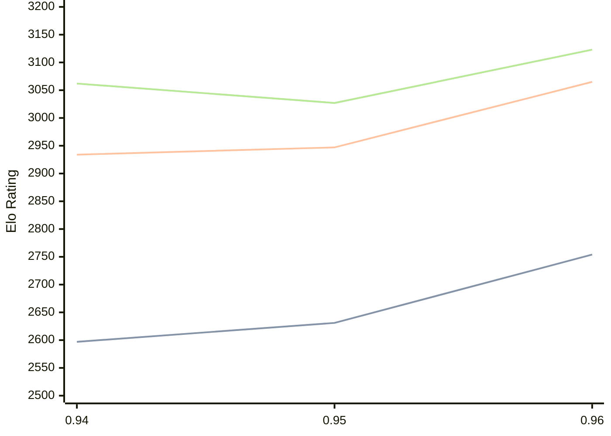

# Engine: Myrddin

Author: John Merlino

Home: https://github.com/JVMerlino/Myrddin

## Elo Ratings

| Version | Published | STC 8.0+0.08s  | LTC 60.0+0.60s | VLTC 2m24s+1.12s | Comment |
| --- | --- | --- | --- | --- | --- |
| 0.96 | 2026-06-08 | 2754(+123) | 3065(+118) | 3123(+96) |  |
| 0.95 | 2026-04-23 | 2631(+34) | 2947(+13) | 3027(-35) |  |
| 0.94 | 2025-12-11 | 2597 | 2934 | 3062 |  |
 | | | cElo (∆ prev) | cElo (∆ prev) | cElo (∆ prev) | 

<a href="https://github.com/computer-chess-index/cci/issues/new?template=submit-version.yml&title=[VERSION]+Myrddin+<version>&body=###%20Engine%20name%0AMyrddin%0A%0A###%20Version%0A0.96" target="_blank">Submit new version</a>

 Test Conditions:

GUI/CLI: <a href=https://github.com/cutechess/cutechess target="_blank">Cute-Chess</a> 
Elo Calculation: <a href=https://www.remi-coulom.fr/Bayesian-Elo/ target="_blank">Bayesian-Elo</a> 
CPU: Intel(R) Core(TM) i5-7500T 2.70GHz 
Opening book: 8_moves_v3 
\* STC: 8.0+0.08s, LTC: 60.0+0.60s, VLTC: 2m24s+1.12s

 Lists:
Ratings: <a href=https://github.com/computer-chess-index/cci/blob/main/lists/CCIRatings.csv target="_blank">Complete list</a>

Generated: 2026-09-16 04:40:02

## Ratings Verlauf

## Detailed Evaluation Results

| Version | Time Control | Elo  | Range +/- | Matches | Score | Average Opponent Elo | Draws |
| --- | --- | --- | --- | --- | --- | --- | --- |
| 0.96 | VLTC (2m24s+1.12s) | 3123 | 27 | 374 | 50% | 3124 | 54% |
| 0.96 | LTC (60.0+0.60s) | 3065 | 27 | 384 | 50% | 3063 | 48% |
| 0.96 | STC (8.0+0.08s) | 2754 | 28 | 404 | 49% | 2762 | 34% |
| --- | --- | --- | --- | --- | --- | --- | --- |
| 0.95 | VLTC (2m24s+1.12s) | 3027 | 29 | 370 | 51% | 3017 | 43% |
| 0.95 | LTC (60.0+0.60s) | 2947 | 29 | 366 | 49% | 2955 | 41% |
| 0.95 | STC (8.0+0.08s) | 2631 | 29 | 398 | 52% | 2610 | 33% |
| --- | --- | --- | --- | --- | --- | --- | --- |
| 0.94 | VLTC (2m24s+1.12s) | 3062 | 27 | 380 | 50% | 3060 | 52% |
| 0.94 | LTC (60.0+0.60s) | 2934 | 28 | 382 | 53% | 2901 | 41% |
| 0.94 | STC (8.0+0.08s) | 2597 | 27 | 476 | 50% | 2580 | 31% |
| --- | --- | --- | --- | --- | --- | --- | --- |