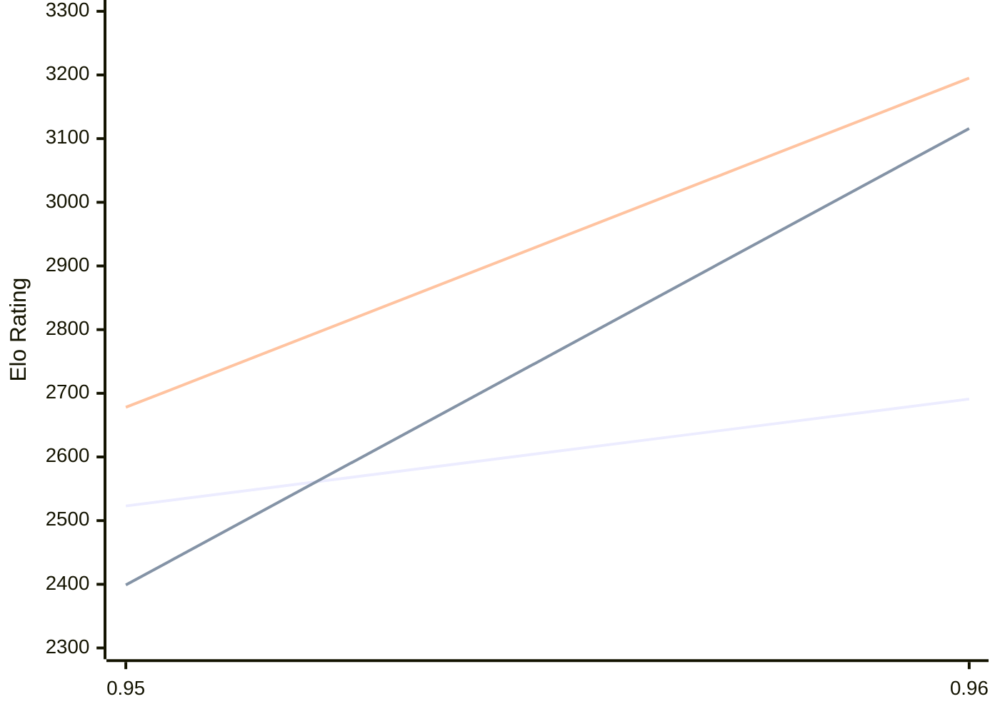
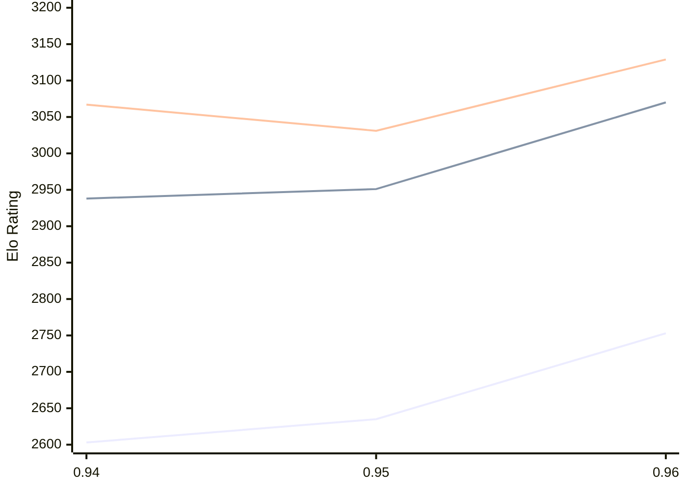

# Engine: Myrddin

Author: John Merlino

Home: https://github.com/JVMerlino/Myrddin

## Elo Ratings E1 (Ultra 7 265T (1.50 GHz) - E-Core)

| Version | Published | STC 8.0+0.08s  | LTC 60.0+0.60s | VLTC 2m24s+1.12s | Comment |
| --- | --- | --- | --- | --- | --- |
| 0.96 | 2026-06-08 | 2691(+168) | 3116(+717) | 3195(+517) |  |
| 0.95 | 2026-04-23 | 2523 | 2399 | 2678 |  |
 | | | cElo (∆ prev) | cElo (∆ prev) | cElo (∆ prev) | 

## Elo Ratings P1 (Ultra 7 265T (1.50 GHz) - P-Core)

| Version | Published | STC 8.0+0.08s  | LTC 60.0+0.60s | VLTC 2m24s+1.12s | Comment |
| --- | --- | --- | --- | --- | --- |
| 0.96 | 2026-06-08 | 2839(+262) | 3195(+new) | 3294(+614) |  |
| 0.95 | 2026-04-23 | 2577 |  | 2680 |  |
 | | | cElo (∆ prev) | cElo (∆ prev) | cElo (∆ prev) | 

## Elo Ratings T1 (i5-7500T 2.70GHz)

| Version | Published | STC 8.0+0.08s  | LTC 60.0+0.60s | VLTC 2m24s+1.12s | Comment |
| --- | --- | --- | --- | --- | --- |
| 0.96 | 2026-06-08 | 2753(+118) | 3070(+119) | 3129(+98) |  |
| 0.95 | 2026-04-23 | 2635(+32) | 2951(+13) | 3031(-36) |  |
| 0.94 | 2025-12-11 | 2603 | 2938 | 3067 |  |
 | | | cElo (∆ prev) | cElo (∆ prev) | cElo (∆ prev) | 

<a href="https://github.com/computer-chess-index/cci/issues/new?template=submit-version.yml&title=[VERSION]+Myrddin+<version>&body=###%20Engine%20name%0AMyrddin%0A%0A###%20Version%0A0.96" target="_blank">Submit new version</a>

 Test Conditions:

GUI/CLI: <a href=https://github.com/cutechess/cutechess target="_blank">Cute-Chess</a> 
Elo Calculation: <a href=https://www.remi-coulom.fr/Bayesian-Elo/ target="_blank">Bayesian-Elo</a> 
CPU for P1: Intel(R) Core(TM) Ultra 7 265T (1.50 GHz) - P-Core 
CPU for E1: Intel(R) Core(TM) Ultra 7 265T (1.50 GHz) - E-Core 
CPU for T1: Intel(R) Core(TM) i5-7500T 2.70GHz 
Opening book: 8_moves_v3 
\* STC: 8.0+0.08s, LTC: 60.0+0.60s, VLTC: 2m24s+1.12s

 Lists:
Ratings: <a href=https://github.com/computer-chess-index/cci/blob/main/lists/CCIRatings.csv target="_blank">Complete list</a>

Generated: 2026-11-12 05:40:09

## Ratings Verlauf E1 / P1

```mermaid
%%{init: {"theme":"base","themeVariables":{"seriesColors:['#a3a3a3','#222221','#faa371']}}}%%
xychart-beta
  x-axis ["0.95", "0.96"]
  y-axis "Elo Rating" 2300 --> 3300
  line "E1: STC (8.0+0.08s)" [2523, 2691]
  line "E1: LTC (60.0+0.60s)" [2399, 3116]
  line "E1: VLTC (2m24s+1.12s)" [2678, 3195]
  line "P1: STC (8.0+0.08s)" [2839]
  line "P1: LTC (60.0+0.60s)" [3195]
  line "P1: VLTC (2m24s+1.12s)" [3294]
```

## Ratings Verlauf T1

```mermaid
%%{init: {"theme":"base","themeVariables":{"seriesColors:['#a3a3a3','#222221','#faa371']}}}%%
xychart-beta
  x-axis ["0.94", "0.95", "0.96"]
  y-axis "Elo Rating" 2600 --> 3200
  line "T1: STC (8.0+0.08s)" [2603, 2635, 2753]
  line "T1: LTC (60.0+0.60s)" [2938, 2951, 3070]
  line "T1: VLTC (2m24s+1.12s)" [3067, 3031, 3129]
```

## Detailed Evaluation Results

| Version | Time Control | Variant | Elo  | Range +/- | Matches | Score | Average Opponent Elo | Draws |
| --- | --- |--- | --- | --- | --- | --- | --- | --- |
| 0.96 | VLTC (2m24s+1.12s) | T1 | 3129 | 27 | 382 | 50% | 3128 | 54% |
|  |  | P1 | 3294 | 38 | 184 | 50% | 3295 | 57% |
|  |  | E1 | 3195 | 27 | 416 | 53% | 3120 | 47% |
|  | LTC (60.0+0.60s) | T1 | 3070 | 27 | 390 | 50% | 3069 | 49% |
|  |  | P1 | 3195 | 30 | 318 | 51% | 3181 | 51% |
|  |  | E1 | 3116 | 30 | 336 | 53% | 3069 | 46% |
|  | STC (8.0+0.08s) | T1 | 2753 | 28 | 418 | 48% | 2768 | 35% |
|  |  | P1 | 2839 | 33 | 284 | 47% | 2865 | 39% |
|  |  | E1 | 2691 | 26 | 466 | 44% | 2742 | 36% |
| --- | --- |--- | --- | --- | --- | --- | --- | --- |
| 0.95 | VLTC (2m24s+1.12s) | E1 | 2678 | 229 | 4 | 13% | 2885 | 25% |
|  |  | T1 | 3031 | 29 | 370 | 51% | 3021 | 43% |
|  |  | P1 | 2680 | 229 | 4 | 13% | 2886 | 25% |
|  | LTC (60.0+0.60s) | E1 | 2399 | 294 | 4 | 0% | 2765 | 0% |
|  |  | T1 | 2951 | 29 | 366 | 49% | 2961 | 41% |
|  | STC (8.0+0.08s) | E1 | 2523 | 143 | 16 | 34% | 2653 | 19% |
|  |  | T1 | 2635 | 29 | 398 | 52% | 2614 | 33% |
|  |  | P1 | 2577 | 262 | 4 | 0% | 2890 | 0% |
| --- | --- |--- | --- | --- | --- | --- | --- | --- |
| 0.94 | VLTC (2m24s+1.12s) | T1 | 3067 | 27 | 380 | 50% | 3065 | 52% |
|  | LTC (60.0+0.60s) | T1 | 2938 | 28 | 382 | 53% | 2907 | 41% |
|  | STC (8.0+0.08s) | T1 | 2603 | 27 | 476 | 50% | 2584 | 31% |