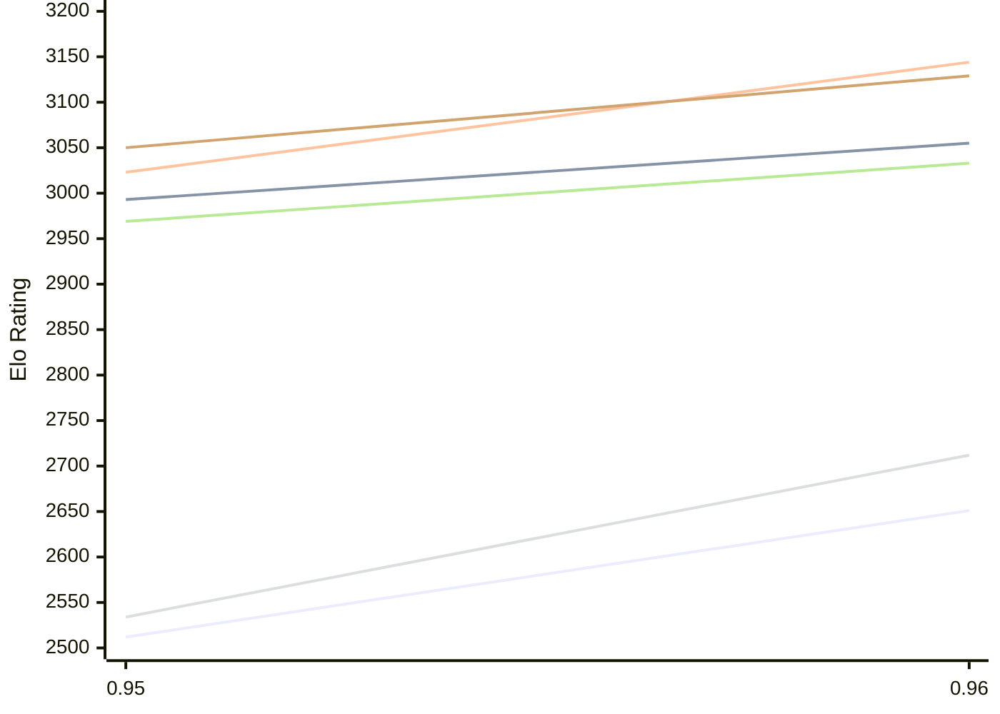
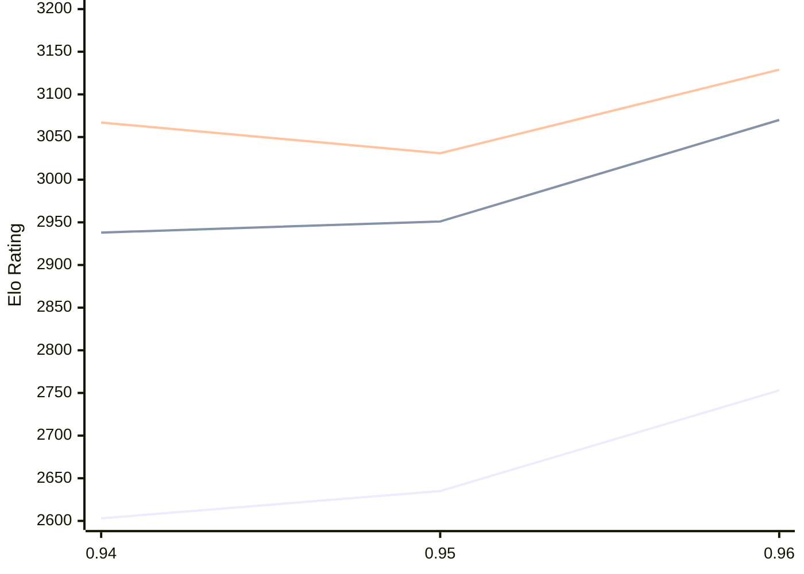

# Engine: Myrddin

Author: John Merlino

Home: https://github.com/JVMerlino/Myrddin

## Elo Ratings E1 (Ultra 7 265T (1.50 GHz) - E-Core)

| Version | Published | STC 8.0+0.08s  | LTC 60.0+0.60s | VLTC 2m24s+1.12s | Comment |
| --- | --- | --- | --- | --- | --- |
| 0.96 | 2026-06-08 | 2651(+139) | 3055(+62) | 3144(+121) |  |
| 0.95 | 2026-04-23 | 2512 | 2993 | 3023 |  |
 | | | cElo (∆ prev) | cElo (∆ prev) | cElo (∆ prev) | 

## Elo Ratings P1 (Ultra 7 265T (1.50 GHz) - P-Core)

| Version | Published | STC 8.0+0.08s  | LTC 60.0+0.60s | VLTC 2m24s+1.12s | Comment |
| --- | --- | --- | --- | --- | --- |
| 0.96 | 2026-06-08 | 2712(+178) | 3033(+64) | 3129(+79) |  |
| 0.95 | 2026-04-23 | 2534 | 2969 | 3050 |  |
 | | | cElo (∆ prev) | cElo (∆ prev) | cElo (∆ prev) | 

## Elo Ratings T1 (i5-7500T 2.70GHz)

| Version | Published | STC 8.0+0.08s  | LTC 60.0+0.60s | VLTC 2m24s+1.12s | Comment |
| --- | --- | --- | --- | --- | --- |
| 0.96 | 2026-06-08 | 2753(+118) | 3070(+119) | 3129(+98) |  |
| 0.95 | 2026-04-23 | 2635(+32) | 2951(+13) | 3031(-36) |  |
| 0.94 | 2025-12-11 | 2603 | 2938 | 3067 |  |
 | | | cElo (∆ prev) | cElo (∆ prev) | cElo (∆ prev) | 

<a href="https://github.com/computer-chess-index/cci/issues/new?template=submit-version.yml&title=[VERSION]+Myrddin+<version>&body=###%20Engine%20name%0AMyrddin%0A%0A###%20Version%0A0.96" target="_blank">Submit new version</a>

 Test Conditions:

GUI/CLI: <a href=https://github.com/cutechess/cutechess target="_blank">Cute-Chess</a> 
Elo Calculation: <a href=https://www.remi-coulom.fr/Bayesian-Elo/ target="_blank">Bayesian-Elo</a> 
CPU for P1: Intel(R) Core(TM) Ultra 7 265T (1.50 GHz) - P-Core 
CPU for E1: Intel(R) Core(TM) Ultra 7 265T (1.50 GHz) - E-Core 
CPU for T1: Intel(R) Core(TM) i5-7500T 2.70GHz 
Opening book: 8_moves_v3 
\* STC: 8.0+0.08s, LTC: 60.0+0.60s, VLTC: 2m24s+1.12s

 Lists:
Ratings: <a href=https://github.com/computer-chess-index/cci/blob/main/lists/CCIRatings.csv target="_blank">Complete list</a>

Generated: 2026-11-28 05:40:45

## Ratings Verlauf E1 / P1

```mermaid
%%{init: {"theme":"base","themeVariables":{"seriesColors:['#a3a3a3','#222221','#faa371']}}}%%
xychart-beta
  x-axis ["0.95", "0.96"]
  y-axis "Elo Rating" 2500 --> 3200
  line "E1: STC (8.0+0.08s)" [2512, 2651]
  line "E1: LTC (60.0+0.60s)" [2993, 3055]
  line "E1: VLTC (2m24s+1.12s)" [3023, 3144]
  line "P1: STC (8.0+0.08s)" [2534, 2712]
  line "P1: LTC (60.0+0.60s)" [2969, 3033]
  line "P1: VLTC (2m24s+1.12s)" [3050, 3129]
```

## Ratings Verlauf T1

```mermaid
%%{init: {"theme":"base","themeVariables":{"seriesColors:['#a3a3a3','#222221','#faa371']}}}%%
xychart-beta
  x-axis ["0.94", "0.95", "0.96"]
  y-axis "Elo Rating" 2600 --> 3200
  line "T1: STC (8.0+0.08s)" [2603, 2635, 2753]
  line "T1: LTC (60.0+0.60s)" [2938, 2951, 3070]
  line "T1: VLTC (2m24s+1.12s)" [3067, 3031, 3129]
```

## Detailed Evaluation Results

| Version | Time Control | Variant | Elo  | Range +/- | Matches | Score | Average Opponent Elo | Draws |
| --- | --- |--- | --- | --- | --- | --- | --- | --- |
| 0.96 | VLTC (2m24s+1.12s) | T1 | 3129 | 27 | 382 | 50% | 3128 | 54% |
|  |  | P1 | 3129 | 36 | 220 | 49% | 3143 | 54% |
|  |  | E1 | 3144 | 26 | 460 | 53% | 3082 | 47% |
|  | LTC (60.0+0.60s) | T1 | 3070 | 27 | 390 | 50% | 3069 | 49% |
|  |  | P1 | 3033 | 28 | 374 | 49% | 3031 | 50% |
|  |  | E1 | 3055 | 27 | 404 | 51% | 3028 | 47% |
|  | STC (8.0+0.08s) | T1 | 2753 | 28 | 418 | 48% | 2768 | 35% |
|  |  | P1 | 2712 | 31 | 328 | 48% | 2732 | 38% |
|  |  | E1 | 2651 | 25 | 538 | 44% | 2715 | 34% |
| --- | --- |--- | --- | --- | --- | --- | --- | --- |
| 0.95 | VLTC (2m24s+1.12s) | T1 | 3031 | 29 | 370 | 51% | 3021 | 43% |
|  |  | P1 | 3050 | 72 | 60 | 46% | 3078 | 42% |
|  |  | E1 | 3023 | 49 | 120 | 44% | 3073 | 51% |
|  | LTC (60.0+0.60s) | T1 | 2951 | 29 | 366 | 49% | 2961 | 41% |
|  |  | P1 | 2969 | 57 | 96 | 48% | 2979 | 36% |
|  |  | E1 | 2993 | 52 | 114 | 50% | 2992 | 39% |
|  | STC (8.0+0.08s) | P1 | 2534 | 61 | 100 | 53% | 2496 | 28% |
|  |  | E1 | 2512 | 54 | 116 | 45% | 2553 | 32% |
|  |  | T1 | 2635 | 29 | 398 | 52% | 2614 | 33% |
| --- | --- |--- | --- | --- | --- | --- | --- | --- |
| 0.94 | VLTC (2m24s+1.12s) | T1 | 3067 | 27 | 380 | 50% | 3065 | 52% |
|  | LTC (60.0+0.60s) | T1 | 2938 | 28 | 382 | 53% | 2907 | 41% |
|  | STC (8.0+0.08s) | T1 | 2603 | 27 | 476 | 50% | 2584 | 31% |