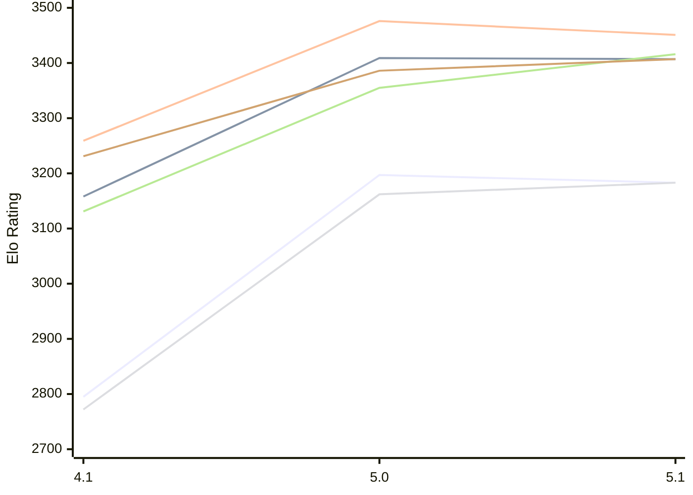

# Engine: NarcNext

Author: Madushan B. Dissanayake

Home: https://github.com/Madushan996/NARC-NEXT

## Elo Ratings E1 (Ultra 7 265T (1.50 GHz) - E-Core)

| Version | Published | STC 8.0+0.08s  | LTC 60.0+0.60s | VLTC 2m24s+1.12s | Comment |
| --- | --- | --- | --- | --- | --- |
| 5.1 | 2026-11-05 | 3183(-14) | 3407(-2) | 3451(-25) |  |
| 5.0 | 2026-11-02 | 3197(+402) | 3409(+251) | 3476(+217) |  |
| 4.1 | 2026-08-06 | 2795 | 3158 | 3259 |  |
 | | | cElo (∆ prev) | cElo (∆ prev) | cElo (∆ prev) | 

## Elo Ratings P1 (Ultra 7 265T (1.50 GHz) - P-Core)

| Version | Published | STC 8.0+0.08s  | LTC 60.0+0.60s | VLTC 2m24s+1.12s | Comment |
| --- | --- | --- | --- | --- | --- |
| 5.1 | 2026-11-05 | 3183(+21) | 3416(+61) | 3407(+21) |  |
| 5.0 | 2026-11-02 | 3162(+390) | 3355(+224) | 3386(+155) |  |
| 4.1 | 2026-08-06 | 2772 | 3131 | 3231 |  |
 | | | cElo (∆ prev) | cElo (∆ prev) | cElo (∆ prev) | 

## Elo Ratings T1 (i5-7500T 2.70GHz)

| Version | Published | STC 8.0+0.08s  | LTC 60.0+0.60s | VLTC 2m24s+1.12s | Comment |
| --- | --- | --- | --- | --- | --- |
| 4.1 | 2026-08-06 | 2871 | 3163 | 3281 |  |
 | | | cElo (∆ prev) | cElo (∆ prev) | cElo (∆ prev) | 

<a href="https://github.com/computer-chess-index/cci/issues/new?template=submit-version.yml&title=[VERSION]+NarcNext+<version>&body=###%20Engine%20name%0ANarcNext%0A%0A###%20Version%0A4.1" target="_blank">Submit new version</a>

 Test Conditions:

GUI/CLI: <a href=https://github.com/cutechess/cutechess target="_blank">Cute-Chess</a> 
Elo Calculation: <a href=https://www.remi-coulom.fr/Bayesian-Elo/ target="_blank">Bayesian-Elo</a> 
CPU for P1: Intel(R) Core(TM) Ultra 7 265T (1.50 GHz) - P-Core 
CPU for E1: Intel(R) Core(TM) Ultra 7 265T (1.50 GHz) - E-Core 
CPU for T1: Intel(R) Core(TM) i5-7500T 2.70GHz 
Opening book: 8_moves_v3 
\* STC: 8.0+0.08s, LTC: 60.0+0.60s, VLTC: 2m24s+1.12s

 Lists:
Ratings: <a href=https://github.com/computer-chess-index/cci/blob/main/lists/CCIRatings.csv target="_blank">Complete list</a>

Generated: 2026-11-20 05:40:28

## Ratings Verlauf E1 / P1

```mermaid
%%{init: {"theme":"base","themeVariables":{"seriesColors:['#a3a3a3','#222221','#faa371']}}}%%
xychart-beta
  x-axis ["4.1", "5.0", "5.1"]
  y-axis "Elo Rating" 2700 --> 3500
  line "E1: STC (8.0+0.08s)" [2795, 3197, 3183]
  line "E1: LTC (60.0+0.60s)" [3158, 3409, 3407]
  line "E1: VLTC (2m24s+1.12s)" [3259, 3476, 3451]
  line "P1: STC (8.0+0.08s)" [2772, 3162, 3183]
  line "P1: LTC (60.0+0.60s)" [3131, 3355, 3416]
  line "P1: VLTC (2m24s+1.12s)" [3231, 3386, 3407]
```

## Detailed Evaluation Results

| Version | Time Control | Variant | Elo  | Range +/- | Matches | Score | Average Opponent Elo | Draws |
| --- | --- |--- | --- | --- | --- | --- | --- | --- |
| 5.1 | VLTC (2m24s+1.12s) | P1 | 3407 | 46 | 110 | 50% | 3405 | 83% |
|  |  | E1 | 3451 | 31 | 246 | 51% | 3443 | 75% |
|  | LTC (60.0+0.60s) | P1 | 3416 | 43 | 132 | 50% | 3420 | 73% |
|  |  | E1 | 3407 | 32 | 238 | 51% | 3405 | 71% |
|  | STC (8.0+0.08s) | P1 | 3183 | 40 | 160 | 48% | 3200 | 63% |
|  |  | E1 | 3183 | 29 | 310 | 50% | 3187 | 62% |
| --- | --- |--- | --- | --- | --- | --- | --- | --- |
| 5.0 | VLTC (2m24s+1.12s) | P1 | 3386 | 43 | 134 | 53% | 3368 | 72% |
|  |  | E1 | 3476 | 32 | 248 | 54% | 3445 | 73% |
|  | LTC (60.0+0.60s) | P1 | 3355 | 33 | 222 | 57% | 3309 | 74% |
|  |  | E1 | 3409 | 31 | 268 | 54% | 3376 | 69% |
|  | STC (8.0+0.08s) | P1 | 3162 | 45 | 134 | 52% | 3140 | 58% |
|  |  | E1 | 3197 | 30 | 304 | 52% | 3151 | 57% |
| --- | --- |--- | --- | --- | --- | --- | --- | --- |
| 4.1 | VLTC (2m24s+1.12s) | E1 | 3259 | 27 | 378 | 47% | 3281 | 58% |
|  |  | T1 | 3281 | 30 | 308 | 51% | 3270 | 55% |
|  |  | P1 | 3231 | 31 | 276 | 48% | 3244 | 57% |
|  | LTC (60.0+0.60s) | T1 | 3163 | 30 | 318 | 52% | 3150 | 54% |
|  |  | P1 | 3131 | 35 | 226 | 49% | 3139 | 56% |
|  |  | E1 | 3158 | 28 | 372 | 48% | 3170 | 47% |
|  | STC (8.0+0.08s) | T1 | 2871 | 28 | 392 | 50% | 2870 | 42% |
|  |  | P1 | 2772 | 37 | 236 | 46% | 2816 | 38% |
|  |  | E1 | 2795 | 29 | 386 | 45% | 2842 | 37% |