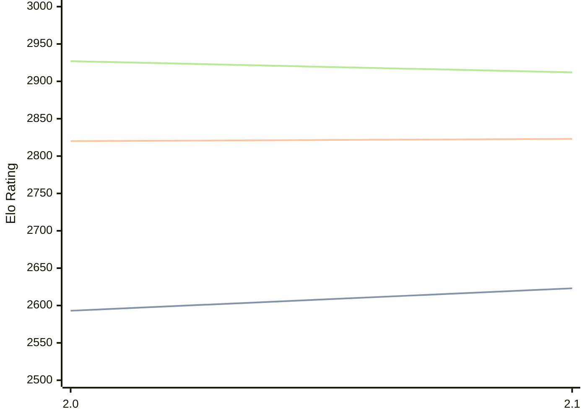

# Engine: Noggin

Author: Jeremy Lim

Home: https://github.com/jeremyylimmm/noggin

## Elo Ratings

| Version | Published | STC 8.0+0.08s  | LTC 60.0+0.60s | VLTC 2m24s+1.12s | Comment |
| --- | --- | --- | --- | --- | --- |
| 2.1 | 2026-07-04 | 2623(+30) | 2823(+3) | 2912(-15) |  |
| 2.0 | 2026-06-14 | 2593(+new) | 2820(+new) | 2927(+new) |  |
| 1.0 | 2026-06-09 |  |  |  |  |
 | | | cElo (∆ prev) | cElo (∆ prev) | cElo (∆ prev) | 

<a href="https://github.com/computer-chess-index/cci/issues/new?template=submit-version.yml&title=[VERSION]+Noggin+<version>&body=###%20Engine%20name%0ANoggin%0A%0A###%20Version%0A2.1" target="_blank">Submit new version</a>

 Test Conditions:

GUI/CLI: <a href=https://github.com/cutechess/cutechess target="_blank">Cute-Chess</a> 
Elo Calculation: <a href=https://www.remi-coulom.fr/Bayesian-Elo/ target="_blank">Bayesian-Elo</a> 
CPU: Intel(R) Core(TM) i5-7500T 2.70GHz 
Opening book: 8_moves_v3 
\* STC: 8.0+0.08s, LTC: 60.0+0.60s, VLTC: 2m24s+1.12s

 Lists:
Ratings: <a href=https://github.com/computer-chess-index/cci/blob/main/lists/CCIRatings.csv target="_blank">Complete list</a>

Generated: 2026-07-11 06:28:08

## Ratings Verlauf

## Ratings Verlauf

⬛ STC (8.0+0.08s) &nbsp;&nbsp; 🟧 LTC (60.0+0.60s) &nbsp;&nbsp; 🟩 VLTC (2m24s+1.12s)

dark mode: 🟩STC (8.0+0.08s) 🟧LTC (60.0+0.60s) ⬜VLTC (2m24s+1.12s)

## Detailed Evaluation Results

| Version | Time Control | Elo  | Range +/- | Matches | Score | Average Opponent Elo | Draws |
| --- | --- | --- | --- | --- | --- | --- | --- |
| 2.1 | VLTC (2m24s+1.12s) | 2912 | 59 | 88 | 52% | 2892 | 36% |
| 2.1 | LTC (60.0+0.60s) | 2823 | 69 | 60 | 49% | 2828 | 48% |
| 2.1 | STC (8.0+0.08s) | 2623 | 62 | 84 | 46% | 2658 | 30% |
| --- | --- | --- | --- | --- | --- | --- | --- |
| 2.0 | VLTC (2m24s+1.12s) | 2927 | 49 | 128 | 56% | 2880 | 41% |
| 2.0 | LTC (60.0+0.60s) | 2820 | 56 | 92 | 51% | 2808 | 46% |
| 2.0 | STC (8.0+0.08s) | 2593 | 52 | 124 | 44% | 2649 | 31% |
| --- | --- | --- | --- | --- | --- | --- | --- |