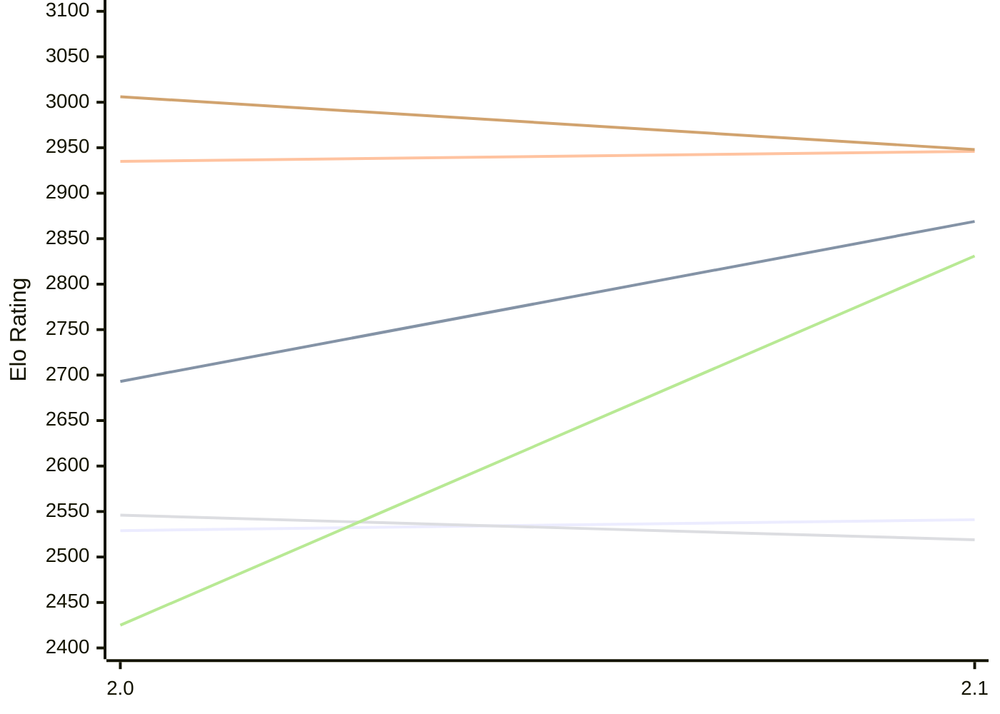
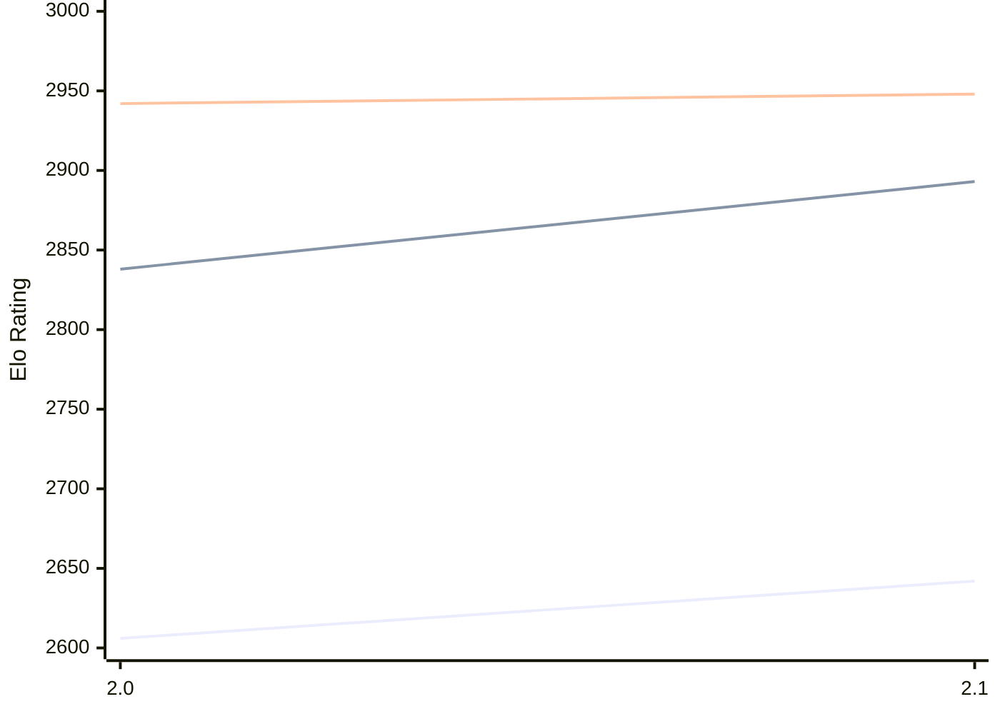

# Engine: Noggin

Author: Jeremy Lim

Home: https://github.com/jeremyylimmm/noggin

## Elo Ratings E1 (Ultra 7 265T (1.50 GHz) - E-Core)

| Version | Published | STC 8.0+0.08s  | LTC 60.0+0.60s | VLTC 2m24s+1.12s | Comment |
| --- | --- | --- | --- | --- | --- |
| 2.1 | 2026-07-04 | 2541(+12) | 2869(+176) | 2946(+11) |  |
| 2.0 | 2026-06-14 | 2529 | 2693 | 2935 |  |
 | | | cElo (∆ prev) | cElo (∆ prev) | cElo (∆ prev) | 

## Elo Ratings P1 (Ultra 7 265T (1.50 GHz) - P-Core)

| Version | Published | STC 8.0+0.08s  | LTC 60.0+0.60s | VLTC 2m24s+1.12s | Comment |
| --- | --- | --- | --- | --- | --- |
| 2.1 | 2026-07-04 | 2519(-27) | 2831(+406) | 2948(-58) |  |
| 2.0 | 2026-06-14 | 2546 | 2425 | 3006 |  |
 | | | cElo (∆ prev) | cElo (∆ prev) | cElo (∆ prev) | 

## Elo Ratings T1 (i5-7500T 2.70GHz)

| Version | Published | STC 8.0+0.08s  | LTC 60.0+0.60s | VLTC 2m24s+1.12s | Comment |
| --- | --- | --- | --- | --- | --- |
| 2.1 | 2026-07-04 | 2642(+36) | 2893(+55) | 2948(+6) |  |
| 2.0 | 2026-06-14 | 2606 | 2838 | 2942 |  |
 | | | cElo (∆ prev) | cElo (∆ prev) | cElo (∆ prev) | 

<a href="https://github.com/computer-chess-index/cci/issues/new?template=submit-version.yml&title=[VERSION]+Noggin+<version>&body=###%20Engine%20name%0ANoggin%0A%0A###%20Version%0A2.1" target="_blank">Submit new version</a>

 Test Conditions:

GUI/CLI: <a href=https://github.com/cutechess/cutechess target="_blank">Cute-Chess</a> 
Elo Calculation: <a href=https://www.remi-coulom.fr/Bayesian-Elo/ target="_blank">Bayesian-Elo</a> 
CPU for P1: Intel(R) Core(TM) Ultra 7 265T (1.50 GHz) - P-Core 
CPU for E1: Intel(R) Core(TM) Ultra 7 265T (1.50 GHz) - E-Core 
CPU for T1: Intel(R) Core(TM) i5-7500T 2.70GHz 
Opening book: 8_moves_v3 
\* STC: 8.0+0.08s, LTC: 60.0+0.60s, VLTC: 2m24s+1.12s

 Lists:
Ratings: <a href=https://github.com/computer-chess-index/cci/blob/main/lists/CCIRatings.csv target="_blank">Complete list</a>

Generated: 2026-11-13 05:40:42

## Ratings Verlauf E1 / P1

```mermaid
%%{init: {"theme":"base","themeVariables":{"seriesColors:['#a3a3a3','#222221','#faa371']}}}%%
xychart-beta
  x-axis ["2.0", "2.1"]
  y-axis "Elo Rating" 2400 --> 3100
  line "E1: STC (8.0+0.08s)" [2529, 2541]
  line "E1: LTC (60.0+0.60s)" [2693, 2869]
  line "E1: VLTC (2m24s+1.12s)" [2935, 2946]
  line "P1: STC (8.0+0.08s)" [2546, 2519]
  line "P1: LTC (60.0+0.60s)" [2425, 2831]
  line "P1: VLTC (2m24s+1.12s)" [3006, 2948]
```

## Ratings Verlauf T1

```mermaid
%%{init: {"theme":"base","themeVariables":{"seriesColors:['#a3a3a3','#222221','#faa371']}}}%%
xychart-beta
  x-axis ["2.0", "2.1"]
  y-axis "Elo Rating" 2600 --> 3000
  line "T1: STC (8.0+0.08s)" [2606, 2642]
  line "T1: LTC (60.0+0.60s)" [2838, 2893]
  line "T1: VLTC (2m24s+1.12s)" [2942, 2948]
```

## Detailed Evaluation Results

| Version | Time Control | Variant | Elo  | Range +/- | Matches | Score | Average Opponent Elo | Draws |
| --- | --- |--- | --- | --- | --- | --- | --- | --- |
| 2.1 | VLTC (2m24s+1.12s) | T1 | 2948 | 34 | 260 | 52% | 2935 | 45% |
|  |  | P1 | 2948 | 49 | 128 | 48% | 2967 | 41% |
|  |  | E1 | 2946 | 35 | 276 | 57% | 2808 | 37% |
|  | LTC (60.0+0.60s) | T1 | 2893 | 37 | 224 | 52% | 2878 | 43% |
|  |  | P1 | 2831 | 48 | 134 | 49% | 2850 | 45% |
|  |  | E1 | 2869 | 35 | 288 | 58% | 2711 | 36% |
|  | STC (8.0+0.08s) | T1 | 2642 | 39 | 220 | 48% | 2658 | 30% |
|  |  | P1 | 2519 | 53 | 124 | 48% | 2539 | 24% |
|  |  | E1 | 2541 | 42 | 200 | 49% | 2531 | 29% |
| --- | --- |--- | --- | --- | --- | --- | --- | --- |
| 2.0 | VLTC (2m24s+1.12s) | E1 | 2935 | 109 | 28 | 57% | 2762 | 43% |
|  |  | T1 | 2942 | 49 | 128 | 56% | 2894 | 41% |
|  |  | P1 | 3006 | 226 | 8 | 56% | 2878 | 13% |
|  | LTC (60.0+0.60s) | E1 | 2693 | 223 | 12 | 46% | 2750 | 8% |
|  |  | T1 | 2838 | 56 | 92 | 51% | 2826 | 46% |
|  |  | P1 | 2425 | 262 | 4 | 0% | 2739 | 0% |
|  | STC (8.0+0.08s) | E1 | 2529 | 100 | 36 | 35% | 2773 | 36% |
|  |  | T1 | 2606 | 52 | 124 | 44% | 2661 | 31% |
|  |  | P1 | 2546 | 131 | 24 | 50% | 2495 | 17% |