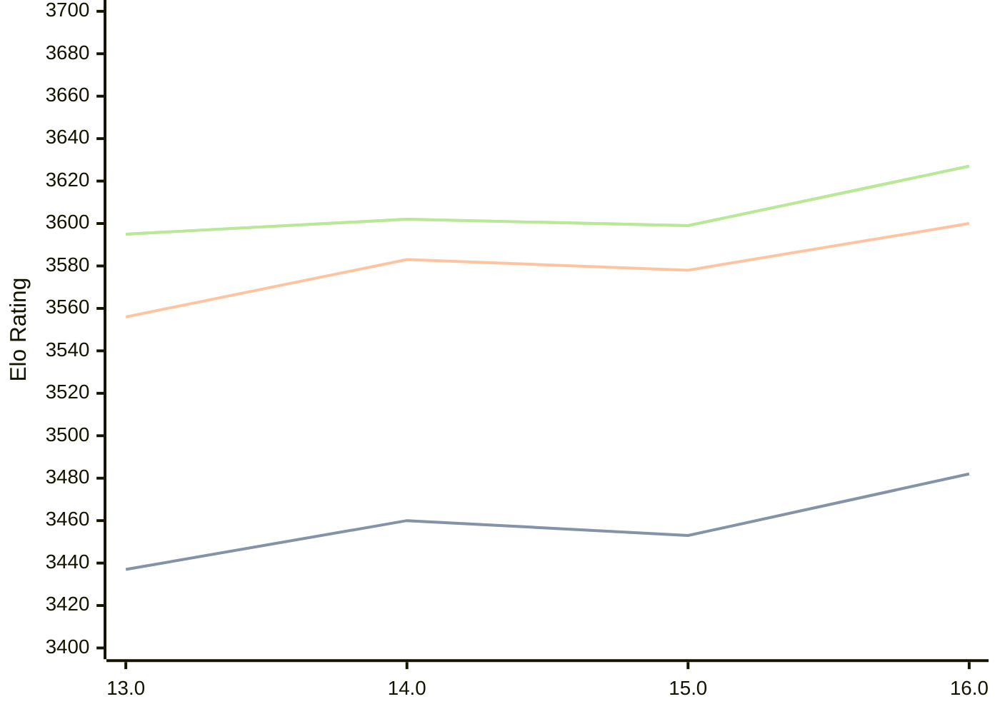

# Engine: Obsidian

Author: Gabriele Lombardo

Home: https://github.com/gab8192/Obsidian

## Elo Ratings

| Version | Published | STC 8.0+0.08s  | LTC 60.0+0.60s | VLTC 2m24s+1.12s | Comment |
| --- | --- | --- | --- | --- | --- |
| 16.0 | 2025-05-21 | 3482(+29) | 3600(+22) | 3627(+28) |  |
| 15.0 | 2025-01-31 | 3453(-7) | 3578(-5) | 3599(-3) |  |
| 14.0 | 2024-10-22 | 3460(+23) | 3583(+27) | 3602(+7) |  |
| 13.0 | 2024-07-01 | 3437(+new) | 3556(+new) | 3595(+new) |  |
| 12.0 | 2024-04-11 |  |  |  |  |
| 11.0 | 2024-03-02 |  |  |  |  |
| 10.0 | 2024-01-16 |  |  |  |  |
| 9.0 | 2023-12-17 |  |  |  |  |
| 8.0 | 2023-11-30 |  |  |  |  |
| 7.0 | 2023-11-07 |  |  |  |  |
| 6.0 | 2023-10-21 |  |  |  |  |
| 5.0 | 2023-10-01 |  |  |  |  |
| 4.0 | 2023-09-23 |  |  |  |  |
 | | | cElo (∆ prev) | cElo (∆ prev) | cElo (∆ prev) | 

<a href="https://github.com/computer-chess-index/cci/issues/new?template=submit-version.yml&title=[VERSION]+Obsidian+<version>&body=###%20Engine%20name%0AObsidian%0A%0A###%20Version%0A16.0" target="_blank">Submit new version</a>

 Test Conditions:

GUI/CLI: <a href=https://github.com/cutechess/cutechess target="_blank">Cute-Chess</a> 
Elo Calculation: <a href=https://www.remi-coulom.fr/Bayesian-Elo/ target="_blank">Bayesian-Elo</a> 
CPU: Intel(R) Core(TM) i5-7500T 2.70GHz 
Opening book: 8_moves_v3 
\* STC: 8.0+0.08s, LTC: 60.0+0.60s, VLTC: 2m24s+1.12s

 Lists:
Ratings: <a href=https://github.com/computer-chess-index/cci/blob/main/lists/CCIRatings.csv target="_blank">Complete list</a>

Generated: 2026-05-03 07:41:31

## Ratings Verlauf

⬛ STC (8.0+0.08s) &nbsp;&nbsp; 🟧 LTC (60.0+0.60s) &nbsp;&nbsp; 🟩 VLTC (2m24s+1.12s)

dark mode: 🟩STC (8.0+0.08s) 🟧LTC (60.0+0.60s) ⬜VLTC (2m24s+1.12s)

## Detailed Evaluation Results

| Version | Time Control | Elo  | Range +/- | Matches | Score | Average Opponent Elo | Draws |
| --- | --- | --- | --- | --- | --- | --- | --- |
| 16.0 | VLTC (2m24s+1.12s) | 3627 | 22 | 472 | 53% | 3607 | 92% |
| 16.0 | D1 | 1029 | 21 | 712 | 50% | 1026 | 36% |
| 16.0 | D10 | 3096 | 17 | 904 | 49% | 3098 | 65% |
| 16.0 | D11 | 3217 | 17 | 872 | 50% | 3214 | 66% |
| 16.0 | D12 | 3309 | 17 | 880 | 50% | 3308 | 68% |
| 16.0 | D13 | 3379 | 17 | 900 | 49% | 3387 | 74% |
| 16.0 | D14 | 3428 | 16 | 968 | 50% | 3426 | 73% |
| 16.0 | D15 | 3470 | 16 | 952 | 50% | 3471 | 78% |
| 16.0 | D16 | 3506 | 16 | 962 | 51% | 3502 | 81% |
| 16.0 | D17 | 3528 | 15 | 1006 | 50% | 3529 | 84% |
| 16.0 | D18 | 3551 | 15 | 1016 | 50% | 3555 | 86% |
| 16.0 | D19 | 3561 | 15 | 992 | 50% | 3560 | 85% |
| 16.0 | D2 | 1056 | 22 | 704 | 52% | 1040 | 30% |
| 16.0 | D20 | 3576 | 16 | 906 | 50% | 3575 | 89% |
| 16.0 | D21 | 3595 | 16 | 848 | 51% | 3587 | 87% |
| 16.0 | D22 | 3600 | 17 | 768 | 51% | 3592 | 90% |
| 16.0 | D23 | 3614 | 19 | 618 | 52% | 3600 | 90% |
| 16.0 | D24 | 3619 | 20 | 538 | 52% | 3606 | 91% |
| 16.0 | D25 | 3626 | 22 | 468 | 53% | 3609 | 91% |
| 16.0 | D26 | 3629 | 22 | 482 | 53% | 3607 | 90% |
| 16.0 | D3 | 1085 | 22 | 676 | 50% | 1083 | 30% |
| 16.0 | D4 | 1389 | 22 | 672 | 48% | 1409 | 35% |
| 16.0 | D5 | 1615 | 21 | 750 | 47% | 1644 | 38% |
| 16.0 | D6 | 2094 | 19 | 826 | 47% | 2124 | 44% |
| 16.0 | D7 | 2429 | 18 | 870 | 49% | 2438 | 51% |
| 16.0 | D8 | 2753 | 19 | 776 | 47% | 2773 | 55% |
| 16.0 | D9 | 2971 | 18 | 848 | 50% | 2970 | 58% |
| 16.0 | S10 | 3490 | 17 | 852 | 51% | 3486 | 81% |
| 16.0 | S40 | 3578 | 17 | 756 | 51% | 3571 | 86% |
| 16.0 | LTC (60.0+0.60s) | 3600 | 18 | 692 | 51% | 3594 | 88% |
| 16.0 | STC (8.0+0.08s) | 3482 | 16 | 1012 | 50% | 3484 | 77% |
| --- | --- | --- | --- | --- | --- | --- | --- |
| 15.0 | VLTC (2m24s+1.12s) | 3599 | 31 | 236 | 51% | 3595 | 89% |
| 15.0 | D1 | 1112 | 32 | 316 | 47% | 1143 | 35% |
| 15.0 | D10 | 3119 | 31 | 276 | 50% | 3120 | 62% |
| 15.0 | D11 | 3191 | 29 | 308 | 49% | 3200 | 63% |
| 15.0 | D12 | 3245 | 30 | 284 | 51% | 3240 | 68% |
| 15.0 | D13 | 3335 | 29 | 292 | 50% | 3336 | 72% |
| 15.0 | D14 | 3394 | 27 | 336 | 50% | 3394 | 73% |
| 15.0 | D15 | 3449 | 29 | 292 | 50% | 3447 | 79% |
| 15.0 | D16 | 3480 | 29 | 288 | 50% | 3482 | 82% |
| 15.0 | D17 | 3495 | 26 | 336 | 51% | 3486 | 83% |
| 15.0 | D18 | 3521 | 27 | 320 | 49% | 3526 | 80% |
| 15.0 | D19 | 3533 | 27 | 320 | 49% | 3538 | 89% |
| 15.0 | D2 | 1085 | 35 | 272 | 50% | 1091 | 26% |
| 15.0 | D20 | 3561 | 28 | 288 | 51% | 3559 | 91% |
| 15.0 | D21 | 3572 | 29 | 272 | 50% | 3575 | 86% |
| 15.0 | D22 | 3584 | 27 | 312 | 51% | 3578 | 89% |
| 15.0 | D23 | 3584 | 29 | 272 | 50% | 3582 | 86% |
| 15.0 | D24 | 3598 | 30 | 252 | 51% | 3591 | 87% |
| 15.0 | D25 | 3606 | 34 | 200 | 51% | 3598 | 90% |
| 15.0 | D26 | 3605 | 34 | 200 | 52% | 3595 | 88% |
| 15.0 | D3 | 1123 | 36 | 272 | 48% | 1139 | 24% |
| 15.0 | D4 | 1365 | 36 | 252 | 50% | 1362 | 33% |
| 15.0 | D5 | 1700 | 35 | 276 | 48% | 1719 | 32% |
| 15.0 | D6 | 2121 | 36 | 248 | 51% | 2111 | 38% |
| 15.0 | D7 | 2368 | 33 | 280 | 52% | 2353 | 47% |
| 15.0 | D8 | 2701 | 35 | 240 | 50% | 2696 | 43% |
| 15.0 | D9 | 2950 | 33 | 260 | 51% | 2944 | 50% |
| 15.0 | S10 | 3479 | 28 | 300 | 50% | 3476 | 81% |
| 15.0 | S40 | 3564 | 28 | 296 | 51% | 3559 | 84% |
| 15.0 | LTC (60.0+0.60s) | 3578 | 29 | 280 | 50% | 3575 | 84% |
| 15.0 | STC (8.0+0.08s) | 3453 | 27 | 320 | 51% | 3444 | 79% |
| --- | --- | --- | --- | --- | --- | --- | --- |
| 14.0 | VLTC (2m24s+1.12s) | 3602 | 22 | 492 | 52% | 3591 | 89% |
| 14.0 | C4 | 3648 | 50 | 88 | 51% | 3641 | 95% |
| 14.0 | D1 | 1219 | 21 | 816 | 51% | 1212 | 21% |
| 14.0 | D10 | 3042 | 20 | 744 | 49% | 3051 | 51% |
| 14.0 | D11 | 3140 | 19 | 816 | 50% | 3144 | 54% |
| 14.0 | D12 | 3224 | 18 | 836 | 49% | 3228 | 63% |
| 14.0 | D13 | 3290 | 18 | 828 | 51% | 3285 | 68% |
| 14.0 | D14 | 3374 | 17 | 912 | 49% | 3378 | 69% |
| 14.0 | D15 | 3409 | 16 | 980 | 48% | 3421 | 74% |
| 14.0 | D16 | 3445 | 17 | 816 | 50% | 3448 | 79% |
| 14.0 | D17 | 3475 | 16 | 892 | 49% | 3480 | 82% |
| 14.0 | D18 | 3499 | 17 | 860 | 50% | 3501 | 83% |
| 14.0 | D19 | 3517 | 17 | 848 | 49% | 3521 | 79% |
| 14.0 | D2 | 1307 | 23 | 752 | 48% | 1332 | 13% |
| 14.0 | D20 | 3542 | 17 | 836 | 50% | 3541 | 85% |
| 14.0 | D21 | 3553 | 17 | 848 | 50% | 3553 | 86% |
| 14.0 | D22 | 3561 | 17 | 788 | 50% | 3564 | 87% |
| 14.0 | D23 | 3572 | 19 | 648 | 50% | 3569 | 90% |
| 14.0 | D24 | 3584 | 20 | 572 | 51% | 3575 | 87% |
| 14.0 | D3 | 1208 | 21 | 888 | 48% | 1238 | 12% |
| 14.0 | D4 | 1380 | 22 | 860 | 47% | 1416 | 11% |
| 14.0 | D5 | 1574 | 21 | 856 | 46% | 1627 | 16% |
| 14.0 | D6 | 1814 | 22 | 784 | 51% | 1809 | 18% |
| 14.0 | D7 | 2317 | 22 | 732 | 49% | 2327 | 24% |
| 14.0 | D8 | 2660 | 21 | 744 | 48% | 2680 | 34% |
| 14.0 | D9 | 2843 | 19 | 828 | 51% | 2832 | 45% |
| 14.0 | S10 | 3478 | 16 | 936 | 50% | 3474 | 78% |
| 14.0 | S40 | 3561 | 17 | 844 | 50% | 3559 | 86% |
| 14.0 | LTC (60.0+0.60s) | 3583 | 19 | 644 | 51% | 3575 | 86% |
| 14.0 | STC (8.0+0.08s) | 3460 | 16 | 944 | 50% | 3456 | 78% |
| --- | --- | --- | --- | --- | --- | --- | --- |
| 13.0 | VLTC (2m24s+1.12s) | 3595 | 38 | 160 | 52% | 3576 | 82% |
| 13.0 | C4 | 3642 | 47 | 104 | 54% | 3613 | 86% |
| 13.0 | D1 | 1161 | 19 | 1000 | 48% | 1176 | 26% |
| 13.0 | D10 | 3024 | 15 | 1195 | 50% | 3027 | 57% |
| 13.0 | D11 | 3133 | 17 | 927 | 49% | 3139 | 62% |
| 13.0 | D12 | 3220 | 16 | 988 | 49% | 3225 | 65% |
| 13.0 | D13 | 3298 | 15 | 1144 | 53% | 3264 | 66% |
| 13.0 | D14 | 3353 | 15 | 1088 | 50% | 3356 | 76% |
| 13.0 | D15 | 3409 | 15 | 1108 | 51% | 3403 | 76% |
| 13.0 | D16 | 3426 | 15 | 1129 | 49% | 3432 | 78% |
| 13.0 | D17 | 3459 | 17 | 828 | 50% | 3456 | 80% |
| 13.0 | D18 | 3488 | 17 | 812 | 49% | 3495 | 83% |
| 13.0 | D19 | 3511 | 16 | 908 | 49% | 3521 | 81% |
| 13.0 | D2 | 1262 | 19 | 1020 | 51% | 1254 | 11% |
| 13.0 | D20 | 3532 | 18 | 756 | 51% | 3525 | 85% |
| 13.0 | D21 | 3552 | 18 | 704 | 48% | 3563 | 87% |
| 13.0 | D22 | 3556 | 20 | 580 | 50% | 3556 | 88% |
| 13.0 | D23 | 3567 | 20 | 560 | 51% | 3555 | 88% |
| 13.0 | D24 | 3578 | 21 | 500 | 50% | 3578 | 90% |
| 13.0 | D3 | 1183 | 18 | 1220 | 53% | 1152 | 11% |
| 13.0 | D4 | 1382 | 19 | 1040 | 45% | 1446 | 16% |
| 13.0 | D5 | 1577 | 20 | 936 | 49% | 1590 | 16% |
| 13.0 | D6 | 1870 | 19 | 1036 | 51% | 1854 | 19% |
| 13.0 | D7 | 2336 | 20 | 864 | 52% | 2319 | 29% |
| 13.0 | D8 | 2660 | 18 | 1000 | 52% | 2641 | 40% |
| 13.0 | D9 | 2851 | 17 | 1000 | 51% | 2846 | 47% |
| 13.0 | S10 | 3467 | 33 | 216 | 50% | 3470 | 80% |
| 13.0 | S40 | 3560 | 38 | 160 | 50% | 3557 | 88% |
| 13.0 | LTC (60.0+0.60s) | 3556 | 34 | 200 | 49% | 3564 | 83% |
| 13.0 | STC (8.0+0.08s) | 3437 | 28 | 332 | 52% | 3425 | 68% |
| --- | --- | --- | --- | --- | --- | --- | --- |
| 12.0 |  |  |  |  |  |  |  |
| 11.0 |  |  |  |  |  |  |  |
| 10.0 |  |  |  |  |  |  |  |
| 9.0 |  |  |  |  |  |  |  |
| 8.0 |  |  |  |  |  |  |  |
| 7.0 |  |  |  |  |  |  |  |
| 6.0 |  |  |  |  |  |  |  |
| 5.0 |  |  |  |  |  |  |  |
| 4.0 |  |  |  |  |  |  |  |