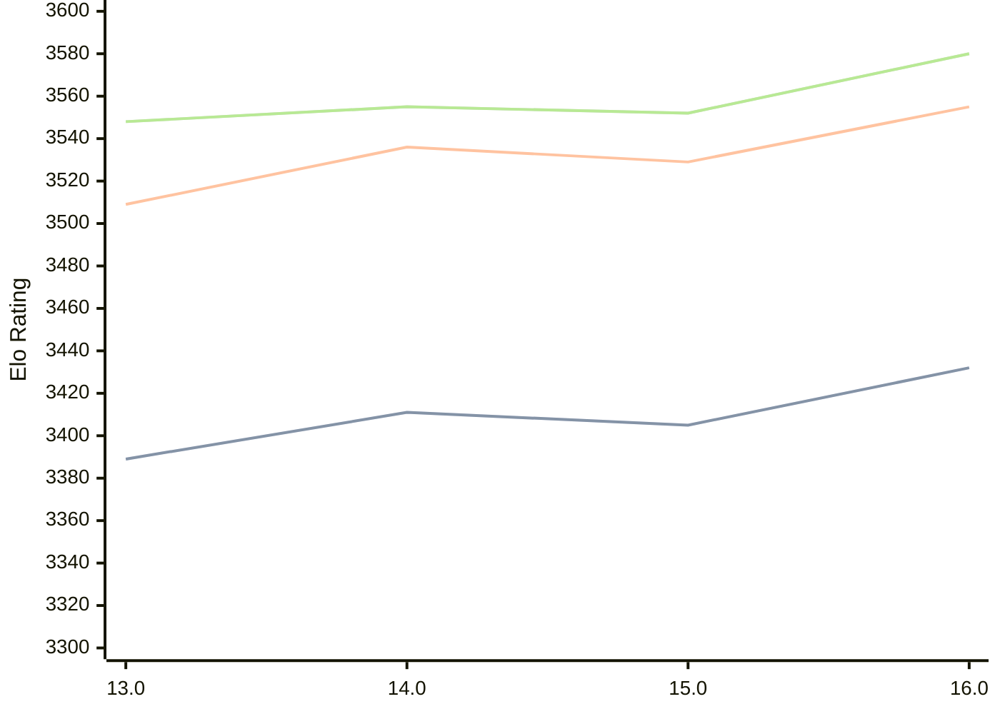

# Engine: Obsidian

Author: Gabriele Lombardo

Home: https://github.com/gab8192/Obsidian

## Elo Ratings

| Version | Published | STC 8.0+0.08s  | LTC 60.0+0.60s | VLTC 2m24s+1.12s | Comment |
| --- | --- | --- | --- | --- | --- |
| 16.0 | 2025-05-21 | 3432(+27) | 3555(+26) | 3580(+28) |  |
| 15.0 | 2025-01-31 | 3405(-6) | 3529(-7) | 3552(-3) |  |
| 14.0 | 2024-10-22 | 3411(+22) | 3536(+27) | 3555(+7) |  |
| 13.0 | 2024-07-01 | 3389 | 3509 | 3548 |  |
 | | | cElo (∆ prev) | cElo (∆ prev) | cElo (∆ prev) | 

<a href="https://github.com/computer-chess-index/cci/issues/new?template=submit-version.yml&title=[VERSION]+Obsidian+<version>&body=###%20Engine%20name%0AObsidian%0A%0A###%20Version%0A16.0" target="_blank">Submit new version</a>

 Test Conditions:

GUI/CLI: <a href=https://github.com/cutechess/cutechess target="_blank">Cute-Chess</a> 
Elo Calculation: <a href=https://www.remi-coulom.fr/Bayesian-Elo/ target="_blank">Bayesian-Elo</a> 
CPU: Intel(R) Core(TM) i5-7500T 2.70GHz 
Opening book: 8_moves_v3 
\* STC: 8.0+0.08s, LTC: 60.0+0.60s, VLTC: 2m24s+1.12s

 Lists:
Ratings: <a href=https://github.com/computer-chess-index/cci/blob/main/lists/CCIRatings.csv target="_blank">Complete list</a>

Generated: 2026-08-21 06:28:19

## Ratings Verlauf

⬛ STC (8.0+0.08s) &nbsp;&nbsp; 🟧 LTC (60.0+0.60s) &nbsp;&nbsp; 🟩 VLTC (2m24s+1.12s)

dark mode: 🟩STC (8.0+0.08s) 🟧LTC (60.0+0.60s) ⬜VLTC (2m24s+1.12s)

## Detailed Evaluation Results

| Version | Time Control | Elo  | Range +/- | Matches | Score | Average Opponent Elo | Draws |
| --- | --- | --- | --- | --- | --- | --- | --- |
| 16.0 | VLTC (2m24s+1.12s) | 3580 | 20 | 536 | 53% | 3563 | 92% |
| 16.0 | LTC (60.0+0.60s) | 3555 | 17 | 768 | 51% | 3548 | 89% |
| 16.0 | STC (8.0+0.08s) | 3432 | 15 | 1156 | 49% | 3436 | 76% |
| --- | --- | --- | --- | --- | --- | --- | --- |
| 15.0 | VLTC (2m24s+1.12s) | 3552 | 31 | 236 | 51% | 3548 | 89% |
| 15.0 | LTC (60.0+0.60s) | 3529 | 29 | 280 | 50% | 3528 | 84% |
| 15.0 | STC (8.0+0.08s) | 3405 | 27 | 320 | 51% | 3397 | 79% |
| --- | --- | --- | --- | --- | --- | --- | --- |
| 14.0 | VLTC (2m24s+1.12s) | 3555 | 22 | 492 | 52% | 3544 | 89% |
| 14.0 | LTC (60.0+0.60s) | 3536 | 19 | 644 | 51% | 3528 | 86% |
| 14.0 | STC (8.0+0.08s) | 3411 | 16 | 944 | 50% | 3409 | 78% |
| --- | --- | --- | --- | --- | --- | --- | --- |
| 13.0 | VLTC (2m24s+1.12s) | 3548 | 38 | 160 | 52% | 3529 | 82% |
| 13.0 | LTC (60.0+0.60s) | 3509 | 34 | 200 | 49% | 3517 | 83% |
| 13.0 | STC (8.0+0.08s) | 3389 | 28 | 332 | 52% | 3376 | 68% |
| --- | --- | --- | --- | --- | --- | --- | --- |