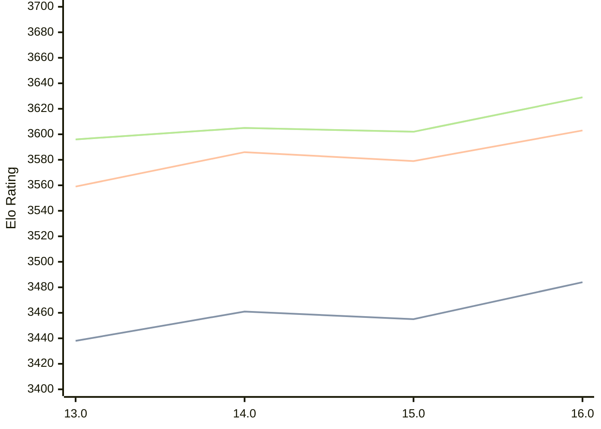

# Engine: Obsidian

Author: Gabriele Lombardo

Home: https://github.com/gab8192/Obsidian

## Elo Ratings

| Version | Published | STC 8.0+0.08s  | LTC 60.0+0.60s | VLTC 2m24s+1.12s | Comment |
| --- | --- | --- | --- | --- | --- |
| 16.0 | 2025-05-21 | 3484(+29) | 3603(+24) | 3629(+27) |  |
| 15.0 | 2025-01-31 | 3455(-6) | 3579(-7) | 3602(-3) |  |
| 14.0 | 2024-10-22 | 3461(+23) | 3586(+27) | 3605(+9) |  |
| 13.0 | 2024-07-01 | 3438(+new) | 3559(+new) | 3596(+new) |  |
| 12.0 | 2024-04-11 |  |  |  |  |
| 11.0 | 2024-03-02 |  |  |  |  |
| 10.0 | 2024-01-16 |  |  |  |  |
| 9.0 | 2023-12-17 |  |  |  |  |
| 8.0 | 2023-11-30 |  |  |  |  |
| 7.0 | 2023-11-07 |  |  |  |  |
| 6.0 | 2023-10-21 |  |  |  |  |
| 5.0 | 2023-10-01 |  |  |  |  |
| 4.0 | 2023-09-23 |  |  |  |  |
 | | | cElo (∆ prev) | cElo (∆ prev) | cElo (∆ prev) | 

<a href="https://github.com/computer-chess-index/cci/issues/new?template=submit-version.yml&title=[VERSION]+Obsidian+<version>&body=###%20Engine%20name%0AObsidian%0A%0A###%20Version%0A16.0" target="_blank">Submit new version</a>

 Test Conditions:

GUI/CLI: <a href=https://github.com/cutechess/cutechess target="_blank">Cute-Chess</a> 
Elo Calculation: <a href=https://www.remi-coulom.fr/Bayesian-Elo/ target="_blank">Bayesian-Elo</a> 
CPU: Intel(R) Core(TM) i5-7500T 2.70GHz 
Opening book: 8_moves_v3 
\* STC: 8.0+0.08s, LTC: 60.0+0.60s, VLTC: 2m24s+1.12s

 Lists:
Ratings: <a href=https://github.com/computer-chess-index/cci/blob/main/lists/CCIRatings.csv target="_blank">Complete list</a>

Generated: 2026-05-06 06:26:40

## Ratings Verlauf

⬛ STC (8.0+0.08s) &nbsp;&nbsp; 🟧 LTC (60.0+0.60s) &nbsp;&nbsp; 🟩 VLTC (2m24s+1.12s)

dark mode: 🟩STC (8.0+0.08s) 🟧LTC (60.0+0.60s) ⬜VLTC (2m24s+1.12s)

## Detailed Evaluation Results

| Version | Time Control | Elo  | Range +/- | Matches | Score | Average Opponent Elo | Draws |
| --- | --- | --- | --- | --- | --- | --- | --- |
| 16.0 | VLTC (2m24s+1.12s) | 3629 | 22 | 472 | 53% | 3610 | 92% |
| 16.0 | LTC (60.0+0.60s) | 3603 | 18 | 692 | 51% | 3596 | 88% |
| 16.0 | STC (8.0+0.08s) | 3484 | 16 | 1012 | 50% | 3486 | 77% |
| --- | --- | --- | --- | --- | --- | --- | --- |
| 15.0 | VLTC (2m24s+1.12s) | 3602 | 31 | 236 | 51% | 3596 | 89% |
| 15.0 | LTC (60.0+0.60s) | 3579 | 29 | 280 | 50% | 3576 | 84% |
| 15.0 | STC (8.0+0.08s) | 3455 | 27 | 320 | 51% | 3447 | 79% |
| --- | --- | --- | --- | --- | --- | --- | --- |
| 14.0 | VLTC (2m24s+1.12s) | 3605 | 22 | 492 | 52% | 3594 | 89% |
| 14.0 | LTC (60.0+0.60s) | 3586 | 19 | 644 | 51% | 3576 | 86% |
| 14.0 | STC (8.0+0.08s) | 3461 | 16 | 944 | 50% | 3459 | 78% |
| --- | --- | --- | --- | --- | --- | --- | --- |
| 13.0 | VLTC (2m24s+1.12s) | 3596 | 38 | 160 | 52% | 3579 | 82% |
| 13.0 | LTC (60.0+0.60s) | 3559 | 34 | 200 | 49% | 3567 | 83% |
| 13.0 | STC (8.0+0.08s) | 3438 | 28 | 332 | 52% | 3428 | 68% |
| --- | --- | --- | --- | --- | --- | --- | --- |