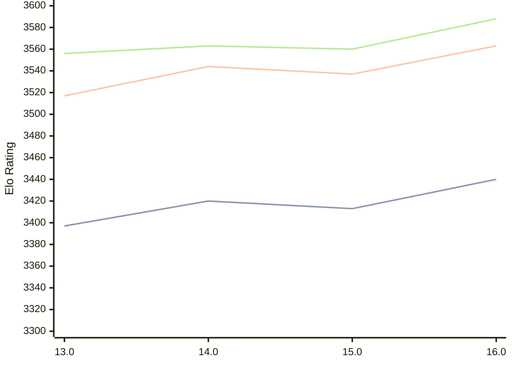

# Engine: Obsidian

Author: Gabriele Lombardo

Home: https://github.com/gab8192/Obsidian

## Elo Ratings

| Version | Published | STC 8.0+0.08s  | LTC 60.0+0.60s | VLTC 2m24s+1.12s | Comment |
| --- | --- | --- | --- | --- | --- |
| 16.0 | 2025-05-21 | 3440(+27) | 3563(+26) | 3588(+28) |  |
| 15.0 | 2025-01-31 | 3413(-7) | 3537(-7) | 3560(-3) |  |
| 14.0 | 2024-10-22 | 3420(+23) | 3544(+27) | 3563(+7) |  |
| 13.0 | 2024-07-01 | 3397 | 3517 | 3556 |  |
 | | | cElo (∆ prev) | cElo (∆ prev) | cElo (∆ prev) | 

<a href="https://github.com/computer-chess-index/cci/issues/new?template=submit-version.yml&title=[VERSION]+Obsidian+<version>&body=###%20Engine%20name%0AObsidian%0A%0A###%20Version%0A16.0" target="_blank">Submit new version</a>

 Test Conditions:

GUI/CLI: <a href=https://github.com/cutechess/cutechess target="_blank">Cute-Chess</a> 
Elo Calculation: <a href=https://www.remi-coulom.fr/Bayesian-Elo/ target="_blank">Bayesian-Elo</a> 
CPU: Intel(R) Core(TM) i5-7500T 2.70GHz 
Opening book: 8_moves_v3 
\* STC: 8.0+0.08s, LTC: 60.0+0.60s, VLTC: 2m24s+1.12s

 Lists:
Ratings: <a href=https://github.com/computer-chess-index/cci/blob/main/lists/CCIRatings.csv target="_blank">Complete list</a>

Generated: 2026-09-08 04:40:21

## Ratings Verlauf

## Detailed Evaluation Results

| Version | Time Control | Elo  | Range +/- | Matches | Score | Average Opponent Elo | Draws |
| --- | --- | --- | --- | --- | --- | --- | --- |
| 16.0 | VLTC (2m24s+1.12s) | 3588 | 20 | 556 | 53% | 3571 | 92% |
| 16.0 | LTC (60.0+0.60s) | 3563 | 17 | 796 | 51% | 3556 | 89% |
| 16.0 | STC (8.0+0.08s) | 3440 | 14 | 1184 | 49% | 3443 | 76% |
| --- | --- | --- | --- | --- | --- | --- | --- |
| 15.0 | VLTC (2m24s+1.12s) | 3560 | 31 | 236 | 51% | 3556 | 89% |
| 15.0 | LTC (60.0+0.60s) | 3537 | 29 | 280 | 50% | 3536 | 84% |
| 15.0 | STC (8.0+0.08s) | 3413 | 27 | 320 | 51% | 3403 | 79% |
| --- | --- | --- | --- | --- | --- | --- | --- |
| 14.0 | VLTC (2m24s+1.12s) | 3563 | 22 | 492 | 52% | 3552 | 89% |
| 14.0 | LTC (60.0+0.60s) | 3544 | 19 | 644 | 51% | 3536 | 86% |
| 14.0 | STC (8.0+0.08s) | 3420 | 16 | 944 | 50% | 3416 | 78% |
| --- | --- | --- | --- | --- | --- | --- | --- |
| 13.0 | VLTC (2m24s+1.12s) | 3556 | 38 | 160 | 52% | 3537 | 82% |
| 13.0 | LTC (60.0+0.60s) | 3517 | 34 | 200 | 49% | 3525 | 83% |
| 13.0 | STC (8.0+0.08s) | 3397 | 28 | 332 | 52% | 3384 | 68% |
| --- | --- | --- | --- | --- | --- | --- | --- |