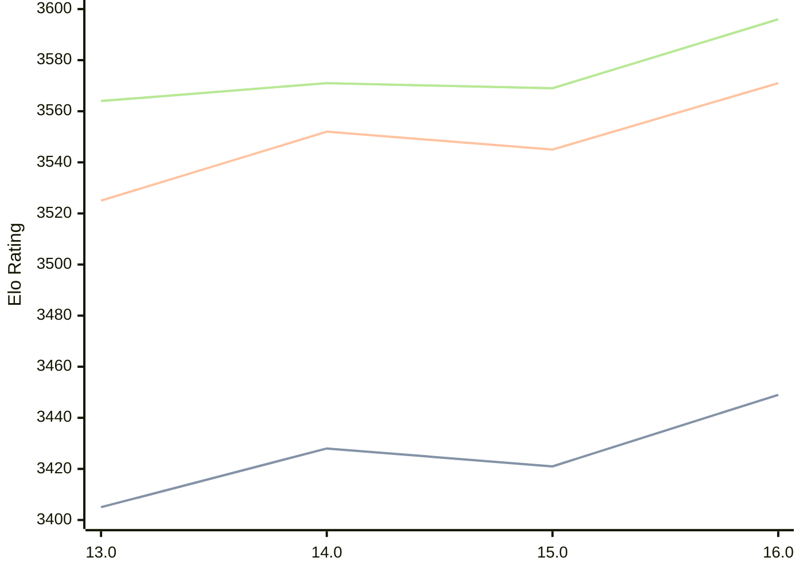

# Engine: Obsidian

Author: Gabriele Lombardo

Home: https://github.com/gab8192/Obsidian

## Elo Ratings E1

| Version | Published | STC 8.0+0.08s  | LTC 60.0+0.60s | VLTC 2m24s+1.12s | Comment |
| --- | --- | --- | --- | --- | --- |
| 16.0 | 2025-05-21 | 3355 | 3578 | 3617 |  |
 | | | cElo (∆ prev) | cElo (∆ prev) | cElo (∆ prev) | 

## Elo Ratings P1

| Version | Published | STC 8.0+0.08s  | LTC 60.0+0.60s | VLTC 2m24s+1.12s | Comment |
| --- | --- | --- | --- | --- | --- |
| 16.0 | 2025-05-21 | 3630 | 3807 | 3864 |  |
 | | | cElo (∆ prev) | cElo (∆ prev) | cElo (∆ prev) | 

## Elo Ratings T1

| Version | Published | STC 8.0+0.08s  | LTC 60.0+0.60s | VLTC 2m24s+1.12s | Comment |
| --- | --- | --- | --- | --- | --- |
| 16.0 | 2025-05-21 | 3449(+28) | 3571(+26) | 3596(+27) |  |
| 15.0 | 2025-01-31 | 3421(-7) | 3545(-7) | 3569(-2) |  |
| 14.0 | 2024-10-22 | 3428(+23) | 3552(+27) | 3571(+7) |  |
| 13.0 | 2024-07-01 | 3405 | 3525 | 3564 |  |
 | | | cElo (∆ prev) | cElo (∆ prev) | cElo (∆ prev) | 

<a href="https://github.com/computer-chess-index/cci/issues/new?template=submit-version.yml&title=[VERSION]+Obsidian+<version>&body=###%20Engine%20name%0AObsidian%0A%0A###%20Version%0A16.0" target="_blank">Submit new version</a>

 Test Conditions:

GUI/CLI: <a href=https://github.com/cutechess/cutechess target="_blank">Cute-Chess</a> 
Elo Calculation: <a href=https://www.remi-coulom.fr/Bayesian-Elo/ target="_blank">Bayesian-Elo</a> 
CPU for P1: Intel(R) Core(TM) Ultra 7 265T (1.50 GHz) - P-Core 
CPU for E1: Intel(R) Core(TM) Ultra 7 265T (1.50 GHz) - E-Core 
CPU for T1: Intel(R) Core(TM) i5-7500T 2.70GHz 
Opening book: 8_moves_v3 
\* STC: 8.0+0.08s, LTC: 60.0+0.60s, VLTC: 2m24s+1.12s

 Lists:
Ratings: <a href=https://github.com/computer-chess-index/cci/blob/main/lists/CCIRatings.csv target="_blank">Complete list</a>

Generated: 2026-10-10 04:40:38

## Ratings Verlauf

```mermaid
%%{init: {"theme":"base","themeVariables":{"seriesColors:['#a3a3a3','#222221','#faa371']}}}%%
xychart-beta
  x-axis ["13.0", "14.0", "15.0", "16.0"]
  y-axis "Elo Rating" 3400 --> 3600
  line "" [3405, 3428, 3421, 3449]
  line "STC (8.0+0.08s)" [3405, 3428, 3421, 3449]
  line "LTC (60.0+0.60s)" [3525, 3552, 3545, 3571]
  line "" [3564, 3571, 3569, 3596]
  line "VLTC (2m24s+1.12s)" [3564, 3571, 3569, 3596]
```

## Detailed Evaluation Results

| Version | Time Control | Elo  | Range +/- | Matches | Score | Average Opponent Elo | Draws |
| --- | --- | --- | --- | --- | --- | --- | --- |
| 16.0 | VLTC (2m24s+1.12s) | 3596 | 20 | 564 | 53% | 3579 | 92% |
| 16.0 | VLTC (2m24s+1.12s) | 3864 | 65 | 52 | 51% | 3856 | 87% |
| 16.0 | VLTC (2m24s+1.12s) | 3617 | 47 | 100 | 50% | 3618 | 92% |
| 16.0 | LTC (60.0+0.60s) | 3807 | 60 | 64 | 54% | 3781 | 86% |
| 16.0 | LTC (60.0+0.60s) | 3571 | 17 | 800 | 51% | 3564 | 89% |
| 16.0 | LTC (60.0+0.60s) | 3578 | 44 | 114 | 50% | 3575 | 89% |
| 16.0 | STC (8.0+0.08s) | 3630 | 39 | 160 | 49% | 3636 | 75% |
| --- | --- | --- | --- | --- | --- | --- | --- |
| 16.0 | STC (8.0+0.08s) | 3449 | 14 | 1196 | 49% | 3451 | 76% |
| --- | --- | --- | --- | --- | --- | --- | --- |
| 16.0 | STC (8.0+0.08s) | 3355 | 31 | 260 | 46% | 3386 | 76% |
| --- | --- | --- | --- | --- | --- | --- | --- |
| 15.0 | VLTC (2m24s+1.12s) | 3569 | 31 | 236 | 51% | 3564 | 89% |
| 15.0 | LTC (60.0+0.60s) | 3545 | 29 | 280 | 50% | 3544 | 84% |
| 15.0 | STC (8.0+0.08s) | 3421 | 27 | 320 | 51% | 3411 | 79% |
| --- | --- | --- | --- | --- | --- | --- | --- |
| 14.0 | VLTC (2m24s+1.12s) | 3571 | 22 | 492 | 52% | 3560 | 89% |
| 14.0 | LTC (60.0+0.60s) | 3552 | 19 | 644 | 51% | 3544 | 86% |
| 14.0 | STC (8.0+0.08s) | 3428 | 16 | 944 | 50% | 3425 | 78% |
| --- | --- | --- | --- | --- | --- | --- | --- |
| 13.0 | VLTC (2m24s+1.12s) | 3564 | 38 | 160 | 52% | 3545 | 82% |
| 13.0 | LTC (60.0+0.60s) | 3525 | 34 | 200 | 49% | 3533 | 83% |
| 13.0 | STC (8.0+0.08s) | 3405 | 28 | 332 | 52% | 3393 | 68% |
| --- | --- | --- | --- | --- | --- | --- | --- |