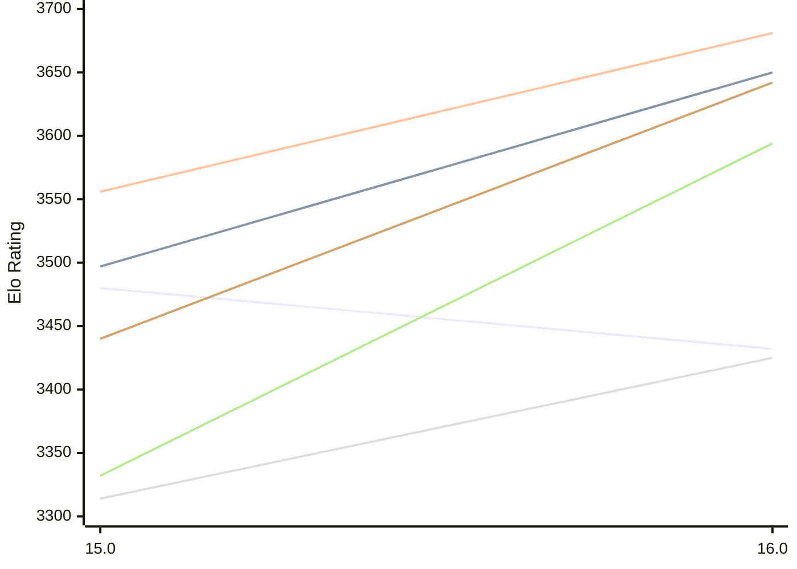
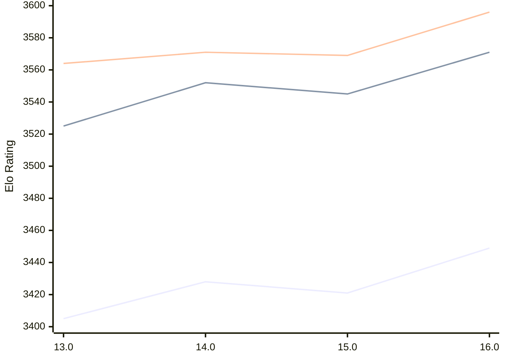

# Engine: Obsidian

Author: Gabriele Lombardo

Home: https://github.com/gab8192/Obsidian

## Elo Ratings E1 (Ultra 7 265T (1.50 GHz) - E-Core)

| Version | Published | STC 8.0+0.08s  | LTC 60.0+0.60s | VLTC 2m24s+1.12s | Comment |
| --- | --- | --- | --- | --- | --- |
| 16.0 | 2025-05-21 | 3432(-48) | 3650(+153) | 3681(+125) |  |
| 15.0 | 2025-01-31 | 3480 | 3497 | 3556 |  |
 | | | cElo (∆ prev) | cElo (∆ prev) | cElo (∆ prev) | 

## Elo Ratings P1 (Ultra 7 265T (1.50 GHz) - P-Core)

| Version | Published | STC 8.0+0.08s  | LTC 60.0+0.60s | VLTC 2m24s+1.12s | Comment |
| --- | --- | --- | --- | --- | --- |
| 16.0 | 2025-05-21 | 3425(+111) | 3594(+262) | 3642(+202) |  |
| 15.0 | 2025-01-31 | 3314 | 3332 | 3440 |  |
 | | | cElo (∆ prev) | cElo (∆ prev) | cElo (∆ prev) | 

## Elo Ratings T1 (i5-7500T 2.70GHz)

| Version | Published | STC 8.0+0.08s  | LTC 60.0+0.60s | VLTC 2m24s+1.12s | Comment |
| --- | --- | --- | --- | --- | --- |
| 16.0 | 2025-05-21 | 3449(+28) | 3571(+26) | 3596(+27) |  |
| 15.0 | 2025-01-31 | 3421(-7) | 3545(-7) | 3569(-2) |  |
| 14.0 | 2024-10-22 | 3428(+23) | 3552(+27) | 3571(+7) |  |
| 13.0 | 2024-07-01 | 3405 | 3525 | 3564 |  |
 | | | cElo (∆ prev) | cElo (∆ prev) | cElo (∆ prev) | 

<a href="https://github.com/computer-chess-index/cci/issues/new?template=submit-version.yml&title=[VERSION]+Obsidian+<version>&body=###%20Engine%20name%0AObsidian%0A%0A###%20Version%0A16.0" target="_blank">Submit new version</a>

 Test Conditions:

GUI/CLI: <a href=https://github.com/cutechess/cutechess target="_blank">Cute-Chess</a> 
Elo Calculation: <a href=https://www.remi-coulom.fr/Bayesian-Elo/ target="_blank">Bayesian-Elo</a> 
CPU for P1: Intel(R) Core(TM) Ultra 7 265T (1.50 GHz) - P-Core 
CPU for E1: Intel(R) Core(TM) Ultra 7 265T (1.50 GHz) - E-Core 
CPU for T1: Intel(R) Core(TM) i5-7500T 2.70GHz 
Opening book: 8_moves_v3 
\* STC: 8.0+0.08s, LTC: 60.0+0.60s, VLTC: 2m24s+1.12s

 Lists:
Ratings: <a href=https://github.com/computer-chess-index/cci/blob/main/lists/CCIRatings.csv target="_blank">Complete list</a>

Generated: 2026-11-14 05:40:22

## Ratings Verlauf E1 / P1

```mermaid
%%{init: {"theme":"base","themeVariables":{"seriesColors:['#a3a3a3','#222221','#faa371']}}}%%
xychart-beta
  x-axis ["15.0", "16.0"]
  y-axis "Elo Rating" 3300 --> 3700
  line "E1: STC (8.0+0.08s)" [3480, 3432]
  line "E1: LTC (60.0+0.60s)" [3497, 3650]
  line "E1: VLTC (2m24s+1.12s)" [3556, 3681]
  line "P1: STC (8.0+0.08s)" [3314, 3425]
  line "P1: LTC (60.0+0.60s)" [3332, 3594]
  line "P1: VLTC (2m24s+1.12s)" [3440, 3642]
```

## Ratings Verlauf T1

```mermaid
%%{init: {"theme":"base","themeVariables":{"seriesColors:['#a3a3a3','#222221','#faa371']}}}%%
xychart-beta
  x-axis ["13.0", "14.0", "15.0", "16.0"]
  y-axis "Elo Rating" 3400 --> 3600
  line "T1: STC (8.0+0.08s)" [3405, 3428, 3421, 3449]
  line "T1: LTC (60.0+0.60s)" [3525, 3552, 3545, 3571]
  line "T1: VLTC (2m24s+1.12s)" [3564, 3571, 3569, 3596]
```

## Detailed Evaluation Results

| Version | Time Control | Variant | Elo  | Range +/- | Matches | Score | Average Opponent Elo | Draws |
| --- | --- |--- | --- | --- | --- | --- | --- | --- |
| 16.0 | VLTC (2m24s+1.12s) | T1 | 3596 | 20 | 564 | 53% | 3579 | 92% |
|  |  | P1 | 3642 | 43 | 124 | 50% | 3640 | 85% |
|  |  | E1 | 3681 | 27 | 298 | 50% | 3683 | 93% |
|  | LTC (60.0+0.60s) | P1 | 3594 | 40 | 144 | 51% | 3588 | 86% |
|  |  | T1 | 3571 | 17 | 800 | 51% | 3564 | 89% |
|  |  | E1 | 3650 | 33 | 214 | 50% | 3646 | 87% |
|  | STC (8.0+0.08s) | P1 | 3425 | 34 | 212 | 49% | 3426 | 77% |
|  |  | T1 | 3449 | 14 | 1196 | 49% | 3451 | 76% |
|  |  | E1 | 3432 | 25 | 384 | 48% | 3448 | 75% |
| --- | --- |--- | --- | --- | --- | --- | --- | --- |
| 15.0 | VLTC (2m24s+1.12s) | T1 | 3569 | 31 | 236 | 51% | 3564 | 89% |
|  |  | P1 | 3440 | 111 | 28 | 77% | 2944 | 46% |
|  |  | E1 | 3556 | 117 | 20 | 70% | 3398 | 60% |
|  | LTC (60.0+0.60s) | P1 | 3332 | 181 | 16 | 91% | 2885 | 19% |
|  |  | T1 | 3545 | 29 | 280 | 50% | 3544 | 84% |
|  |  | E1 | 3497 | 127 | 22 | 80% | 3213 | 41% |
|  | STC (8.0+0.08s) | P1 | 3314 | 184 | 12 | 88% | 2942 | 25% |
|  |  | T1 | 3421 | 27 | 320 | 51% | 3411 | 79% |
|  |  | E1 | 3480 | 103 | 28 | 68% | 3279 | 57% |
| --- | --- |--- | --- | --- | --- | --- | --- | --- |
| 14.0 | VLTC (2m24s+1.12s) | T1 | 3571 | 22 | 492 | 52% | 3560 | 89% |
|  | LTC (60.0+0.60s) | T1 | 3552 | 19 | 644 | 51% | 3544 | 86% |
|  | STC (8.0+0.08s) | T1 | 3428 | 16 | 944 | 50% | 3425 | 78% |
| --- | --- |--- | --- | --- | --- | --- | --- | --- |
| 13.0 | VLTC (2m24s+1.12s) | T1 | 3564 | 38 | 160 | 52% | 3545 | 82% |
|  | LTC (60.0+0.60s) | T1 | 3525 | 34 | 200 | 49% | 3533 | 83% |
|  | STC (8.0+0.08s) | T1 | 3405 | 28 | 332 | 52% | 3393 | 68% |