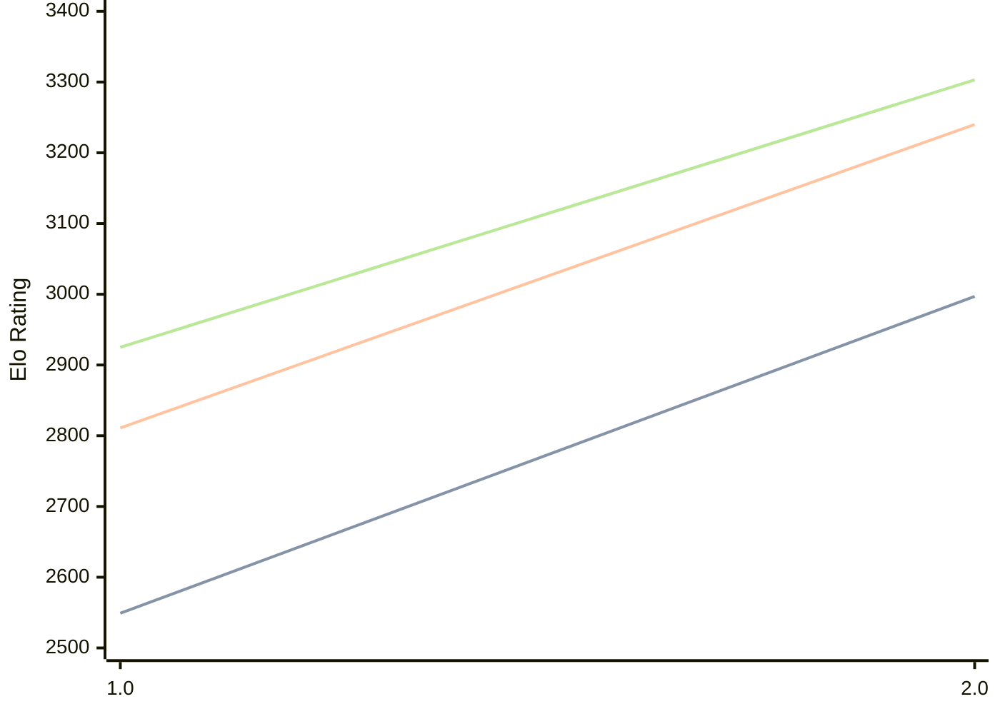

# Engine: Onslaught

Author: Kai Chung

Home: https://github.com/kachhy/Onslaught

## Elo Ratings

| Version | Published | STC 8.0+0.08s  | LTC 60.0+0.60s | VLTC 2m24s+1.12s | Comment |
| --- | --- | --- | --- | --- | --- |
| 2.0 | 2026-09-12 | 2997(+448) | 3240(+429) | 3303(+378) |  |
| 1.0 | 2026-06-02 | 2549 | 2811 | 2925 |  |
 | | | cElo (∆ prev) | cElo (∆ prev) | cElo (∆ prev) | 

<a href="https://github.com/computer-chess-index/cci/issues/new?template=submit-version.yml&title=[VERSION]+Onslaught+<version>&body=###%20Engine%20name%0AOnslaught%0A%0A###%20Version%0A2.0" target="_blank">Submit new version</a>

 Test Conditions:

GUI/CLI: <a href=https://github.com/cutechess/cutechess target="_blank">Cute-Chess</a> 
Elo Calculation: <a href=https://www.remi-coulom.fr/Bayesian-Elo/ target="_blank">Bayesian-Elo</a> 
CPU: Intel(R) Core(TM) i5-7500T 2.70GHz 
Opening book: 8_moves_v3 
\* STC: 8.0+0.08s, LTC: 60.0+0.60s, VLTC: 2m24s+1.12s

 Lists:
Ratings: <a href=https://github.com/computer-chess-index/cci/blob/main/lists/CCIRatings.csv target="_blank">Complete list</a>

Generated: 2026-09-25 04:40:43

## Ratings Verlauf

## Detailed Evaluation Results

| Version | Time Control | Elo  | Range +/- | Matches | Score | Average Opponent Elo | Draws |
| --- | --- | --- | --- | --- | --- | --- | --- |
| 2.0 | VLTC (2m24s+1.12s) | 3303 | 32 | 260 | 53% | 3279 | 65% |
| 2.0 | LTC (60.0+0.60s) | 3240 | 30 | 302 | 53% | 3217 | 62% |
| 2.0 | STC (8.0+0.08s) | 2997 | 36 | 228 | 51% | 2984 | 44% |
| --- | --- | --- | --- | --- | --- | --- | --- |
| 1.0 | VLTC (2m24s+1.12s) | 2925 | 29 | 364 | 51% | 2919 | 45% |
| 1.0 | LTC (60.0+0.60s) | 2811 | 31 | 324 | 51% | 2795 | 43% |
| 1.0 | STC (8.0+0.08s) | 2549 | 30 | 372 | 50% | 2546 | 33% |
| --- | --- | --- | --- | --- | --- | --- | --- |