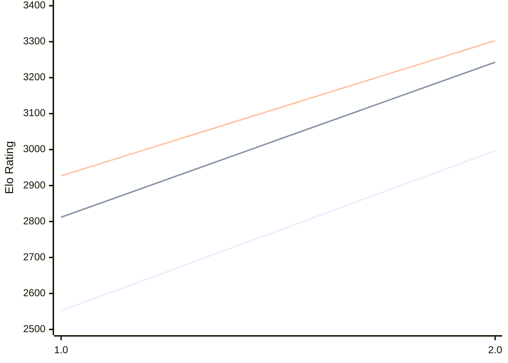

# Engine: Onslaught

Author: Kai Chung

Home: https://github.com/kachhy/Onslaught

## Elo Ratings E1 (Ultra 7 265T (1.50 GHz) - E-Core)

| Version | Published | STC 8.0+0.08s  | LTC 60.0+0.60s | VLTC 2m24s+1.12s | Comment |
| --- | --- | --- | --- | --- | --- |
| 2.0 | 2026-09-12 | 2935 | 3236 | 3306 |  |
 | | | cElo (∆ prev) | cElo (∆ prev) | cElo (∆ prev) | 

## Elo Ratings P1 (Ultra 7 265T (1.50 GHz) - P-Core)

| Version | Published | STC 8.0+0.08s  | LTC 60.0+0.60s | VLTC 2m24s+1.12s | Comment |
| --- | --- | --- | --- | --- | --- |
| 2.0 | 2026-09-12 | 3035 | 3372 | 3425 |  |
 | | | cElo (∆ prev) | cElo (∆ prev) | cElo (∆ prev) | 

## Elo Ratings T1 (i5-7500T 2.70GHz)

| Version | Published | STC 8.0+0.08s  | LTC 60.0+0.60s | VLTC 2m24s+1.12s | Comment |
| --- | --- | --- | --- | --- | --- |
| 2.0 | 2026-09-12 | 2997(+445) | 3243(+431) | 3303(+376) |  |
| 1.0 | 2026-06-02 | 2552 | 2812 | 2927 |  |
 | | | cElo (∆ prev) | cElo (∆ prev) | cElo (∆ prev) | 

<a href="https://github.com/computer-chess-index/cci/issues/new?template=submit-version.yml&title=[VERSION]+Onslaught+<version>&body=###%20Engine%20name%0AOnslaught%0A%0A###%20Version%0A2.0" target="_blank">Submit new version</a>

 Test Conditions:

GUI/CLI: <a href=https://github.com/cutechess/cutechess target="_blank">Cute-Chess</a> 
Elo Calculation: <a href=https://www.remi-coulom.fr/Bayesian-Elo/ target="_blank">Bayesian-Elo</a> 
CPU for P1: Intel(R) Core(TM) Ultra 7 265T (1.50 GHz) - P-Core 
CPU for E1: Intel(R) Core(TM) Ultra 7 265T (1.50 GHz) - E-Core 
CPU for T1: Intel(R) Core(TM) i5-7500T 2.70GHz 
Opening book: 8_moves_v3 
\* STC: 8.0+0.08s, LTC: 60.0+0.60s, VLTC: 2m24s+1.12s

 Lists:
Ratings: <a href=https://github.com/computer-chess-index/cci/blob/main/lists/CCIRatings.csv target="_blank">Complete list</a>

Generated: 2026-10-21 04:41:09

## Ratings Verlauf T1

```mermaid
%%{init: {"theme":"base","themeVariables":{"seriesColors:['#a3a3a3','#222221','#faa371']}}}%%
xychart-beta
  x-axis ["1.0", "2.0"]
  y-axis "Elo Rating" 2500 --> 3400
  line "T1: STC (8.0+0.08s)" [2552, 2997]
  line "T1: LTC (60.0+0.60s)" [2812, 3243]
  line "T1: VLTC (2m24s+1.12s)" [2927, 3303]
```

## Detailed Evaluation Results

| Version | Time Control | Variant | Elo  | Range +/- | Matches | Score | Average Opponent Elo | Draws |
| --- | --- |--- | --- | --- | --- | --- | --- | --- |
| 2.0 | VLTC (2m24s+1.12s) | T1 | 3303 | 32 | 264 | 53% | 3282 | 65% |
|  |  | P1 | 3425 | 33 | 244 | 48% | 3443 | 61% |
|  |  | E1 | 3306 | 30 | 284 | 48% | 3325 | 62% |
|  | LTC (60.0+0.60s) | T1 | 3243 | 29 | 314 | 53% | 3220 | 61% |
|  |  | P1 | 3372 | 35 | 228 | 51% | 3366 | 57% |
|  |  | E1 | 3236 | 28 | 348 | 47% | 3259 | 54% |
|  | STC (8.0+0.08s) | T1 | 2997 | 36 | 232 | 51% | 2986 | 45% |
|  |  | P1 | 3035 | 33 | 284 | 48% | 3056 | 41% |
|  |  | E1 | 2935 | 32 | 294 | 45% | 2974 | 47% |
| --- | --- |--- | --- | --- | --- | --- | --- | --- |
| 1.0 | VLTC (2m24s+1.12s) | T1 | 2927 | 29 | 364 | 51% | 2920 | 45% |
|  | LTC (60.0+0.60s) | T1 | 2812 | 31 | 324 | 51% | 2797 | 43% |
|  | STC (8.0+0.08s) | T1 | 2552 | 30 | 372 | 50% | 2547 | 33% |