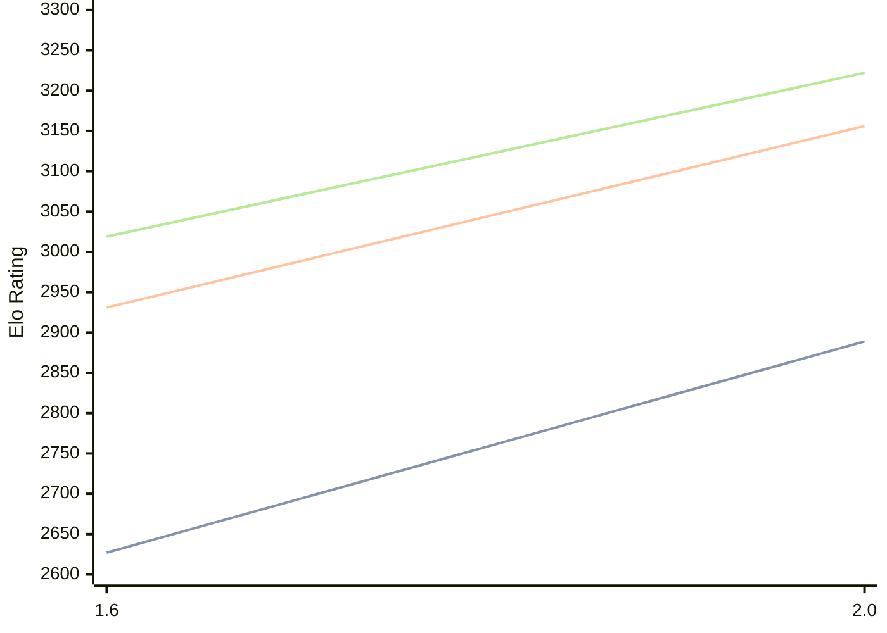

# Engine: Onyx

Author: Dylan Hogarth

Home: https://github.com/dylan2554/onyx

## Elo Ratings

| Version | Published | STC 8.0+0.08s  | LTC 60.0+0.60s | VLTC 2m24s+1.12s | Comment |
| --- | --- | --- | --- | --- | --- |
| 2.0 | 2026-07-12 | 2889(+262) | 3156(+225) | 3222(+203) |  |
| 1.6 | 2026-06-13 | 2627 | 2931 | 3019 |  |
 | | | cElo (∆ prev) | cElo (∆ prev) | cElo (∆ prev) | 

<a href="https://github.com/computer-chess-index/cci/issues/new?template=submit-version.yml&title=[VERSION]+Onyx+<version>&body=###%20Engine%20name%0AOnyx%0A%0A###%20Version%0A2.0" target="_blank">Submit new version</a>

 Test Conditions:

GUI/CLI: <a href=https://github.com/cutechess/cutechess target="_blank">Cute-Chess</a> 
Elo Calculation: <a href=https://www.remi-coulom.fr/Bayesian-Elo/ target="_blank">Bayesian-Elo</a> 
CPU: Intel(R) Core(TM) i5-7500T 2.70GHz 
Opening book: 8_moves_v3 
\* STC: 8.0+0.08s, LTC: 60.0+0.60s, VLTC: 2m24s+1.12s

 Lists:
Ratings: <a href=https://github.com/computer-chess-index/cci/blob/main/lists/CCIRatings.csv target="_blank">Complete list</a>

Generated: 2026-08-27 07:37:07

## Ratings Verlauf

## Detailed Evaluation Results

| Version | Time Control | Elo  | Range +/- | Matches | Score | Average Opponent Elo | Draws |
| --- | --- | --- | --- | --- | --- | --- | --- |
| 2.0 | VLTC (2m24s+1.12s) | 3222 | 30 | 296 | 49% | 3225 | 57% |
| 2.0 | LTC (60.0+0.60s) | 3156 | 30 | 314 | 50% | 3155 | 51% |
| 2.0 | STC (8.0+0.08s) | 2889 | 31 | 318 | 49% | 2894 | 39% |
| --- | --- | --- | --- | --- | --- | --- | --- |
| 1.6 | VLTC (2m24s+1.12s) | 3019 | 32 | 296 | 48% | 3035 | 40% |
| 1.6 | LTC (60.0+0.60s) | 2931 | 34 | 264 | 46% | 2963 | 41% |
| 1.6 | STC (8.0+0.08s) | 2627 | 34 | 276 | 50% | 2633 | 33% |
| --- | --- | --- | --- | --- | --- | --- | --- |