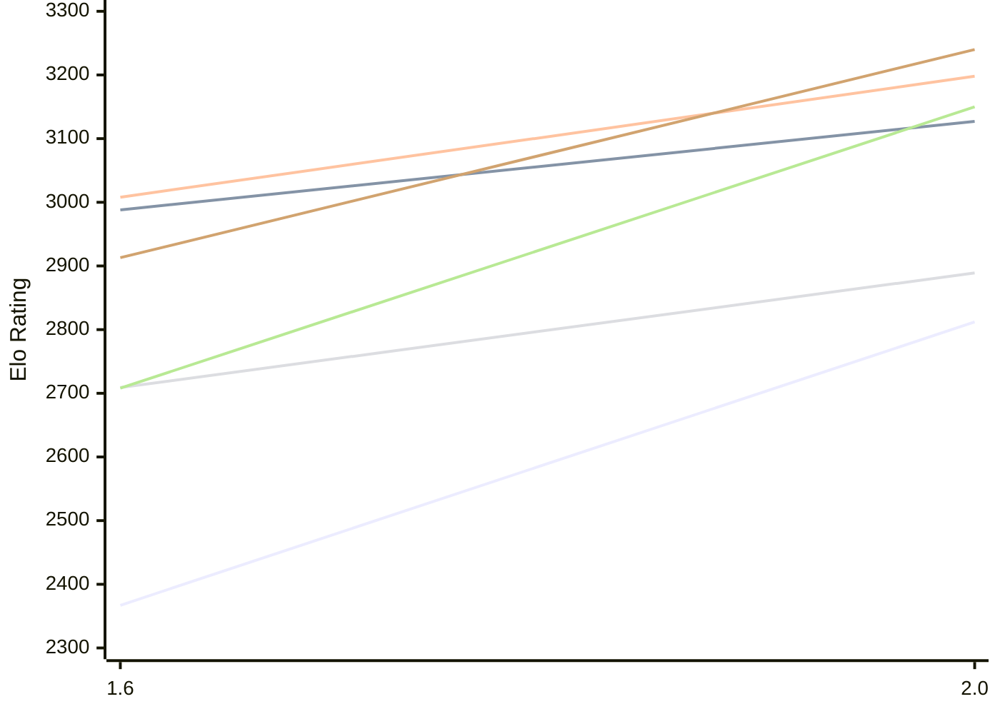
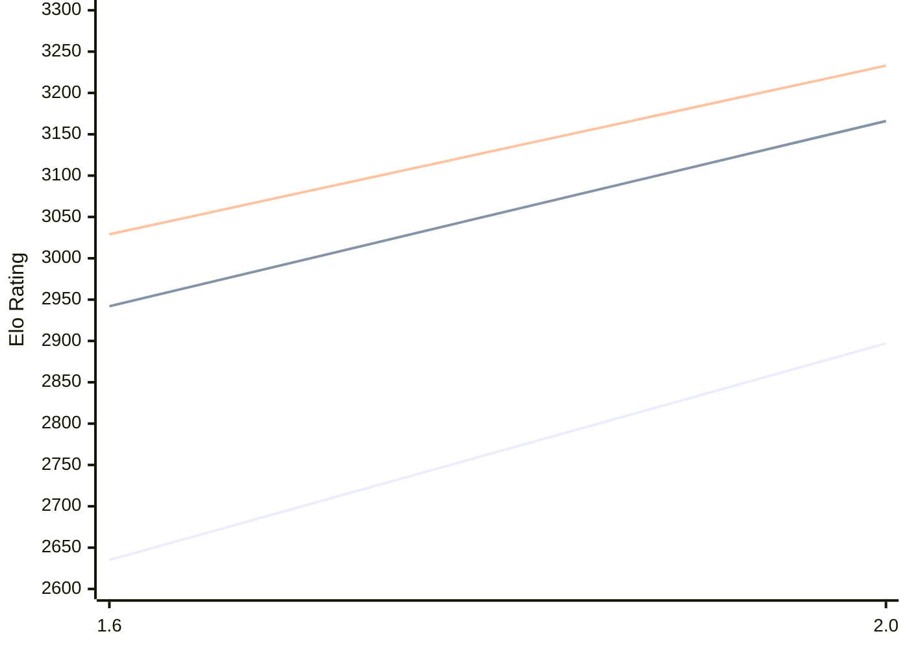

# Engine: Onyx

Author: Dylan Hogarth

Home: https://github.com/dylan2554/onyx

## Elo Ratings E1 (Ultra 7 265T (1.50 GHz) - E-Core)

| Version | Published | STC 8.0+0.08s  | LTC 60.0+0.60s | VLTC 2m24s+1.12s | Comment |
| --- | --- | --- | --- | --- | --- |
| 2.0 | 2026-07-12 | 2812(+445) | 3127(+139) | 3198(+190) |  |
| 1.6 | 2026-06-13 | 2367 | 2988 | 3008 |  |
 | | | cElo (∆ prev) | cElo (∆ prev) | cElo (∆ prev) | 

## Elo Ratings P1 (Ultra 7 265T (1.50 GHz) - P-Core)

| Version | Published | STC 8.0+0.08s  | LTC 60.0+0.60s | VLTC 2m24s+1.12s | Comment |
| --- | --- | --- | --- | --- | --- |
| 2.0 | 2026-07-12 | 2889(+180) | 3150(+442) | 3240(+327) |  |
| 1.6 | 2026-06-13 | 2709 | 2708 | 2913 |  |
 | | | cElo (∆ prev) | cElo (∆ prev) | cElo (∆ prev) | 

## Elo Ratings T1 (i5-7500T 2.70GHz)

| Version | Published | STC 8.0+0.08s  | LTC 60.0+0.60s | VLTC 2m24s+1.12s | Comment |
| --- | --- | --- | --- | --- | --- |
| 2.0 | 2026-07-12 | 2897(+262) | 3166(+224) | 3233(+204) |  |
| 1.6 | 2026-06-13 | 2635 | 2942 | 3029 |  |
 | | | cElo (∆ prev) | cElo (∆ prev) | cElo (∆ prev) | 

<a href="https://github.com/computer-chess-index/cci/issues/new?template=submit-version.yml&title=[VERSION]+Onyx+<version>&body=###%20Engine%20name%0AOnyx%0A%0A###%20Version%0A2.0" target="_blank">Submit new version</a>

 Test Conditions:

GUI/CLI: <a href=https://github.com/cutechess/cutechess target="_blank">Cute-Chess</a> 
Elo Calculation: <a href=https://www.remi-coulom.fr/Bayesian-Elo/ target="_blank">Bayesian-Elo</a> 
CPU for P1: Intel(R) Core(TM) Ultra 7 265T (1.50 GHz) - P-Core 
CPU for E1: Intel(R) Core(TM) Ultra 7 265T (1.50 GHz) - E-Core 
CPU for T1: Intel(R) Core(TM) i5-7500T 2.70GHz 
Opening book: 8_moves_v3 
\* STC: 8.0+0.08s, LTC: 60.0+0.60s, VLTC: 2m24s+1.12s

 Lists:
Ratings: <a href=https://github.com/computer-chess-index/cci/blob/main/lists/CCIRatings.csv target="_blank">Complete list</a>

Generated: 2026-11-13 05:40:50

## Ratings Verlauf E1 / P1

```mermaid
%%{init: {"theme":"base","themeVariables":{"seriesColors:['#a3a3a3','#222221','#faa371']}}}%%
xychart-beta
  x-axis ["1.6", "2.0"]
  y-axis "Elo Rating" 2300 --> 3300
  line "E1: STC (8.0+0.08s)" [2367, 2812]
  line "E1: LTC (60.0+0.60s)" [2988, 3127]
  line "E1: VLTC (2m24s+1.12s)" [3008, 3198]
  line "P1: STC (8.0+0.08s)" [2709, 2889]
  line "P1: LTC (60.0+0.60s)" [2708, 3150]
  line "P1: VLTC (2m24s+1.12s)" [2913, 3240]
```

## Ratings Verlauf T1

```mermaid
%%{init: {"theme":"base","themeVariables":{"seriesColors:['#a3a3a3','#222221','#faa371']}}}%%
xychart-beta
  x-axis ["1.6", "2.0"]
  y-axis "Elo Rating" 2600 --> 3300
  line "T1: STC (8.0+0.08s)" [2635, 2897]
  line "T1: LTC (60.0+0.60s)" [2942, 3166]
  line "T1: VLTC (2m24s+1.12s)" [3029, 3233]
```

## Detailed Evaluation Results

| Version | Time Control | Variant | Elo  | Range +/- | Matches | Score | Average Opponent Elo | Draws |
| --- | --- |--- | --- | --- | --- | --- | --- | --- |
| 2.0 | VLTC (2m24s+1.12s) | T1 | 3233 | 28 | 342 | 50% | 3235 | 58% |
|  |  | P1 | 3240 | 31 | 278 | 50% | 3241 | 60% |
|  |  | E1 | 3198 | 25 | 436 | 47% | 3222 | 55% |
|  | LTC (60.0+0.60s) | T1 | 3166 | 29 | 346 | 50% | 3164 | 51% |
|  |  | P1 | 3150 | 31 | 300 | 48% | 3164 | 50% |
|  |  | E1 | 3127 | 27 | 408 | 47% | 3150 | 50% |
|  | STC (8.0+0.08s) | T1 | 2897 | 29 | 370 | 49% | 2904 | 40% |
|  |  | P1 | 2889 | 33 | 288 | 50% | 2897 | 40% |
|  |  | E1 | 2812 | 26 | 464 | 46% | 2831 | 39% |
| --- | --- |--- | --- | --- | --- | --- | --- | --- |
| 1.6 | VLTC (2m24s+1.12s) | P1 | 2913 | 167 | 16 | 75% | 2418 | 25% |
|  |  | E1 | 3008 | 137 | 28 | 75% | 2553 | 14% |
|  |  | T1 | 3029 | 32 | 296 | 48% | 3044 | 40% |
|  | LTC (60.0+0.60s) | E1 | 2988 | 145 | 20 | 50% | 3006 | 20% |
|  |  | T1 | 2942 | 34 | 264 | 46% | 2973 | 41% |
|  |  | P1 | 2708 | 179 | 16 | 69% | 2489 | 13% |
|  | STC (8.0+0.08s) | E1 | 2367 | 120 | 28 | 39% | 2468 | 14% |
|  |  | T1 | 2635 | 34 | 276 | 50% | 2641 | 33% |
|  |  | P1 | 2709 | 283 | 8 | 50% | 2691 | 0% |