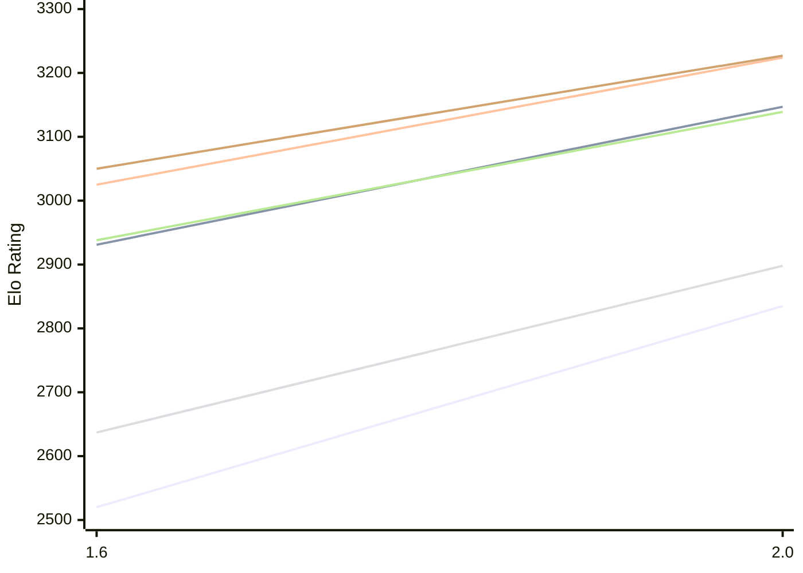
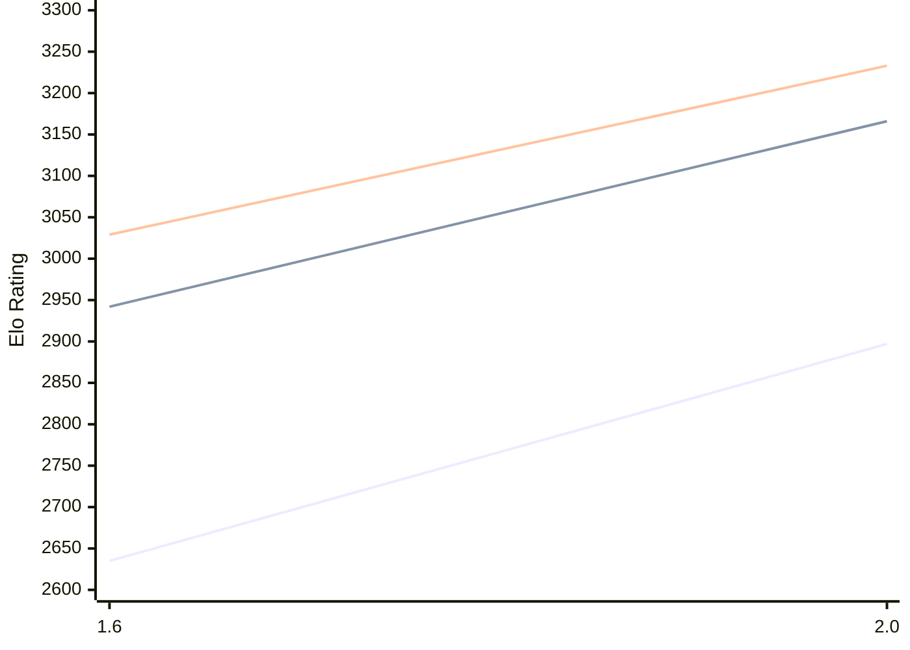

# Engine: Onyx

Author: Dylan Hogarth

Home: https://github.com/dylan2554/onyx

## Elo Ratings E1 (Ultra 7 265T (1.50 GHz) - E-Core)

| Version | Published | STC 8.0+0.08s  | LTC 60.0+0.60s | VLTC 2m24s+1.12s | Comment |
| --- | --- | --- | --- | --- | --- |
| 2.0 | 2026-07-12 | 2835(+315) | 3147(+216) | 3224(+199) |  |
| 1.6 | 2026-06-13 | 2520 | 2931 | 3025 |  |
 | | | cElo (∆ prev) | cElo (∆ prev) | cElo (∆ prev) | 

## Elo Ratings P1 (Ultra 7 265T (1.50 GHz) - P-Core)

| Version | Published | STC 8.0+0.08s  | LTC 60.0+0.60s | VLTC 2m24s+1.12s | Comment |
| --- | --- | --- | --- | --- | --- |
| 2.0 | 2026-07-12 | 2898(+261) | 3139(+201) | 3227(+177) |  |
| 1.6 | 2026-06-13 | 2637 | 2938 | 3050 |  |
 | | | cElo (∆ prev) | cElo (∆ prev) | cElo (∆ prev) | 

## Elo Ratings T1 (i5-7500T 2.70GHz)

| Version | Published | STC 8.0+0.08s  | LTC 60.0+0.60s | VLTC 2m24s+1.12s | Comment |
| --- | --- | --- | --- | --- | --- |
| 2.0 | 2026-07-12 | 2897(+262) | 3166(+224) | 3233(+204) |  |
| 1.6 | 2026-06-13 | 2635 | 2942 | 3029 |  |
 | | | cElo (∆ prev) | cElo (∆ prev) | cElo (∆ prev) | 

<a href="https://github.com/computer-chess-index/cci/issues/new?template=submit-version.yml&title=[VERSION]+Onyx+<version>&body=###%20Engine%20name%0AOnyx%0A%0A###%20Version%0A2.0" target="_blank">Submit new version</a>

 Test Conditions:

GUI/CLI: <a href=https://github.com/cutechess/cutechess target="_blank">Cute-Chess</a> 
Elo Calculation: <a href=https://www.remi-coulom.fr/Bayesian-Elo/ target="_blank">Bayesian-Elo</a> 
CPU for P1: Intel(R) Core(TM) Ultra 7 265T (1.50 GHz) - P-Core 
CPU for E1: Intel(R) Core(TM) Ultra 7 265T (1.50 GHz) - E-Core 
CPU for T1: Intel(R) Core(TM) i5-7500T 2.70GHz 
Opening book: 8_moves_v3 
\* STC: 8.0+0.08s, LTC: 60.0+0.60s, VLTC: 2m24s+1.12s

 Lists:
Ratings: <a href=https://github.com/computer-chess-index/cci/blob/main/lists/CCIRatings.csv target="_blank">Complete list</a>

Generated: 2026-11-25 05:41:04

## Ratings Verlauf E1 / P1

```mermaid
%%{init: {"theme":"base","themeVariables":{"seriesColors:['#a3a3a3','#222221','#faa371']}}}%%
xychart-beta
  x-axis ["1.6", "2.0"]
  y-axis "Elo Rating" 2500 --> 3300
  line "E1: STC (8.0+0.08s)" [2520, 2835]
  line "E1: LTC (60.0+0.60s)" [2931, 3147]
  line "E1: VLTC (2m24s+1.12s)" [3025, 3224]
  line "P1: STC (8.0+0.08s)" [2637, 2898]
  line "P1: LTC (60.0+0.60s)" [2938, 3139]
  line "P1: VLTC (2m24s+1.12s)" [3050, 3227]
```

## Ratings Verlauf T1

```mermaid
%%{init: {"theme":"base","themeVariables":{"seriesColors:['#a3a3a3','#222221','#faa371']}}}%%
xychart-beta
  x-axis ["1.6", "2.0"]
  y-axis "Elo Rating" 2600 --> 3300
  line "T1: STC (8.0+0.08s)" [2635, 2897]
  line "T1: LTC (60.0+0.60s)" [2942, 3166]
  line "T1: VLTC (2m24s+1.12s)" [3029, 3233]
```

## Detailed Evaluation Results

| Version | Time Control | Variant | Elo  | Range +/- | Matches | Score | Average Opponent Elo | Draws |
| --- | --- |--- | --- | --- | --- | --- | --- | --- |
| 2.0 | VLTC (2m24s+1.12s) | E1 | 3224 | 25 | 464 | 48% | 3245 | 54% |
|  |  | T1 | 3233 | 28 | 342 | 50% | 3235 | 58% |
|  |  | P1 | 3227 | 31 | 286 | 50% | 3227 | 60% |
|  | LTC (60.0+0.60s) | T1 | 3166 | 29 | 346 | 50% | 3164 | 51% |
|  |  | P1 | 3139 | 29 | 336 | 47% | 3162 | 48% |
|  |  | E1 | 3147 | 25 | 452 | 47% | 3171 | 49% |
|  | STC (8.0+0.08s) | T1 | 2897 | 29 | 370 | 49% | 2904 | 40% |
|  |  | P1 | 2898 | 31 | 336 | 48% | 2928 | 40% |
|  |  | E1 | 2835 | 24 | 544 | 47% | 2853 | 38% |
| --- | --- |--- | --- | --- | --- | --- | --- | --- |
| 1.6 | VLTC (2m24s+1.12s) | T1 | 3029 | 32 | 296 | 48% | 3044 | 40% |
|  |  | P1 | 3050 | 63 | 84 | 53% | 2946 | 39% |
|  |  | E1 | 3025 | 52 | 124 | 55% | 2917 | 35% |
|  | LTC (60.0+0.60s) | T1 | 2942 | 34 | 264 | 46% | 2973 | 41% |
|  |  | P1 | 2938 | 65 | 84 | 57% | 2850 | 31% |
|  |  | E1 | 2931 | 58 | 102 | 47% | 2966 | 30% |
|  | STC (8.0+0.08s) | T1 | 2635 | 34 | 276 | 50% | 2641 | 33% |
|  |  | P1 | 2637 | 54 | 112 | 46% | 2689 | 36% |
|  |  | E1 | 2520 | 50 | 140 | 55% | 2466 | 23% |