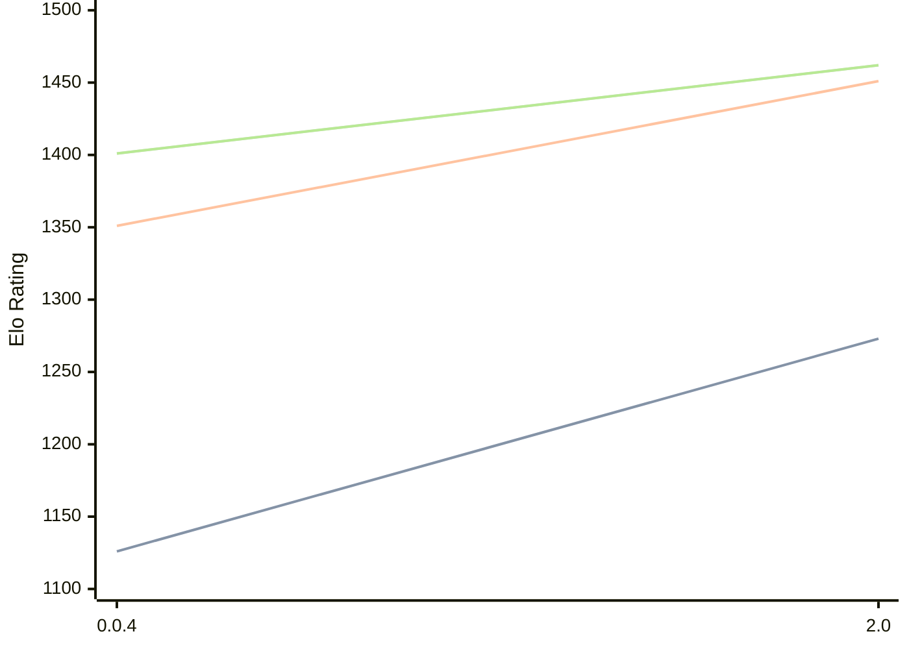

# Engine: Oops!Mate

Author: Swoyam Pokharel

Home: https://github.com/PS-Wizard/OopsMate

## Elo Ratings

| Version | Published | STC 8.0+0.08s  | LTC 60.0+0.60s | VLTC 2m24s+1.12s | Comment |
| --- | --- | --- | --- | --- | --- |
| 2.0 | 2026-05-12 |  |  |  |  |
| 16.0 | 2026-02-06 |  |  |  |  |
| 15.0 | 2026-02-06 |  |  |  | eval pending* |
| 14.0 | 2026-02-06 |  |  |  |  |
| 13.0 | 2026-02-05 |  |  |  |  |
| 12.0 | 2026-02-05 |  |  |  |  |
| 11.0 | 2026-02-04 |  |  |  |  |
| 10.0 | 2026-02-03 |  |  |  |  |
| 9.0 | 2026-02-03 |  |  |  |  |
| 8.0 | 2026-02-02 |  |  |  |  |
| 7.0 | 2026-02-02 |  |  |  |  |
| 6.0 | 2026-02-02 |  |  |  |  |
| 5.0 | 2026-01-31 |  |  |  |  |
| 4.0 | 2026-01-31 |  |  |  |  |
| 3.0 | 2026-01-31 |  |  |  |  |
| 2.0 | 2026-01-30 | 1273(+new) | 1451(+new) | 1462(+new) |  |
| 1.0 | 2026-01-30 |  |  |  |  |
| 0.0.4 | 2025-11-23 | 1126(+new) | 1351(+new) | 1401(+new) |  |
| 0.0.3 | 2025-11-13 |  |  |  |  |
| 0.0.2 | 2025-11-04 |  |  |  |  |
| 0.0.1 | 2025-11-04 |  |  |  |  |
| 0.0.0 | 2025-11-02 |  |  |  |  |
 | | | cElo (∆ prev) | cElo (∆ prev) | cElo (∆ prev) | 

<a href="https://github.com/computer-chess-index/cci/issues/new?template=submit-version.yml&title=[VERSION]+Oops!Mate+<version>&body=###%20Engine%20name%0AOops!Mate%0A%0A###%20Version%0A2.0" target="_blank">Submit new version</a>

 Test Conditions:

GUI/CLI: <a href=https://github.com/cutechess/cutechess target="_blank">Cute-Chess</a> 
Elo Calculation: <a href=https://www.remi-coulom.fr/Bayesian-Elo/ target="_blank">Bayesian-Elo</a> 
CPU: Intel(R) Core(TM) i5-7500T 2.70GHz 
Opening book: 8_moves_v3 
\* STC: 8.0+0.08s, LTC: 60.0+0.60s, VLTC: 2m24s+1.12s

 Lists:
Ratings: <a href=https://github.com/computer-chess-index/cci/blob/main/lists/CCIRatings.csv target="_blank">Complete list</a>

Generated: 2026-07-16 06:26:58

## Ratings Verlauf

## Ratings Verlauf

⬛ STC (8.0+0.08s) &nbsp;&nbsp; 🟧 LTC (60.0+0.60s) &nbsp;&nbsp; 🟩 VLTC (2m24s+1.12s)

dark mode: 🟩STC (8.0+0.08s) 🟧LTC (60.0+0.60s) ⬜VLTC (2m24s+1.12s)

## Detailed Evaluation Results

| Version | Time Control | Elo  | Range +/- | Matches | Score | Average Opponent Elo | Draws |
| --- | --- | --- | --- | --- | --- | --- | --- |
| 2.0 | VLTC (2m24s+1.12s) | 1462 | 29 | 408 | 52% | 1438 | 30% |
| 2.0 | LTC (60.0+0.60s) | 1451 | 28 | 462 | 51% | 1427 | 27% |
| 2.0 | STC (8.0+0.08s) | 1273 | 28 | 498 | 57% | 1152 | 27% |
| --- | --- | --- | --- | --- | --- | --- | --- |
| 0.0.4 | VLTC (2m24s+1.12s) | 1401 | 43 | 190 | 42% | 1544 | 34% |
| 0.0.4 | LTC (60.0+0.60s) | 1351 | 41 | 200 | 45% | 1439 | 32% |
| 0.0.4 | STC (8.0+0.08s) | 1126 | 43 | 198 | 43% | 1224 | 26% |
| --- | --- | --- | --- | --- | --- | --- | --- |