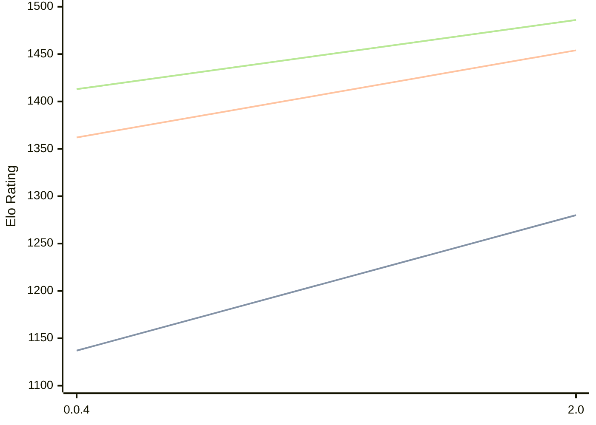

# Engine: Oops!Mate

Author: Swoyam Pokharel

Home: https://github.com/PS-Wizard/OopsMate

## Elo Ratings

| Version | Published | STC 8.0+0.08s  | LTC 60.0+0.60s | VLTC 2m24s+1.12s | Comment |
| --- | --- | --- | --- | --- | --- |
| 2.0 | 2026-01-30 | 1280(+143) | 1454(+92) | 1486(+73) |  |
| 0.0.4 | 2025-11-23 | 1137(+new) | 1362(+new) | 1413(+new) |  |
| 0.0.3 | 2025-11-13 |  |  |  |  |
 | | | cElo (∆ prev) | cElo (∆ prev) | cElo (∆ prev) | 

<a href="https://github.com/computer-chess-index/cci/issues/new?template=submit-version.yml&title=[VERSION]+Oops!Mate+<version>&body=###%20Engine%20name%0AOops!Mate%0A%0A###%20Version%0A2.0" target="_blank">Submit new version</a>

 Test Conditions:

GUI/CLI: <a href=https://github.com/cutechess/cutechess target="_blank">Cute-Chess</a> 
Elo Calculation: <a href=https://www.remi-coulom.fr/Bayesian-Elo/ target="_blank">Bayesian-Elo</a> 
CPU: Intel(R) Core(TM) i5-7500T 2.70GHz 
Opening book: 8_moves_v3 
\* STC: 8.0+0.08s, LTC: 60.0+0.60s, VLTC: 2m24s+1.12s

 Lists:
Ratings: <a href=https://github.com/computer-chess-index/cci/blob/main/lists/CCIRatings.csv target="_blank">Complete list</a>

Generated: 2026-09-06 04:37:08

## Ratings Verlauf

## Detailed Evaluation Results

| Version | Time Control | Elo  | Range +/- | Matches | Score | Average Opponent Elo | Draws |
| --- | --- | --- | --- | --- | --- | --- | --- |
| 2.0 | VLTC (2m24s+1.12s) | 1486 | 28 | 444 | 53% | 1454 | 30% |
| 2.0 | LTC (60.0+0.60s) | 1454 | 27 | 492 | 51% | 1439 | 27% |
| 2.0 | STC (8.0+0.08s) | 1280 | 26 | 546 | 57% | 1169 | 28% |
| --- | --- | --- | --- | --- | --- | --- | --- |
| 0.0.4 | VLTC (2m24s+1.12s) | 1413 | 43 | 190 | 42% | 1557 | 34% |
| 0.0.4 | LTC (60.0+0.60s) | 1362 | 41 | 200 | 45% | 1451 | 32% |
| 0.0.4 | STC (8.0+0.08s) | 1137 | 43 | 198 | 43% | 1237 | 26% |
| --- | --- | --- | --- | --- | --- | --- | --- |