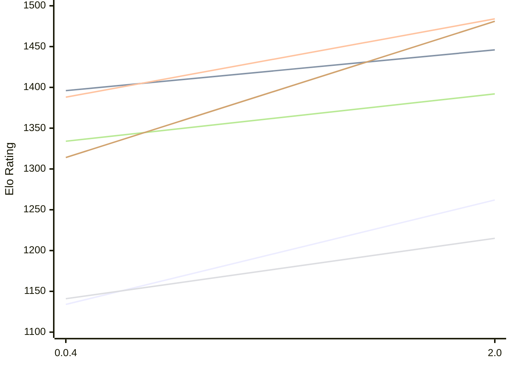
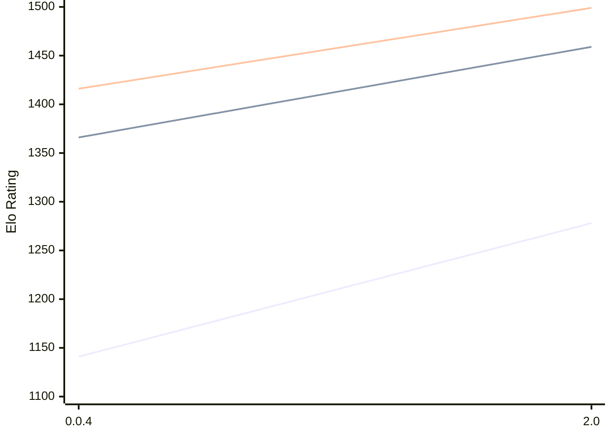

# Engine: Oops!Mate

Author: Swoyam Pokharel

Home: https://github.com/PS-Wizard/OopsMate

## Elo Ratings E1 (Ultra 7 265T (1.50 GHz) - E-Core)

| Version | Published | STC 8.0+0.08s  | LTC 60.0+0.60s | VLTC 2m24s+1.12s | Comment |
| --- | --- | --- | --- | --- | --- |
| 2.0 | 2026-01-30 | 1262(+128) | 1446(+50) | 1484(+96) |  |
| 0.0.4 | 2025-11-23 | 1134 | 1396 | 1388 |  |
 | | | cElo (∆ prev) | cElo (∆ prev) | cElo (∆ prev) | 

## Elo Ratings P1 (Ultra 7 265T (1.50 GHz) - P-Core)

| Version | Published | STC 8.0+0.08s  | LTC 60.0+0.60s | VLTC 2m24s+1.12s | Comment |
| --- | --- | --- | --- | --- | --- |
| 2.0 | 2026-01-30 | 1215(+74) | 1392(+58) | 1481(+167) |  |
| 0.0.4 | 2025-11-23 | 1141 | 1334 | 1314 |  |
 | | | cElo (∆ prev) | cElo (∆ prev) | cElo (∆ prev) | 

## Elo Ratings T1 (i5-7500T 2.70GHz)

| Version | Published | STC 8.0+0.08s  | LTC 60.0+0.60s | VLTC 2m24s+1.12s | Comment |
| --- | --- | --- | --- | --- | --- |
| 2.0 | 2026-01-30 | 1278(+137) | 1459(+93) | 1499(+83) |  |
| 0.0.4 | 2025-11-23 | 1141 | 1366 | 1416 |  |
 | | | cElo (∆ prev) | cElo (∆ prev) | cElo (∆ prev) | 

<a href="https://github.com/computer-chess-index/cci/issues/new?template=submit-version.yml&title=[VERSION]+Oops!Mate+<version>&body=###%20Engine%20name%0AOops!Mate%0A%0A###%20Version%0A2.0" target="_blank">Submit new version</a>

 Test Conditions:

GUI/CLI: <a href=https://github.com/cutechess/cutechess target="_blank">Cute-Chess</a> 
Elo Calculation: <a href=https://www.remi-coulom.fr/Bayesian-Elo/ target="_blank">Bayesian-Elo</a> 
CPU for P1: Intel(R) Core(TM) Ultra 7 265T (1.50 GHz) - P-Core 
CPU for E1: Intel(R) Core(TM) Ultra 7 265T (1.50 GHz) - E-Core 
CPU for T1: Intel(R) Core(TM) i5-7500T 2.70GHz 
Opening book: 8_moves_v3 
\* STC: 8.0+0.08s, LTC: 60.0+0.60s, VLTC: 2m24s+1.12s

 Lists:
Ratings: <a href=https://github.com/computer-chess-index/cci/blob/main/lists/CCIRatings.csv target="_blank">Complete list</a>

Generated: 2026-11-24 05:40:59

## Ratings Verlauf E1 / P1

```mermaid
%%{init: {"theme":"base","themeVariables":{"seriesColors:['#a3a3a3','#222221','#faa371']}}}%%
xychart-beta
  x-axis ["0.0.4", "2.0"]
  y-axis "Elo Rating" 1100 --> 1500
  line "E1: STC (8.0+0.08s)" [1134, 1262]
  line "E1: LTC (60.0+0.60s)" [1396, 1446]
  line "E1: VLTC (2m24s+1.12s)" [1388, 1484]
  line "P1: STC (8.0+0.08s)" [1141, 1215]
  line "P1: LTC (60.0+0.60s)" [1334, 1392]
  line "P1: VLTC (2m24s+1.12s)" [1314, 1481]
```

## Ratings Verlauf T1

```mermaid
%%{init: {"theme":"base","themeVariables":{"seriesColors:['#a3a3a3','#222221','#faa371']}}}%%
xychart-beta
  x-axis ["0.0.4", "2.0"]
  y-axis "Elo Rating" 1100 --> 1500
  line "T1: STC (8.0+0.08s)" [1141, 1278]
  line "T1: LTC (60.0+0.60s)" [1366, 1459]
  line "T1: VLTC (2m24s+1.12s)" [1416, 1499]
```

## Detailed Evaluation Results

| Version | Time Control | Variant | Elo  | Range +/- | Matches | Score | Average Opponent Elo | Draws |
| --- | --- |--- | --- | --- | --- | --- | --- | --- |
| 2.0 | VLTC (2m24s+1.12s) | P1 | 1481 | 41 | 192 | 50% | 1480 | 33% |
|  |  | E1 | 1484 | 31 | 348 | 49% | 1517 | 30% |
|  |  | T1 | 1499 | 27 | 468 | 54% | 1459 | 30% |
|  | LTC (60.0+0.60s) | P1 | 1392 | 43 | 188 | 44% | 1501 | 32% |
|  |  | E1 | 1446 | 32 | 334 | 47% | 1523 | 30% |
|  |  | T1 | 1459 | 27 | 508 | 51% | 1445 | 28% |
|  | STC (8.0+0.08s) | P1 | 1215 | 37 | 224 | 51% | 1204 | 38% |
|  |  | E1 | 1262 | 29 | 402 | 52% | 1253 | 28% |
|  |  | T1 | 1278 | 26 | 576 | 56% | 1170 | 28% |
| --- | --- |--- | --- | --- | --- | --- | --- | --- |
| 0.0.4 | VLTC (2m24s+1.12s) | T1 | 1416 | 43 | 190 | 42% | 1561 | 34% |
|  |  | P1 | 1314 | 61 | 106 | 38% | 1524 | 26% |
|  |  | E1 | 1388 | 52 | 134 | 34% | 1635 | 36% |
|  | LTC (60.0+0.60s) | T1 | 1366 | 41 | 200 | 45% | 1455 | 32% |
|  |  | P1 | 1334 | 61 | 104 | 43% | 1478 | 24% |
|  |  | E1 | 1396 | 54 | 128 | 37% | 1662 | 31% |
|  | STC (8.0+0.08s) | T1 | 1141 | 43 | 198 | 43% | 1239 | 26% |
|  |  | P1 | 1141 | 65 | 100 | 36% | 1470 | 23% |
|  |  | E1 | 1134 | 50 | 148 | 43% | 1322 | 30% |