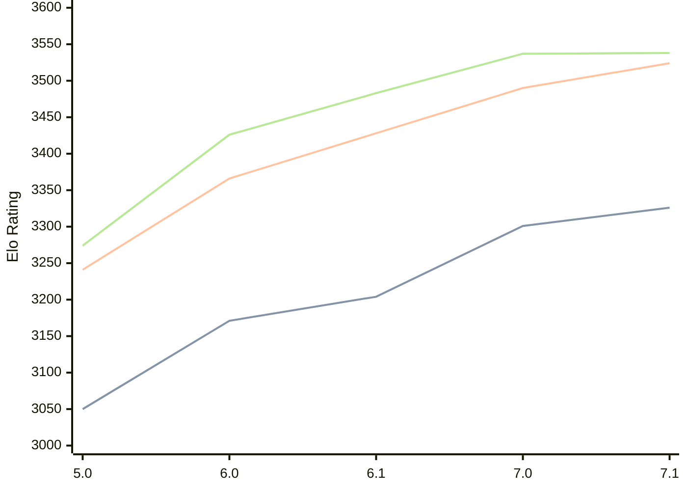

# Engine: PZChessBot

Author: Kevin Lu

Home: https://github.com/kevlu8/PZChessBot

## Elo Ratings

| Version | Published | STC 8.0+0.08s  | LTC 60.0+0.60s | VLTC 2m24s+1.12s | Comment |
| --- | --- | --- | --- | --- | --- |
| 7.1 | 2026-06-27 | 3326(+25) | 3524(+34) | 3538(+1) |  |
| 7.0 | 2026-05-07 | 3301(+97) | 3490(+62) | 3537(+54) |  |
| 6.1 | 2026-02-01 | 3204(+33) | 3428(+62) | 3483(+57) |  |
| 6.0 | 2026-01-01 | 3171(+121) | 3366(+125) | 3426(+152) |  |
| 5.0 | 2025-10-19 | 3050 | 3241 | 3274 |  |
 | | | cElo (∆ prev) | cElo (∆ prev) | cElo (∆ prev) | 

<a href="https://github.com/computer-chess-index/cci/issues/new?template=submit-version.yml&title=[VERSION]+PZChessBot+<version>&body=###%20Engine%20name%0APZChessBot%0A%0A###%20Version%0A7.1" target="_blank">Submit new version</a>

 Test Conditions:

GUI/CLI: <a href=https://github.com/cutechess/cutechess target="_blank">Cute-Chess</a> 
Elo Calculation: <a href=https://www.remi-coulom.fr/Bayesian-Elo/ target="_blank">Bayesian-Elo</a> 
CPU: Intel(R) Core(TM) i5-7500T 2.70GHz 
Opening book: 8_moves_v3 
\* STC: 8.0+0.08s, LTC: 60.0+0.60s, VLTC: 2m24s+1.12s

 Lists:
Ratings: <a href=https://github.com/computer-chess-index/cci/blob/main/lists/CCIRatings.csv target="_blank">Complete list</a>

Generated: 2026-09-15 04:41:22

## Ratings Verlauf

## Detailed Evaluation Results

| Version | Time Control | Elo  | Range +/- | Matches | Score | Average Opponent Elo | Draws |
| --- | --- | --- | --- | --- | --- | --- | --- |
| 7.1 | VLTC (2m24s+1.12s) | 3538 | 31 | 242 | 51% | 3532 | 85% |
| 7.1 | LTC (60.0+0.60s) | 3524 | 29 | 272 | 50% | 3525 | 83% |
| 7.1 | STC (8.0+0.08s) | 3326 | 27 | 354 | 50% | 3325 | 71% |
| --- | --- | --- | --- | --- | --- | --- | --- |
| 7.0 | VLTC (2m24s+1.12s) | 3537 | 25 | 362 | 50% | 3536 | 84% |
| 7.0 | LTC (60.0+0.60s) | 3490 | 25 | 388 | 51% | 3483 | 84% |
| 7.0 | STC (8.0+0.08s) | 3301 | 28 | 340 | 50% | 3301 | 66% |
| --- | --- | --- | --- | --- | --- | --- | --- |
| 6.1 | VLTC (2m24s+1.12s) | 3483 | 21 | 520 | 50% | 3482 | 80% |
| 6.1 | LTC (60.0+0.60s) | 3428 | 23 | 464 | 50% | 3426 | 76% |
| 6.1 | STC (8.0+0.08s) | 3204 | 25 | 456 | 51% | 3197 | 56% |
| --- | --- | --- | --- | --- | --- | --- | --- |
| 6.0 | VLTC (2m24s+1.12s) | 3426 | 28 | 312 | 50% | 3422 | 73% |
| 6.0 | LTC (60.0+0.60s) | 3366 | 31 | 268 | 50% | 3366 | 69% |
| 6.0 | STC (8.0+0.08s) | 3171 | 32 | 264 | 49% | 3178 | 58% |
| --- | --- | --- | --- | --- | --- | --- | --- |
| 5.0 | VLTC (2m24s+1.12s) | 3274 | 32 | 254 | 50% | 3263 | 65% |
| 5.0 | LTC (60.0+0.60s) | 3241 | 38 | 184 | 53% | 3197 | 64% |
| 5.0 | STC (8.0+0.08s) | 3050 | 35 | 236 | 55% | 2967 | 52% |
| --- | --- | --- | --- | --- | --- | --- | --- |