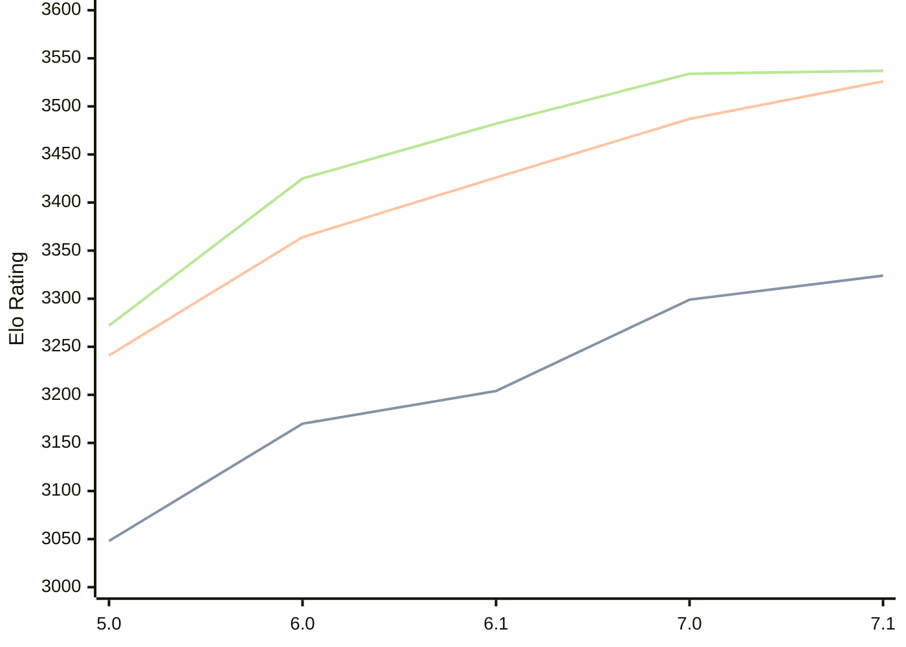

# Engine: PZChessBot

Author: Kevin Lu

Home: https://github.com/kevlu8/PZChessBot

## Elo Ratings

| Version | Published | STC 8.0+0.08s  | LTC 60.0+0.60s | VLTC 2m24s+1.12s | Comment |
| --- | --- | --- | --- | --- | --- |
| 7.1 | 2026-06-27 | 3324(+25) | 3526(+39) | 3537(+3) |  |
| 7.0 | 2026-05-07 | 3299(+95) | 3487(+61) | 3534(+52) |  |
| 6.1 | 2026-02-01 | 3204(+34) | 3426(+62) | 3482(+57) |  |
| 6.0 | 2026-01-01 | 3170(+122) | 3364(+123) | 3425(+153) |  |
| 5.0 | 2025-10-19 | 3048 | 3241 | 3272 |  |
 | | | cElo (∆ prev) | cElo (∆ prev) | cElo (∆ prev) | 

<a href="https://github.com/computer-chess-index/cci/issues/new?template=submit-version.yml&title=[VERSION]+PZChessBot+<version>&body=###%20Engine%20name%0APZChessBot%0A%0A###%20Version%0A7.1" target="_blank">Submit new version</a>

 Test Conditions:

GUI/CLI: <a href=https://github.com/cutechess/cutechess target="_blank">Cute-Chess</a> 
Elo Calculation: <a href=https://www.remi-coulom.fr/Bayesian-Elo/ target="_blank">Bayesian-Elo</a> 
CPU: Intel(R) Core(TM) i5-7500T 2.70GHz 
Opening book: 8_moves_v3 
\* STC: 8.0+0.08s, LTC: 60.0+0.60s, VLTC: 2m24s+1.12s

 Lists:
Ratings: <a href=https://github.com/computer-chess-index/cci/blob/main/lists/CCIRatings.csv target="_blank">Complete list</a>

Generated: 2026-09-11 04:41:17

## Ratings Verlauf

## Detailed Evaluation Results

| Version | Time Control | Elo  | Range +/- | Matches | Score | Average Opponent Elo | Draws |
| --- | --- | --- | --- | --- | --- | --- | --- |
| 7.1 | VLTC (2m24s+1.12s) | 3537 | 31 | 242 | 51% | 3530 | 85% |
| 7.1 | LTC (60.0+0.60s) | 3526 | 30 | 260 | 50% | 3524 | 85% |
| 7.1 | STC (8.0+0.08s) | 3324 | 27 | 342 | 50% | 3324 | 71% |
| --- | --- | --- | --- | --- | --- | --- | --- |
| 7.0 | VLTC (2m24s+1.12s) | 3534 | 25 | 362 | 50% | 3534 | 84% |
| 7.0 | LTC (60.0+0.60s) | 3487 | 25 | 388 | 51% | 3482 | 84% |
| 7.0 | STC (8.0+0.08s) | 3299 | 28 | 340 | 50% | 3299 | 66% |
| --- | --- | --- | --- | --- | --- | --- | --- |
| 6.1 | VLTC (2m24s+1.12s) | 3482 | 21 | 520 | 50% | 3480 | 80% |
| 6.1 | LTC (60.0+0.60s) | 3426 | 23 | 464 | 50% | 3425 | 76% |
| 6.1 | STC (8.0+0.08s) | 3204 | 25 | 456 | 51% | 3195 | 56% |
| --- | --- | --- | --- | --- | --- | --- | --- |
| 6.0 | VLTC (2m24s+1.12s) | 3425 | 28 | 312 | 50% | 3421 | 73% |
| 6.0 | LTC (60.0+0.60s) | 3364 | 31 | 268 | 50% | 3364 | 69% |
| 6.0 | STC (8.0+0.08s) | 3170 | 32 | 264 | 49% | 3178 | 58% |
| --- | --- | --- | --- | --- | --- | --- | --- |
| 5.0 | VLTC (2m24s+1.12s) | 3272 | 32 | 254 | 50% | 3262 | 65% |
| 5.0 | LTC (60.0+0.60s) | 3241 | 38 | 184 | 53% | 3195 | 64% |
| 5.0 | STC (8.0+0.08s) | 3048 | 35 | 236 | 55% | 2965 | 52% |
| --- | --- | --- | --- | --- | --- | --- | --- |