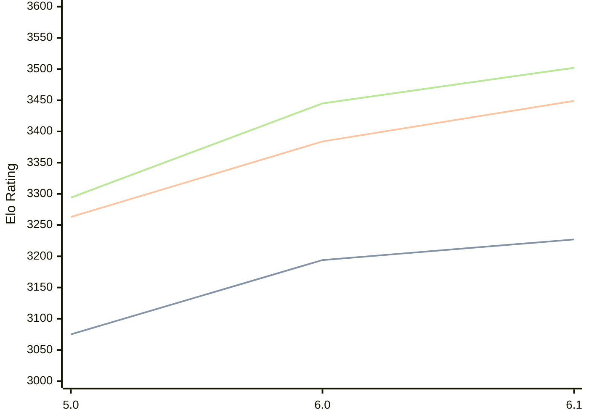

# Engine: PZChessBot

Author: Kevin Lu

Home: https://github.com/kevlu8/PZChessBot

## Ratings nach Version

| Version | Published | STC 8.0+0.08s  | LTC 60.0+0.60s | VLTC 2m24s+1.12s | Comment |
| --- | --- | --- | --- | --- | --- |
| 6.1 | 2026-02-01 | 3227(+33) | 3449(+65) | 3502(+57) |  |
| 6.0 | 2026-01-01 | 3194(+119) | 3384(+121) | 3445(+151) |  |
| 5.0 | 2025-10-19 | 3075(+new) | 3263(+new) | 3294(+new) |  |
| 4.0 | 2025-10-03 |  |  |  |  |
| 3.0 | 2025-07-02 |  |  |  |  |
| 2.0 | 2025-06-17 |  |  |  |  |
| 1.0 | 2025-04-20 |  |  |  |  |
| 20250318T22 | 2025-03-19 |  |  |  |  |
| 20250311T07 | 2025-03-11 |  |  |  |  |
| 20250307T21 | 2025-03-08 |  |  |  |  |
| 20250306T21 | 2025-03-07 |  |  |  |  |
| 20250302T22 | 2025-03-04 |  |  |  |  |
 | | | cElo (∆ prev) | cElo (∆ prev) | cElo (∆ prev) | 

 Test Conditions:

GUI/CLI: <a href=https://github.com/cutechess/cutechess target="_blank">Cute-Chess</a> 
Elo Calculation: <a href=https://www.remi-coulom.fr/Bayesian-Elo/ target="_blank">Bayesian-Elo</a> 
CPU: Intel(R) Core(TM) i5-7500T 2.70GHz 
Opening book: 8_moves_v3 
\* STC: 8.0+0.08s, LTC: 60.0+0.60s, VLTC: 2m24s+1.12s

 Lists:
Ratings: <a href=https://github.com/computer-chess-index/cci/blob/main/lists/CCIRatings.csv target="_blank">Complete list</a>

Generated: 2026-03-19 06:25:37

## Ratings Verlauf

⬛ STC (8.0+0.08s) &nbsp;&nbsp; 🟧 LTC (60.0+0.60s) &nbsp;&nbsp; 🟩 VLTC (2m24s+1.12s)

dark mode: 🟩STC (8.0+0.08s) 🟧LTC (60.0+0.60s) ⬜VLTC (2m24s+1.12s)

