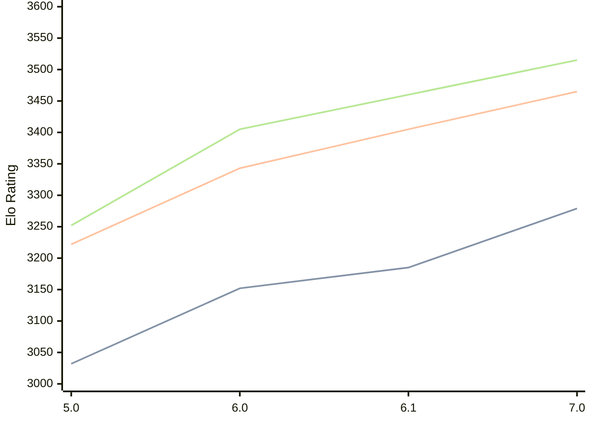

# Engine: PZChessBot

Author: Kevin Lu

Home: https://github.com/kevlu8/PZChessBot

## Elo Ratings

| Version | Published | STC 8.0+0.08s  | LTC 60.0+0.60s | VLTC 2m24s+1.12s | Comment |
| --- | --- | --- | --- | --- | --- |
| 7.0 | 2026-05-07 | 3279(+94) | 3465(+60) | 3515(+55) |  |
| 6.1 | 2026-02-01 | 3185(+33) | 3405(+62) | 3460(+55) |  |
| 6.0 | 2026-01-01 | 3152(+120) | 3343(+121) | 3405(+153) |  |
| 5.0 | 2025-10-19 | 3032(+new) | 3222(+new) | 3252(+new) |  |
| 4.0 | 2025-10-03 |  |  |  |  |
| 3.0 | 2025-07-02 |  |  |  |  |
| 2.0 | 2025-06-17 |  |  |  |  |
| 1.0 | 2025-04-20 |  |  |  |  |
| 20250318T22 | 2025-03-19 |  |  |  |  |
| 20250311T07 | 2025-03-11 |  |  |  |  |
| 20250307T21 | 2025-03-08 |  |  |  |  |
| 20250306T21 | 2025-03-07 |  |  |  |  |
| 20250302T22 | 2025-03-04 |  |  |  |  |
 | | | cElo (∆ prev) | cElo (∆ prev) | cElo (∆ prev) | 

<a href="https://github.com/computer-chess-index/cci/issues/new?template=submit-version.yml&title=[VERSION]+PZChessBot+<version>&body=###%20Engine%20name%0APZChessBot%0A%0A###%20Version%0A7.0" target="_blank">Submit new version</a>

 Test Conditions:

GUI/CLI: <a href=https://github.com/cutechess/cutechess target="_blank">Cute-Chess</a> 
Elo Calculation: <a href=https://www.remi-coulom.fr/Bayesian-Elo/ target="_blank">Bayesian-Elo</a> 
CPU: Intel(R) Core(TM) i5-7500T 2.70GHz 
Opening book: 8_moves_v3 
\* STC: 8.0+0.08s, LTC: 60.0+0.60s, VLTC: 2m24s+1.12s

 Lists:
Ratings: <a href=https://github.com/computer-chess-index/cci/blob/main/lists/CCIRatings.csv target="_blank">Complete list</a>

Generated: 2026-06-08 06:27:17

## Ratings Verlauf

⬛ STC (8.0+0.08s) &nbsp;&nbsp; 🟧 LTC (60.0+0.60s) &nbsp;&nbsp; 🟩 VLTC (2m24s+1.12s)

dark mode: 🟩STC (8.0+0.08s) 🟧LTC (60.0+0.60s) ⬜VLTC (2m24s+1.12s)

## Detailed Evaluation Results

| Version | Time Control | Elo  | Range +/- | Matches | Score | Average Opponent Elo | Draws |
| --- | --- | --- | --- | --- | --- | --- | --- |
| 7.0 | VLTC (2m24s+1.12s) | 3515 | 27 | 326 | 50% | 3511 | 84% |
| 7.0 | LTC (60.0+0.60s) | 3465 | 25 | 368 | 51% | 3459 | 83% |
| 7.0 | STC (8.0+0.08s) | 3279 | 28 | 328 | 50% | 3281 | 66% |
| --- | --- | --- | --- | --- | --- | --- | --- |
| 6.1 | VLTC (2m24s+1.12s) | 3460 | 21 | 520 | 50% | 3459 | 80% |
| 6.1 | LTC (60.0+0.60s) | 3405 | 23 | 464 | 50% | 3403 | 76% |
| 6.1 | STC (8.0+0.08s) | 3185 | 25 | 456 | 51% | 3177 | 56% |
| --- | --- | --- | --- | --- | --- | --- | --- |
| 6.0 | VLTC (2m24s+1.12s) | 3405 | 28 | 312 | 50% | 3399 | 73% |
| 6.0 | LTC (60.0+0.60s) | 3343 | 31 | 268 | 50% | 3343 | 69% |
| 6.0 | STC (8.0+0.08s) | 3152 | 32 | 264 | 49% | 3160 | 58% |
| --- | --- | --- | --- | --- | --- | --- | --- |
| 5.0 | VLTC (2m24s+1.12s) | 3252 | 32 | 254 | 50% | 3241 | 65% |
| 5.0 | LTC (60.0+0.60s) | 3222 | 38 | 184 | 53% | 3177 | 64% |
| 5.0 | STC (8.0+0.08s) | 3032 | 35 | 236 | 55% | 2950 | 52% |
| --- | --- | --- | --- | --- | --- | --- | --- |