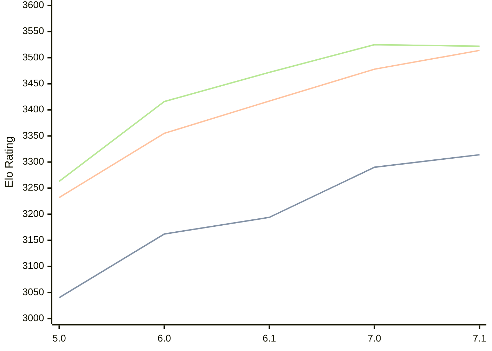

# Engine: PZChessBot

Author: Kevin Lu

Home: https://github.com/kevlu8/PZChessBot

## Elo Ratings

| Version | Published | STC 8.0+0.08s  | LTC 60.0+0.60s | VLTC 2m24s+1.12s | Comment |
| --- | --- | --- | --- | --- | --- |
| 7.1 | 2026-06-27 | 3314(+24) | 3514(+36) | 3522(-3) |  |
| 7.0 | 2026-05-07 | 3290(+96) | 3478(+61) | 3525(+53) |  |
| 6.1 | 2026-02-01 | 3194(+32) | 3417(+62) | 3472(+56) |  |
| 6.0 | 2026-01-01 | 3162(+122) | 3355(+123) | 3416(+153) |  |
| 5.0 | 2025-10-19 | 3040 | 3232 | 3263 |  |
 | | | cElo (∆ prev) | cElo (∆ prev) | cElo (∆ prev) | 

<a href="https://github.com/computer-chess-index/cci/issues/new?template=submit-version.yml&title=[VERSION]+PZChessBot+<version>&body=###%20Engine%20name%0APZChessBot%0A%0A###%20Version%0A7.1" target="_blank">Submit new version</a>

 Test Conditions:

GUI/CLI: <a href=https://github.com/cutechess/cutechess target="_blank">Cute-Chess</a> 
Elo Calculation: <a href=https://www.remi-coulom.fr/Bayesian-Elo/ target="_blank">Bayesian-Elo</a> 
CPU: Intel(R) Core(TM) i5-7500T 2.70GHz 
Opening book: 8_moves_v3 
\* STC: 8.0+0.08s, LTC: 60.0+0.60s, VLTC: 2m24s+1.12s

 Lists:
Ratings: <a href=https://github.com/computer-chess-index/cci/blob/main/lists/CCIRatings.csv target="_blank">Complete list</a>

Generated: 2026-08-19 06:28:16

## Ratings Verlauf

⬛ STC (8.0+0.08s) &nbsp;&nbsp; 🟧 LTC (60.0+0.60s) &nbsp;&nbsp; 🟩 VLTC (2m24s+1.12s)

dark mode: 🟩STC (8.0+0.08s) 🟧LTC (60.0+0.60s) ⬜VLTC (2m24s+1.12s)

## Detailed Evaluation Results

| Version | Time Control | Elo  | Range +/- | Matches | Score | Average Opponent Elo | Draws |
| --- | --- | --- | --- | --- | --- | --- | --- |
| 7.1 | VLTC (2m24s+1.12s) | 3522 | 33 | 214 | 50% | 3521 | 86% |
| 7.1 | LTC (60.0+0.60s) | 3514 | 32 | 232 | 50% | 3514 | 84% |
| 7.1 | STC (8.0+0.08s) | 3314 | 29 | 290 | 50% | 3314 | 71% |
| --- | --- | --- | --- | --- | --- | --- | --- |
| 7.0 | VLTC (2m24s+1.12s) | 3525 | 25 | 362 | 50% | 3525 | 84% |
| 7.0 | LTC (60.0+0.60s) | 3478 | 25 | 388 | 51% | 3471 | 84% |
| 7.0 | STC (8.0+0.08s) | 3290 | 28 | 340 | 50% | 3291 | 66% |
| --- | --- | --- | --- | --- | --- | --- | --- |
| 6.1 | VLTC (2m24s+1.12s) | 3472 | 21 | 520 | 50% | 3471 | 80% |
| 6.1 | LTC (60.0+0.60s) | 3417 | 23 | 464 | 50% | 3416 | 76% |
| 6.1 | STC (8.0+0.08s) | 3194 | 25 | 456 | 51% | 3187 | 56% |
| --- | --- | --- | --- | --- | --- | --- | --- |
| 6.0 | VLTC (2m24s+1.12s) | 3416 | 28 | 312 | 50% | 3411 | 73% |
| 6.0 | LTC (60.0+0.60s) | 3355 | 31 | 268 | 50% | 3355 | 69% |
| 6.0 | STC (8.0+0.08s) | 3162 | 32 | 264 | 49% | 3170 | 58% |
| --- | --- | --- | --- | --- | --- | --- | --- |
| 5.0 | VLTC (2m24s+1.12s) | 3263 | 32 | 254 | 50% | 3252 | 65% |
| 5.0 | LTC (60.0+0.60s) | 3232 | 38 | 184 | 53% | 3187 | 64% |
| 5.0 | STC (8.0+0.08s) | 3040 | 35 | 236 | 55% | 2958 | 52% |
| --- | --- | --- | --- | --- | --- | --- | --- |