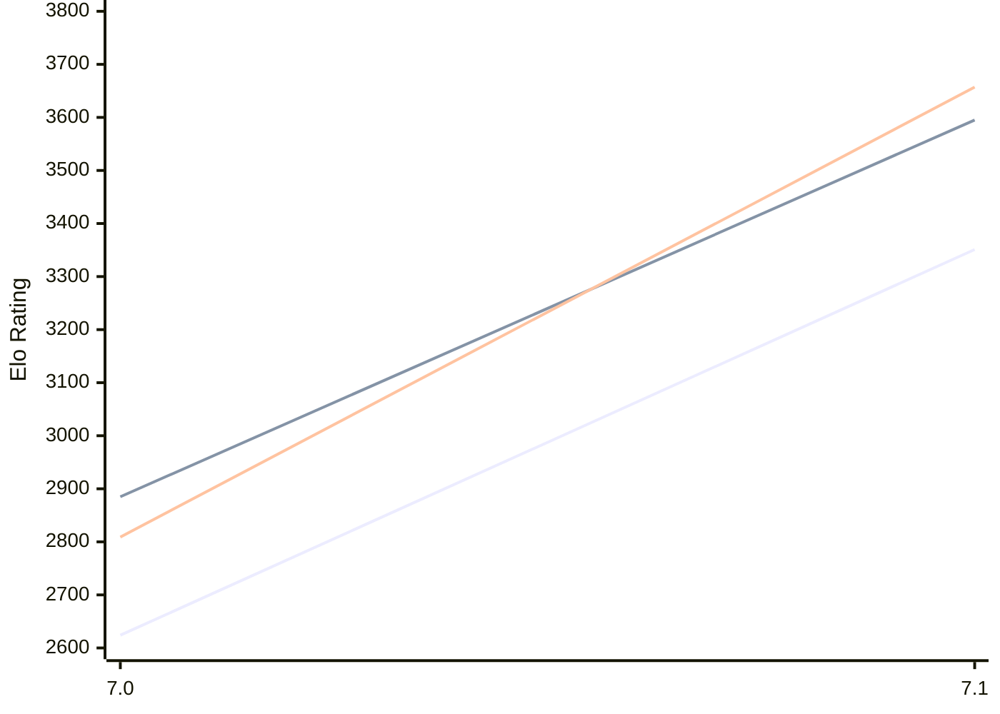
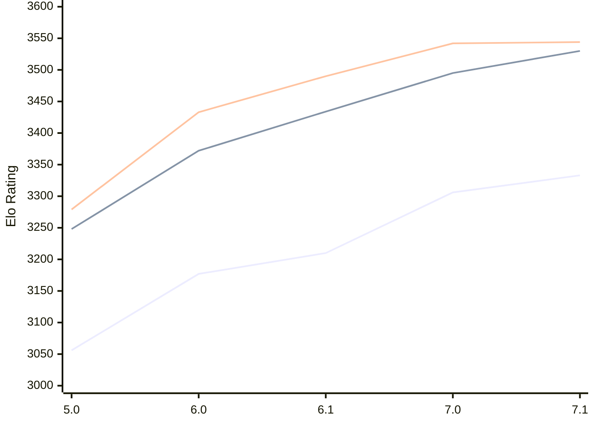

# Engine: PZChessBot

Author: Kevin Lu

Home: https://github.com/kevlu8/PZChessBot

## Elo Ratings E1 (Ultra 7 265T (1.50 GHz) - E-Core)

| Version | Published | STC 8.0+0.08s  | LTC 60.0+0.60s | VLTC 2m24s+1.12s | Comment |
| --- | --- | --- | --- | --- | --- |
| 7.1 | 2026-06-27 | 3351(+727) | 3595(+710) | 3657(+848) |  |
| 7.0 | 2026-05-07 | 2624 | 2885 | 2809 |  |
 | | | cElo (∆ prev) | cElo (∆ prev) | cElo (∆ prev) | 

## Elo Ratings P1 (Ultra 7 265T (1.50 GHz) - P-Core)

| Version | Published | STC 8.0+0.08s  | LTC 60.0+0.60s | VLTC 2m24s+1.12s | Comment |
| --- | --- | --- | --- | --- | --- |
| 7.1 | 2026-06-27 | 3510(+1682) | 3717(+new) | 3749(+890) |  |
| 7.0 | 2026-05-07 | 1828 |  | 2859 |  |
 | | | cElo (∆ prev) | cElo (∆ prev) | cElo (∆ prev) | 

## Elo Ratings T1 (i5-7500T 2.70GHz)

| Version | Published | STC 8.0+0.08s  | LTC 60.0+0.60s | VLTC 2m24s+1.12s | Comment |
| --- | --- | --- | --- | --- | --- |
| 7.1 | 2026-06-27 | 3333(+27) | 3530(+35) | 3544(+2) |  |
| 7.0 | 2026-05-07 | 3306(+96) | 3495(+61) | 3542(+52) |  |
| 6.1 | 2026-02-01 | 3210(+33) | 3434(+62) | 3490(+57) |  |
| 6.0 | 2026-01-01 | 3177(+121) | 3372(+124) | 3433(+154) |  |
| 5.0 | 2025-10-19 | 3056 | 3248 | 3279 |  |
 | | | cElo (∆ prev) | cElo (∆ prev) | cElo (∆ prev) | 

<a href="https://github.com/computer-chess-index/cci/issues/new?template=submit-version.yml&title=[VERSION]+PZChessBot+<version>&body=###%20Engine%20name%0APZChessBot%0A%0A###%20Version%0A7.1" target="_blank">Submit new version</a>

 Test Conditions:

GUI/CLI: <a href=https://github.com/cutechess/cutechess target="_blank">Cute-Chess</a> 
Elo Calculation: <a href=https://www.remi-coulom.fr/Bayesian-Elo/ target="_blank">Bayesian-Elo</a> 
CPU for P1: Intel(R) Core(TM) Ultra 7 265T (1.50 GHz) - P-Core 
CPU for E1: Intel(R) Core(TM) Ultra 7 265T (1.50 GHz) - E-Core 
CPU for T1: Intel(R) Core(TM) i5-7500T 2.70GHz 
Opening book: 8_moves_v3 
\* STC: 8.0+0.08s, LTC: 60.0+0.60s, VLTC: 2m24s+1.12s

 Lists:
Ratings: <a href=https://github.com/computer-chess-index/cci/blob/main/lists/CCIRatings.csv target="_blank">Complete list</a>

Generated: 2026-11-12 05:41:14

## Ratings Verlauf E1 / P1

```mermaid
%%{init: {"theme":"base","themeVariables":{"seriesColors:['#a3a3a3','#222221','#faa371']}}}%%
xychart-beta
  x-axis ["7.0", "7.1"]
  y-axis "Elo Rating" 2600 --> 3800
  line "E1: STC (8.0+0.08s)" [2624, 3351]
  line "E1: LTC (60.0+0.60s)" [2885, 3595]
  line "E1: VLTC (2m24s+1.12s)" [2809, 3657]
  line "P1: STC (8.0+0.08s)" [3510]
  line "P1: LTC (60.0+0.60s)" [3717]
  line "P1: VLTC (2m24s+1.12s)" [3749]
```

## Ratings Verlauf T1

```mermaid
%%{init: {"theme":"base","themeVariables":{"seriesColors:['#a3a3a3','#222221','#faa371']}}}%%
xychart-beta
  x-axis ["5.0", "6.0", "6.1", "7.0", "7.1"]
  y-axis "Elo Rating" 3000 --> 3600
  line "T1: STC (8.0+0.08s)" [3056, 3177, 3210, 3306, 3333]
  line "T1: LTC (60.0+0.60s)" [3248, 3372, 3434, 3495, 3530]
  line "T1: VLTC (2m24s+1.12s)" [3279, 3433, 3490, 3542, 3544]
```

## Detailed Evaluation Results

| Version | Time Control | Variant | Elo  | Range +/- | Matches | Score | Average Opponent Elo | Draws |
| --- | --- |--- | --- | --- | --- | --- | --- | --- |
| 7.1 | VLTC (2m24s+1.12s) | T1 | 3544 | 30 | 250 | 51% | 3538 | 85% |
|  |  | P1 | 3749 | 33 | 228 | 57% | 3686 | 79% |
|  |  | E1 | 3657 | 28 | 336 | 59% | 3530 | 76% |
|  | LTC (60.0+0.60s) | T1 | 3530 | 29 | 284 | 50% | 3532 | 84% |
|  |  | P1 | 3717 | 33 | 224 | 56% | 3626 | 76% |
|  |  | E1 | 3595 | 31 | 272 | 56% | 3494 | 72% |
|  | STC (8.0+0.08s) | T1 | 3333 | 26 | 362 | 50% | 3332 | 71% |
|  |  | P1 | 3510 | 31 | 268 | 50% | 3511 | 68% |
|  |  | E1 | 3351 | 25 | 410 | 46% | 3375 | 67% |
| --- | --- |--- | --- | --- | --- | --- | --- | --- |
| 7.0 | VLTC (2m24s+1.12s) | T1 | 3542 | 25 | 362 | 50% | 3542 | 84% |
|  |  | P1 | 2859 | 198 | 4 | 63% | 2801 | 75% |
|  |  | E1 | 2809 | 211 | 4 | 75% | 2688 | 50% |
|  | LTC (60.0+0.60s) | T1 | 3495 | 25 | 388 | 51% | 3490 | 84% |
|  |  | E1 | 2885 | 229 | 4 | 88% | 2678 | 25% |
|  | STC (8.0+0.08s) | P1 | 1828 | 295 | 4 | 100% | 1462 | 0% |
|  |  | E1 | 2624 | 169 | 12 | 63% | 2341 | 42% |
|  |  | T1 | 3306 | 28 | 340 | 50% | 3308 | 66% |
| --- | --- |--- | --- | --- | --- | --- | --- | --- |
| 6.1 | VLTC (2m24s+1.12s) | T1 | 3490 | 21 | 520 | 50% | 3488 | 80% |
|  | LTC (60.0+0.60s) | T1 | 3434 | 23 | 464 | 50% | 3433 | 76% |
|  | STC (8.0+0.08s) | T1 | 3210 | 25 | 456 | 51% | 3202 | 56% |
| --- | --- |--- | --- | --- | --- | --- | --- | --- |
| 6.0 | VLTC (2m24s+1.12s) | T1 | 3433 | 28 | 312 | 50% | 3429 | 73% |
|  | LTC (60.0+0.60s) | T1 | 3372 | 31 | 268 | 50% | 3372 | 69% |
|  | STC (8.0+0.08s) | T1 | 3177 | 32 | 264 | 49% | 3185 | 58% |
| --- | --- |--- | --- | --- | --- | --- | --- | --- |
| 5.0 | VLTC (2m24s+1.12s) | T1 | 3279 | 32 | 254 | 50% | 3268 | 65% |
|  | LTC (60.0+0.60s) | T1 | 3248 | 38 | 184 | 53% | 3202 | 64% |
|  | STC (8.0+0.08s) | T1 | 3056 | 35 | 236 | 55% | 2973 | 52% |