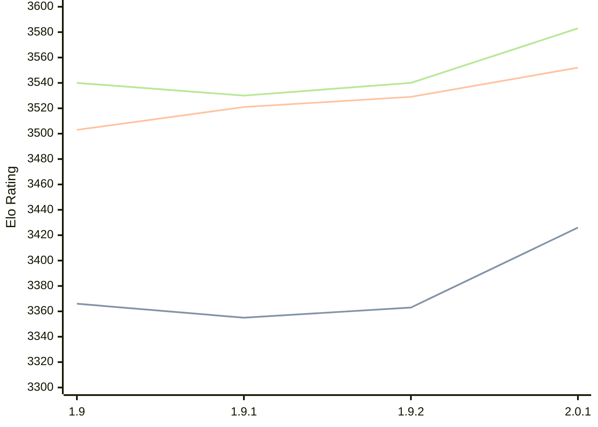

# Engine: Pawnocchio

Author: Jonathan Hallström

Home: https://github.com/JonathanHallstrom/pawnocchio

## Elo Ratings

| Version | Published | STC 8.0+0.08s  | LTC 60.0+0.60s | VLTC 2m24s+1.12s | Comment |
| --- | --- | --- | --- | --- | --- |
| 2.0.1 | 2026-06-29 | 3426(+new) | 3552(+new) | 3583(+new) |  |
| 2.0.0 | 2026-06-27 |  |  |  |  |
| 1.9.2 | 2026-01-15 | 3363(+8) | 3529(+8) | 3540(+10) |  |
| 1.9.1 | 2026-01-12 | 3355(-11) | 3521(+18) | 3530(-10) |  |
| 1.9 | 2026-01-03 | 3366(+new) | 3503(+new) | 3540(+new) |  |
| 1.8.1 | 2025-07-25 |  |  |  |  |
| 1.8 | 2025-07-22 |  |  |  |  |
| 1.7.2 | 2025-06-15 |  |  |  |  |
| 1.7.1 | 2025-06-02 |  |  |  |  |
| 1.7 | 2025-05-31 |  |  |  |  |
| 1.6.1 | 2025-05-15 |  |  |  |  |
| 1.6 | 2025-04-27 |  |  |  |  |
| 1.5 | 2025-04-18 |  |  |  |  |
| 1.4.1 | 2025-04-05 |  |  |  |  |
| 1.3.1415 | 2025-03-14 |  |  |  |  |
| 1.3 | 2025-03-07 |  |  |  |  |
| 1.2 | 2025-02-21 |  |  |  |  |
| 1.1 | 2025-01-24 |  |  |  |  |
| 1.0 | 2025-01-20 |  |  |  |  |
| 0.9 | 2025-01-12 |  |  |  |  |
 | | | cElo (∆ prev) | cElo (∆ prev) | cElo (∆ prev) | 

<a href="https://github.com/computer-chess-index/cci/issues/new?template=submit-version.yml&title=[VERSION]+Pawnocchio+<version>&body=###%20Engine%20name%0APawnocchio%0A%0A###%20Version%0A2.0.1" target="_blank">Submit new version</a>

 Test Conditions:

GUI/CLI: <a href=https://github.com/cutechess/cutechess target="_blank">Cute-Chess</a> 
Elo Calculation: <a href=https://www.remi-coulom.fr/Bayesian-Elo/ target="_blank">Bayesian-Elo</a> 
CPU: Intel(R) Core(TM) i5-7500T 2.70GHz 
Opening book: 8_moves_v3 
\* STC: 8.0+0.08s, LTC: 60.0+0.60s, VLTC: 2m24s+1.12s

 Lists:
Ratings: <a href=https://github.com/computer-chess-index/cci/blob/main/lists/CCIRatings.csv target="_blank">Complete list</a>

Generated: 2026-07-15 06:27:34

## Ratings Verlauf

## Ratings Verlauf

⬛ STC (8.0+0.08s) &nbsp;&nbsp; 🟧 LTC (60.0+0.60s) &nbsp;&nbsp; 🟩 VLTC (2m24s+1.12s)

dark mode: 🟩STC (8.0+0.08s) 🟧LTC (60.0+0.60s) ⬜VLTC (2m24s+1.12s)

## Detailed Evaluation Results

| Version | Time Control | Elo  | Range +/- | Matches | Score | Average Opponent Elo | Draws |
| --- | --- | --- | --- | --- | --- | --- | --- |
| 2.0.1 | VLTC (2m24s+1.12s) | 3583 | 36 | 170 | 53% | 3565 | 92% |
| 2.0.1 | LTC (60.0+0.60s) | 3552 | 41 | 136 | 50% | 3552 | 90% |
| 2.0.1 | STC (8.0+0.08s) | 3426 | 40 | 152 | 49% | 3432 | 76% |
| --- | --- | --- | --- | --- | --- | --- | --- |
| 1.9.2 | VLTC (2m24s+1.12s) | 3540 | 25 | 380 | 51% | 3536 | 88% |
| 1.9.2 | LTC (60.0+0.60s) | 3529 | 25 | 372 | 51% | 3525 | 88% |
| 1.9.2 | STC (8.0+0.08s) | 3363 | 22 | 518 | 49% | 3368 | 79% |
| --- | --- | --- | --- | --- | --- | --- | --- |
| 1.9.1 | VLTC (2m24s+1.12s) | 3530 | 35 | 188 | 49% | 3540 | 91% |
| 1.9.1 | LTC (60.0+0.60s) | 3521 | 35 | 186 | 51% | 3514 | 86% |
| 1.9.1 | STC (8.0+0.08s) | 3355 | 35 | 208 | 51% | 3343 | 70% |
| --- | --- | --- | --- | --- | --- | --- | --- |
| 1.9 | VLTC (2m24s+1.12s) | 3540 | 35 | 192 | 53% | 3510 | 81% |
| 1.9 | LTC (60.0+0.60s) | 3503 | 33 | 224 | 53% | 3464 | 81% |
| 1.9 | STC (8.0+0.08s) | 3366 | 34 | 224 | 54% | 3320 | 71% |
| --- | --- | --- | --- | --- | --- | --- | --- |