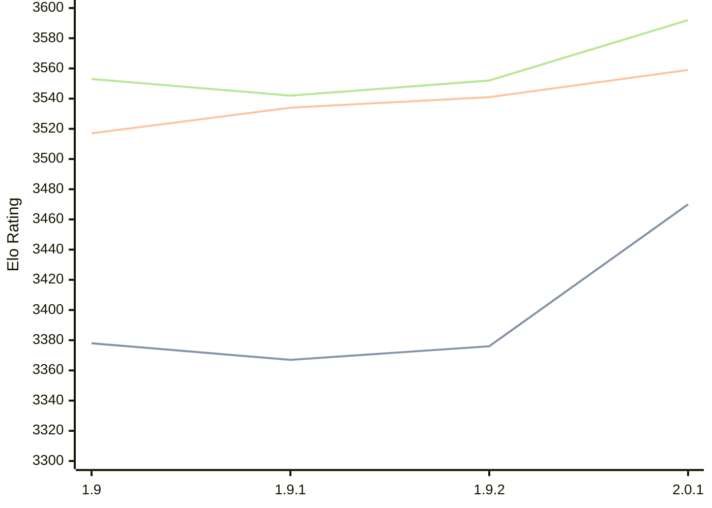

# Engine: Pawnocchio

Author: Jonathan Hallström

Home: https://github.com/JonathanHallstrom/pawnocchio

## Elo Ratings

| Version | Published | STC 8.0+0.08s  | LTC 60.0+0.60s | VLTC 2m24s+1.12s | Comment |
| --- | --- | --- | --- | --- | --- |
| 2.0.1 | 2026-06-29 | 3470(+new) | 3559(+new) | 3592(+new) |  |
| 2.0.0 | 2026-06-27 |  |  |  |  |
| 1.9.2 | 2026-01-15 | 3376(+9) | 3541(+7) | 3552(+10) |  |
| 1.9.1 | 2026-01-12 | 3367(-11) | 3534(+17) | 3542(-11) |  |
| 1.9 | 2026-01-03 | 3378(+new) | 3517(+new) | 3553(+new) |  |
| 1.8.1 | 2025-07-25 |  |  |  |  |
 | | | cElo (∆ prev) | cElo (∆ prev) | cElo (∆ prev) | 

<a href="https://github.com/computer-chess-index/cci/issues/new?template=submit-version.yml&title=[VERSION]+Pawnocchio+<version>&body=###%20Engine%20name%0APawnocchio%0A%0A###%20Version%0A2.0.1" target="_blank">Submit new version</a>

 Test Conditions:

GUI/CLI: <a href=https://github.com/cutechess/cutechess target="_blank">Cute-Chess</a> 
Elo Calculation: <a href=https://www.remi-coulom.fr/Bayesian-Elo/ target="_blank">Bayesian-Elo</a> 
CPU: Intel(R) Core(TM) i5-7500T 2.70GHz 
Opening book: 8_moves_v3 
\* STC: 8.0+0.08s, LTC: 60.0+0.60s, VLTC: 2m24s+1.12s

 Lists:
Ratings: <a href=https://github.com/computer-chess-index/cci/blob/main/lists/CCIRatings.csv target="_blank">Complete list</a>

Generated: 2026-09-02 04:37:45

## Ratings Verlauf

## Detailed Evaluation Results

| Version | Time Control | Elo  | Range +/- | Matches | Score | Average Opponent Elo | Draws |
| --- | --- | --- | --- | --- | --- | --- | --- |
| 2.0.1 | VLTC (2m24s+1.12s) | 3592 | 29 | 270 | 53% | 3572 | 90% |
| 2.0.1 | LTC (60.0+0.60s) | 3559 | 27 | 316 | 50% | 3556 | 90% |
| 2.0.1 | STC (8.0+0.08s) | 3470 | 25 | 388 | 52% | 3460 | 79% |
| --- | --- | --- | --- | --- | --- | --- | --- |
| 1.9.2 | VLTC (2m24s+1.12s) | 3552 | 25 | 380 | 51% | 3548 | 88% |
| 1.9.2 | LTC (60.0+0.60s) | 3541 | 25 | 372 | 51% | 3538 | 88% |
| 1.9.2 | STC (8.0+0.08s) | 3376 | 22 | 518 | 49% | 3382 | 79% |
| --- | --- | --- | --- | --- | --- | --- | --- |
| 1.9.1 | VLTC (2m24s+1.12s) | 3542 | 35 | 188 | 49% | 3552 | 91% |
| 1.9.1 | LTC (60.0+0.60s) | 3534 | 35 | 186 | 51% | 3526 | 86% |
| 1.9.1 | STC (8.0+0.08s) | 3367 | 35 | 208 | 51% | 3356 | 70% |
| --- | --- | --- | --- | --- | --- | --- | --- |
| 1.9 | VLTC (2m24s+1.12s) | 3553 | 35 | 192 | 53% | 3522 | 81% |
| 1.9 | LTC (60.0+0.60s) | 3517 | 33 | 224 | 53% | 3478 | 81% |
| 1.9 | STC (8.0+0.08s) | 3378 | 34 | 224 | 54% | 3332 | 71% |
| --- | --- | --- | --- | --- | --- | --- | --- |