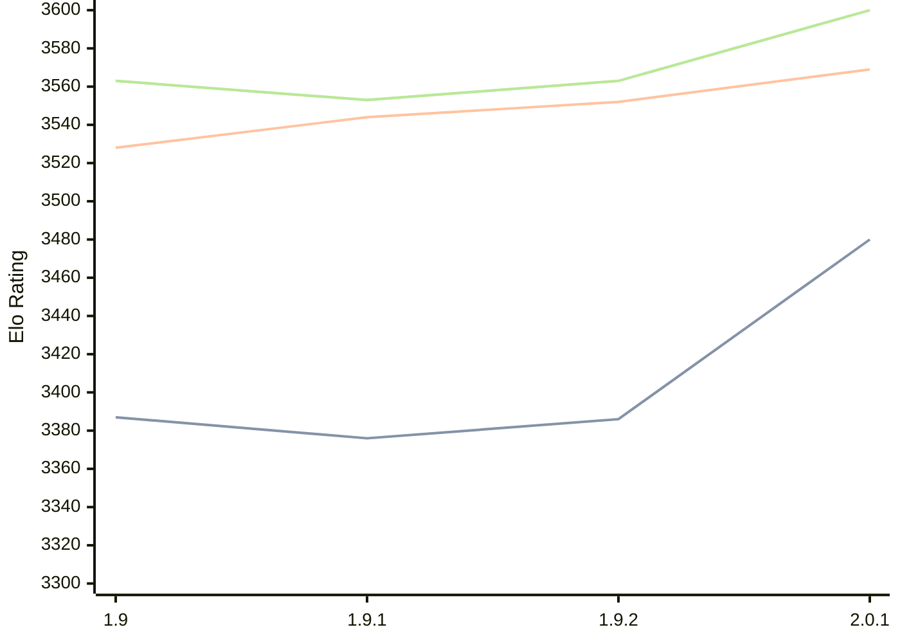

# Engine: Pawnocchio

Author: Jonathan Hallström

Home: https://github.com/JonathanHallstrom/pawnocchio

## Elo Ratings E1

| Version | Published | STC 8.0+0.08s  | LTC 60.0+0.60s | VLTC 2m24s+1.12s | Comment |
| --- | --- | --- | --- | --- | --- |
| 2.0.1 | 2026-06-29 | 3426 | 3575 | 3599 |  |
 | | | cElo (∆ prev) | cElo (∆ prev) | cElo (∆ prev) | 

## Elo Ratings P1

| Version | Published | STC 8.0+0.08s  | LTC 60.0+0.60s | VLTC 2m24s+1.12s | Comment |
| --- | --- | --- | --- | --- | --- |
| 2.0.1 | 2026-06-29 | 3672 | 3791 | 3822 |  |
 | | | cElo (∆ prev) | cElo (∆ prev) | cElo (∆ prev) | 

## Elo Ratings T1

| Version | Published | STC 8.0+0.08s  | LTC 60.0+0.60s | VLTC 2m24s+1.12s | Comment |
| --- | --- | --- | --- | --- | --- |
| 2.0.1 | 2026-06-29 | 3480(+94) | 3569(+17) | 3600(+37) |  |
| 1.9.2 | 2026-01-15 | 3386(+10) | 3552(+8) | 3563(+10) |  |
| 1.9.1 | 2026-01-12 | 3376(-11) | 3544(+16) | 3553(-10) |  |
| 1.9 | 2026-01-03 | 3387 | 3528 | 3563 |  |
 | | | cElo (∆ prev) | cElo (∆ prev) | cElo (∆ prev) | 

<a href="https://github.com/computer-chess-index/cci/issues/new?template=submit-version.yml&title=[VERSION]+Pawnocchio+<version>&body=###%20Engine%20name%0APawnocchio%0A%0A###%20Version%0A2.0.1" target="_blank">Submit new version</a>

 Test Conditions:

GUI/CLI: <a href=https://github.com/cutechess/cutechess target="_blank">Cute-Chess</a> 
Elo Calculation: <a href=https://www.remi-coulom.fr/Bayesian-Elo/ target="_blank">Bayesian-Elo</a> 
CPU for P1: Intel(R) Core(TM) Ultra 7 265T (1.50 GHz) - P-Core 
CPU for E1: Intel(R) Core(TM) Ultra 7 265T (1.50 GHz) - E-Core 
CPU for T1: Intel(R) Core(TM) i5-7500T 2.70GHz 
Opening book: 8_moves_v3 
\* STC: 8.0+0.08s, LTC: 60.0+0.60s, VLTC: 2m24s+1.12s

 Lists:
Ratings: <a href=https://github.com/computer-chess-index/cci/blob/main/lists/CCIRatings.csv target="_blank">Complete list</a>

Generated: 2026-10-09 14:14:26

## Ratings Verlauf

```mermaid
%%{init: {"theme":"base","themeVariables":{"seriesColors:['#a3a3a3','#222221','#faa371']}}}%%
xychart-beta
  x-axis ["1.9", "1.9.1", "1.9.2", "2.0.1"]
  y-axis "Elo Rating" 3300 --> 3600
  line "" [3387, 3376, 3386, 3480]
  line "STC (8.0+0.08s)" [3387, 3376, 3386, 3480]
  line "LTC (60.0+0.60s)" [3528, 3544, 3552, 3569]
  line "" [3563, 3553, 3563, 3600]
  line "VLTC (2m24s+1.12s)" [3563, 3553, 3563, 3600]
```

## Detailed Evaluation Results

| Version | Time Control | Elo  | Range +/- | Matches | Score | Average Opponent Elo | Draws |
| --- | --- | --- | --- | --- | --- | --- | --- |
| 2.0.1 | VLTC (2m24s+1.12s) | 3600 | 27 | 306 | 53% | 3583 | 90% |
| 2.0.1 | VLTC (2m24s+1.12s) | 3822 | 52 | 80 | 52% | 3811 | 91% |
| 2.0.1 | VLTC (2m24s+1.12s) | 3599 | 45 | 112 | 52% | 3587 | 88% |
| 2.0.1 | LTC (60.0+0.60s) | 3569 | 25 | 360 | 50% | 3567 | 90% |
| 2.0.1 | LTC (60.0+0.60s) | 3791 | 47 | 100 | 51% | 3788 | 93% |
| 2.0.1 | LTC (60.0+0.60s) | 3575 | 36 | 176 | 50% | 3578 | 91% |
| 2.0.1 | STC (8.0+0.08s) | 3480 | 24 | 428 | 51% | 3472 | 79% |
| --- | --- | --- | --- | --- | --- | --- | --- |
| 2.0.1 | STC (8.0+0.08s) | 3672 | 40 | 140 | 49% | 3679 | 86% |
| --- | --- | --- | --- | --- | --- | --- | --- |
| 2.0.1 | STC (8.0+0.08s) | 3426 | 33 | 224 | 47% | 3448 | 76% |
| --- | --- | --- | --- | --- | --- | --- | --- |
| 1.9.2 | VLTC (2m24s+1.12s) | 3563 | 25 | 380 | 51% | 3559 | 88% |
| 1.9.2 | LTC (60.0+0.60s) | 3552 | 25 | 372 | 51% | 3548 | 88% |
| 1.9.2 | STC (8.0+0.08s) | 3386 | 22 | 518 | 49% | 3391 | 79% |
| --- | --- | --- | --- | --- | --- | --- | --- |
| 1.9.1 | VLTC (2m24s+1.12s) | 3553 | 35 | 188 | 49% | 3563 | 91% |
| 1.9.1 | LTC (60.0+0.60s) | 3544 | 35 | 186 | 51% | 3537 | 86% |
| 1.9.1 | STC (8.0+0.08s) | 3376 | 35 | 208 | 51% | 3366 | 70% |
| --- | --- | --- | --- | --- | --- | --- | --- |
| 1.9 | VLTC (2m24s+1.12s) | 3563 | 35 | 192 | 53% | 3533 | 81% |
| 1.9 | LTC (60.0+0.60s) | 3528 | 33 | 224 | 53% | 3487 | 81% |
| 1.9 | STC (8.0+0.08s) | 3387 | 34 | 224 | 54% | 3341 | 71% |
| --- | --- | --- | --- | --- | --- | --- | --- |