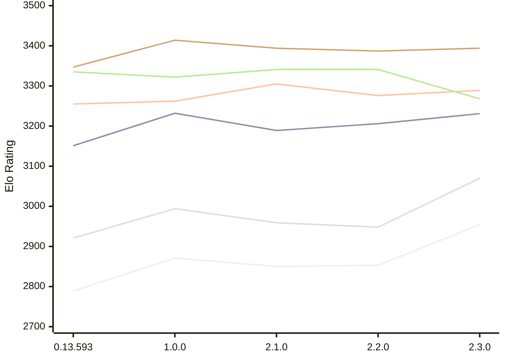

# Engine: Pawnstar

Author: Jonny Reckless

Home: https://github.com/jonny-reckless/pawnstar

## Elo Ratings E1 (Ultra 7 265T (1.50 GHz) - E-Core)

| Version | Published | STC 8.0+0.08s  | LTC 60.0+0.60s | VLTC 2m24s+1.12s | Comment |
| --- | --- | --- | --- | --- | --- |
| 2.3.0 | 2026-11-08 | 2954(+101) | 3231(+25) | 3289(+13) |  |
| 2.2.0 | 2026-11-07 | 2853(+3) | 3206(+17) | 3276(-29) |  |
| 2.1.0 | 2026-10-31 | 2850(-21) | 3189(-43) | 3305(+43) |  |
| 1.0.0 | 2026-10-15 | 2871(+82) | 3232(+81) | 3262(+7) |  |
| 0.13.593 | 2026-06-30 | 2789 | 3151 | 3255 |  |
 | | | cElo (∆ prev) | cElo (∆ prev) | cElo (∆ prev) | 

## Elo Ratings P1 (Ultra 7 265T (1.50 GHz) - P-Core)

| Version | Published | STC 8.0+0.08s  | LTC 60.0+0.60s | VLTC 2m24s+1.12s | Comment |
| --- | --- | --- | --- | --- | --- |
| 2.3.0 | 2026-11-08 | 3070(+122) | 3268(-73) | 3394(+7) |  |
| 2.2.0 | 2026-11-07 | 2948(-11) | 3341(0) | 3387(-7) |  |
| 2.1.0 | 2026-10-31 | 2959(-35) | 3341(+19) | 3394(-20) |  |
| 1.0.0 | 2026-10-15 | 2994(+73) | 3322(-13) | 3414(+67) |  |
| 0.13.593 | 2026-06-30 | 2921 | 3335 | 3347 |  |
 | | | cElo (∆ prev) | cElo (∆ prev) | cElo (∆ prev) | 

## Elo Ratings T1 (i5-7500T 2.70GHz)

| Version | Published | STC 8.0+0.08s  | LTC 60.0+0.60s | VLTC 2m24s+1.12s | Comment |
| --- | --- | --- | --- | --- | --- |
| 0.13.593 | 2026-06-30 | 2831 | 3125 | 3200 |  |
 | | | cElo (∆ prev) | cElo (∆ prev) | cElo (∆ prev) | 

<a href="https://github.com/computer-chess-index/cci/issues/new?template=submit-version.yml&title=[VERSION]+Pawnstar+<version>&body=###%20Engine%20name%0APawnstar%0A%0A###%20Version%0A0.13.593" target="_blank">Submit new version</a>

 Test Conditions:

GUI/CLI: <a href=https://github.com/cutechess/cutechess target="_blank">Cute-Chess</a> 
Elo Calculation: <a href=https://www.remi-coulom.fr/Bayesian-Elo/ target="_blank">Bayesian-Elo</a> 
CPU for P1: Intel(R) Core(TM) Ultra 7 265T (1.50 GHz) - P-Core 
CPU for E1: Intel(R) Core(TM) Ultra 7 265T (1.50 GHz) - E-Core 
CPU for T1: Intel(R) Core(TM) i5-7500T 2.70GHz 
Opening book: 8_moves_v3 
\* STC: 8.0+0.08s, LTC: 60.0+0.60s, VLTC: 2m24s+1.12s

 Lists:
Ratings: <a href=https://github.com/computer-chess-index/cci/blob/main/lists/CCIRatings.csv target="_blank">Complete list</a>

Generated: 2026-11-09 05:40:46

## Ratings Verlauf E1 / P1

```mermaid
%%{init: {"theme":"base","themeVariables":{"seriesColors:['#a3a3a3','#222221','#faa371']}}}%%
xychart-beta
  x-axis ["0.13.593", "1.0.0", "2.1.0", "2.2.0", "2.3.0"]
  y-axis "Elo Rating" 2700 --> 3500
  line "E1: STC (8.0+0.08s)" [2789, 2871, 2850, 2853, 2954]
  line "E1: LTC (60.0+0.60s)" [3151, 3232, 3189, 3206, 3231]
  line "E1: VLTC (2m24s+1.12s)" [3255, 3262, 3305, 3276, 3289]
  line "P1: STC (8.0+0.08s)" [2921, 2994, 2959, 2948, 3070]
  line "P1: LTC (60.0+0.60s)" [3335, 3322, 3341, 3341, 3268]
  line "P1: VLTC (2m24s+1.12s)" [3347, 3414, 3394, 3387, 3394]
```

## Detailed Evaluation Results

| Version | Time Control | Variant | Elo  | Range +/- | Matches | Score | Average Opponent Elo | Draws |
| --- | --- |--- | --- | --- | --- | --- | --- | --- |
| 2.3.0 | VLTC (2m24s+1.12s) | P1 | 3394 | 67 | 60 | 49% | 3401 | 58% |
|  |  | E1 | 3289 | 63 | 62 | 51% | 3282 | 69% |
|  | LTC (60.0+0.60s) | P1 | 3268 | 76 | 46 | 46% | 3303 | 57% |
|  |  | E1 | 3231 | 61 | 72 | 44% | 3275 | 63% |
|  | STC (8.0+0.08s) | P1 | 3070 | 89 | 40 | 53% | 3044 | 30% |
|  |  | E1 | 2954 | 72 | 56 | 43% | 3009 | 46% |
| --- | --- |--- | --- | --- | --- | --- | --- | --- |
| 2.2.0 | VLTC (2m24s+1.12s) | P1 | 3387 | 38 | 178 | 53% | 3367 | 63% |
|  |  | E1 | 3276 | 32 | 262 | 51% | 3271 | 57% |
|  | LTC (60.0+0.60s) | P1 | 3341 | 48 | 116 | 48% | 3356 | 60% |
|  |  | E1 | 3206 | 32 | 280 | 53% | 3185 | 53% |
|  | STC (8.0+0.08s) | P1 | 2948 | 50 | 126 | 51% | 2938 | 36% |
|  |  | E1 | 2853 | 32 | 292 | 53% | 2827 | 43% |
| --- | --- |--- | --- | --- | --- | --- | --- | --- |
| 2.1.0 | VLTC (2m24s+1.12s) | P1 | 3394 | 34 | 232 | 47% | 3414 | 64% |
|  |  | E1 | 3305 | 28 | 340 | 53% | 3282 | 64% |
|  | LTC (60.0+0.60s) | P1 | 3341 | 41 | 152 | 49% | 3347 | 63% |
|  |  | E1 | 3189 | 29 | 344 | 54% | 3159 | 51% |
|  | STC (8.0+0.08s) | E1 | 2850 | 37 | 228 | 49% | 2858 | 40% |
|  |  | P1 | 2959 | 38 | 212 | 45% | 3005 | 40% |
| --- | --- |--- | --- | --- | --- | --- | --- | --- |
| 1.0.0 | VLTC (2m24s+1.12s) | P1 | 3414 | 40 | 160 | 50% | 3417 | 66% |
|  |  | E1 | 3262 | 34 | 232 | 50% | 3259 | 62% |
|  | LTC (60.0+0.60s) | P1 | 3322 | 39 | 180 | 50% | 3318 | 58% |
|  |  | E1 | 3232 | 32 | 276 | 51% | 3225 | 53% |
|  | STC (8.0+0.08s) | P1 | 2994 | 39 | 198 | 52% | 2977 | 45% |
|  |  | E1 | 2871 | 28 | 394 | 47% | 2897 | 40% |
| --- | --- |--- | --- | --- | --- | --- | --- | --- |
| 0.13.593 | VLTC (2m24s+1.12s) | P1 | 3347 | 35 | 220 | 46% | 3376 | 56% |
|  |  | E1 | 3255 | 30 | 312 | 47% | 3275 | 51% |
|  |  | T1 | 3200 | 26 | 432 | 50% | 3189 | 53% |
|  | LTC (60.0+0.60s) | P1 | 3335 | 34 | 248 | 52% | 3316 | 49% |
|  |  | E1 | 3151 | 31 | 300 | 48% | 3170 | 53% |
|  |  | T1 | 3125 | 26 | 450 | 52% | 3089 | 48% |
|  | STC (8.0+0.08s) | P1 | 2921 | 41 | 192 | 46% | 2961 | 35% |
|  |  | E1 | 2789 | 30 | 382 | 46% | 2827 | 31% |
|  |  | T1 | 2831 | 28 | 436 | 49% | 2822 | 32% |