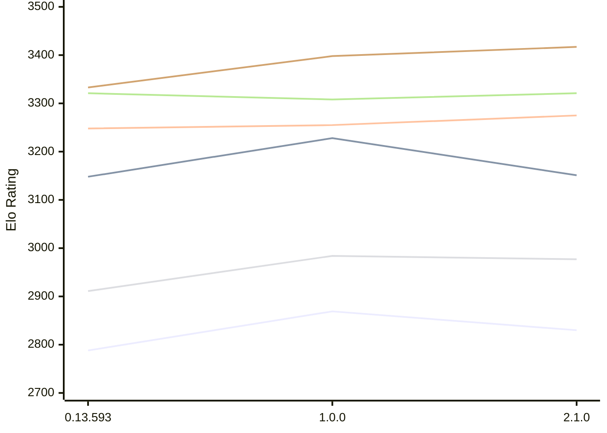

# Engine: Pawnstar

Author: Jonny Reckless

Home: https://github.com/jonny-reckless/pawnstar

## Elo Ratings E1 (Ultra 7 265T (1.50 GHz) - E-Core)

| Version | Published | STC 8.0+0.08s  | LTC 60.0+0.60s | VLTC 2m24s+1.12s | Comment |
| --- | --- | --- | --- | --- | --- |
| 2.1.0 | 2026-10-31 | 2830(-39) | 3151(-77) | 3275(+20) |  |
| 1.0.0 | 2026-10-15 | 2869(+81) | 3228(+80) | 3255(+7) |  |
| 0.13.593 | 2026-06-30 | 2788 | 3148 | 3248 |  |
 | | | cElo (∆ prev) | cElo (∆ prev) | cElo (∆ prev) | 

## Elo Ratings P1 (Ultra 7 265T (1.50 GHz) - P-Core)

| Version | Published | STC 8.0+0.08s  | LTC 60.0+0.60s | VLTC 2m24s+1.12s | Comment |
| --- | --- | --- | --- | --- | --- |
| 2.1.0 | 2026-10-31 | 2977(-7) | 3321(+13) | 3417(+19) |  |
| 1.0.0 | 2026-10-15 | 2984(+73) | 3308(-13) | 3398(+65) |  |
| 0.13.593 | 2026-06-30 | 2911 | 3321 | 3333 |  |
 | | | cElo (∆ prev) | cElo (∆ prev) | cElo (∆ prev) | 

## Elo Ratings T1 (i5-7500T 2.70GHz)

| Version | Published | STC 8.0+0.08s  | LTC 60.0+0.60s | VLTC 2m24s+1.12s | Comment |
| --- | --- | --- | --- | --- | --- |
| 0.13.593 | 2026-06-30 | 2831 | 3125 | 3200 |  |
 | | | cElo (∆ prev) | cElo (∆ prev) | cElo (∆ prev) | 

<a href="https://github.com/computer-chess-index/cci/issues/new?template=submit-version.yml&title=[VERSION]+Pawnstar+<version>&body=###%20Engine%20name%0APawnstar%0A%0A###%20Version%0A0.13.593" target="_blank">Submit new version</a>

 Test Conditions:

GUI/CLI: <a href=https://github.com/cutechess/cutechess target="_blank">Cute-Chess</a> 
Elo Calculation: <a href=https://www.remi-coulom.fr/Bayesian-Elo/ target="_blank">Bayesian-Elo</a> 
CPU for P1: Intel(R) Core(TM) Ultra 7 265T (1.50 GHz) - P-Core 
CPU for E1: Intel(R) Core(TM) Ultra 7 265T (1.50 GHz) - E-Core 
CPU for T1: Intel(R) Core(TM) i5-7500T 2.70GHz 
Opening book: 8_moves_v3 
\* STC: 8.0+0.08s, LTC: 60.0+0.60s, VLTC: 2m24s+1.12s

 Lists:
Ratings: <a href=https://github.com/computer-chess-index/cci/blob/main/lists/CCIRatings.csv target="_blank">Complete list</a>

Generated: 2026-11-02 05:41:06

## Ratings Verlauf E1 / P1

```mermaid
%%{init: {"theme":"base","themeVariables":{"seriesColors:['#a3a3a3','#222221','#faa371']}}}%%
xychart-beta
  x-axis ["0.13.593", "1.0.0", "2.1.0"]
  y-axis "Elo Rating" 2700 --> 3500
  line "E1: STC (8.0+0.08s)" [2788, 2869, 2830]
  line "E1: LTC (60.0+0.60s)" [3148, 3228, 3151]
  line "E1: VLTC (2m24s+1.12s)" [3248, 3255, 3275]
  line "P1: STC (8.0+0.08s)" [2911, 2984, 2977]
  line "P1: LTC (60.0+0.60s)" [3321, 3308, 3321]
  line "P1: VLTC (2m24s+1.12s)" [3333, 3398, 3417]
```

## Detailed Evaluation Results

| Version | Time Control | Variant | Elo  | Range +/- | Matches | Score | Average Opponent Elo | Draws |
| --- | --- |--- | --- | --- | --- | --- | --- | --- |
| 2.1.0 | VLTC (2m24s+1.12s) | P1 | 3417 | 53 | 92 | 51% | 3413 | 62% |
|  |  | E1 | 3275 | 44 | 134 | 53% | 3248 | 63% |
|  | LTC (60.0+0.60s) | E1 | 3151 | 44 | 144 | 53% | 3124 | 53% |
|  |  | P1 | 3321 | 63 | 64 | 48% | 3339 | 64% |
|  | STC (8.0+0.08s) | E1 | 2830 | 54 | 104 | 45% | 2873 | 39% |
|  |  | P1 | 2977 | 56 | 96 | 43% | 3038 | 44% |
| --- | --- |--- | --- | --- | --- | --- | --- | --- |
| 1.0.0 | VLTC (2m24s+1.12s) | P1 | 3398 | 40 | 160 | 50% | 3401 | 66% |
|  |  | E1 | 3255 | 34 | 232 | 50% | 3254 | 62% |
|  | LTC (60.0+0.60s) | P1 | 3308 | 39 | 180 | 50% | 3303 | 58% |
|  |  | E1 | 3228 | 32 | 276 | 51% | 3221 | 53% |
|  | STC (8.0+0.08s) | P1 | 2984 | 38 | 198 | 52% | 2965 | 45% |
|  |  | E1 | 2869 | 28 | 394 | 47% | 2894 | 40% |
| --- | --- |--- | --- | --- | --- | --- | --- | --- |
| 0.13.593 | VLTC (2m24s+1.12s) | P1 | 3333 | 35 | 220 | 46% | 3364 | 56% |
|  |  | E1 | 3248 | 30 | 312 | 47% | 3270 | 51% |
|  |  | T1 | 3200 | 26 | 432 | 50% | 3189 | 53% |
|  | LTC (60.0+0.60s) | P1 | 3321 | 34 | 248 | 52% | 3301 | 49% |
|  |  | E1 | 3148 | 31 | 300 | 48% | 3167 | 53% |
|  |  | T1 | 3125 | 26 | 450 | 52% | 3089 | 48% |
|  | STC (8.0+0.08s) | E1 | 2788 | 30 | 382 | 46% | 2826 | 31% |
|  |  | T1 | 2831 | 28 | 436 | 49% | 2822 | 32% |
|  |  | P1 | 2911 | 41 | 192 | 46% | 2950 | 35% |