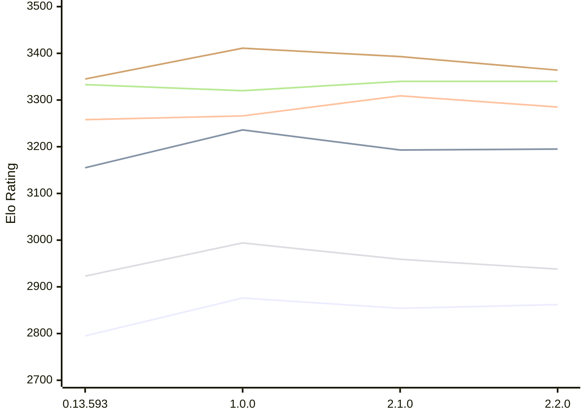

# Engine: Pawnstar

Author: Jonny Reckless

Home: https://github.com/jonny-reckless/pawnstar

## Elo Ratings E1 (Ultra 7 265T (1.50 GHz) - E-Core)

| Version | Published | STC 8.0+0.08s  | LTC 60.0+0.60s | VLTC 2m24s+1.12s | Comment |
| --- | --- | --- | --- | --- | --- |
| 2.2.0 | 2026-11-07 | 2862(+8) | 3195(+2) | 3285(-24) |  |
| 2.1.0 | 2026-10-31 | 2854(-22) | 3193(-43) | 3309(+43) |  |
| 1.0.0 | 2026-10-15 | 2876(+81) | 3236(+81) | 3266(+8) |  |
| 0.13.593 | 2026-06-30 | 2795 | 3155 | 3258 |  |
 | | | cElo (∆ prev) | cElo (∆ prev) | cElo (∆ prev) | 

## Elo Ratings P1 (Ultra 7 265T (1.50 GHz) - P-Core)

| Version | Published | STC 8.0+0.08s  | LTC 60.0+0.60s | VLTC 2m24s+1.12s | Comment |
| --- | --- | --- | --- | --- | --- |
| 2.2.0 | 2026-11-07 | 2938(-21) | 3340(0) | 3364(-29) |  |
| 2.1.0 | 2026-10-31 | 2959(-35) | 3340(+20) | 3393(-18) |  |
| 1.0.0 | 2026-10-15 | 2994(+71) | 3320(-13) | 3411(+66) |  |
| 0.13.593 | 2026-06-30 | 2923 | 3333 | 3345 |  |
 | | | cElo (∆ prev) | cElo (∆ prev) | cElo (∆ prev) | 

## Elo Ratings T1 (i5-7500T 2.70GHz)

| Version | Published | STC 8.0+0.08s  | LTC 60.0+0.60s | VLTC 2m24s+1.12s | Comment |
| --- | --- | --- | --- | --- | --- |
| 0.13.593 | 2026-06-30 | 2831 | 3125 | 3200 |  |
 | | | cElo (∆ prev) | cElo (∆ prev) | cElo (∆ prev) | 

<a href="https://github.com/computer-chess-index/cci/issues/new?template=submit-version.yml&title=[VERSION]+Pawnstar+<version>&body=###%20Engine%20name%0APawnstar%0A%0A###%20Version%0A0.13.593" target="_blank">Submit new version</a>

 Test Conditions:

GUI/CLI: <a href=https://github.com/cutechess/cutechess target="_blank">Cute-Chess</a> 
Elo Calculation: <a href=https://www.remi-coulom.fr/Bayesian-Elo/ target="_blank">Bayesian-Elo</a> 
CPU for P1: Intel(R) Core(TM) Ultra 7 265T (1.50 GHz) - P-Core 
CPU for E1: Intel(R) Core(TM) Ultra 7 265T (1.50 GHz) - E-Core 
CPU for T1: Intel(R) Core(TM) i5-7500T 2.70GHz 
Opening book: 8_moves_v3 
\* STC: 8.0+0.08s, LTC: 60.0+0.60s, VLTC: 2m24s+1.12s

 Lists:
Ratings: <a href=https://github.com/computer-chess-index/cci/blob/main/lists/CCIRatings.csv target="_blank">Complete list</a>

Generated: 2026-11-08 05:40:24

## Ratings Verlauf E1 / P1

```mermaid
%%{init: {"theme":"base","themeVariables":{"seriesColors:['#a3a3a3','#222221','#faa371']}}}%%
xychart-beta
  x-axis ["0.13.593", "1.0.0", "2.1.0", "2.2.0"]
  y-axis "Elo Rating" 2700 --> 3500
  line "E1: STC (8.0+0.08s)" [2795, 2876, 2854, 2862]
  line "E1: LTC (60.0+0.60s)" [3155, 3236, 3193, 3195]
  line "E1: VLTC (2m24s+1.12s)" [3258, 3266, 3309, 3285]
  line "P1: STC (8.0+0.08s)" [2923, 2994, 2959, 2938]
  line "P1: LTC (60.0+0.60s)" [3333, 3320, 3340, 3340]
  line "P1: VLTC (2m24s+1.12s)" [3345, 3411, 3393, 3364]
```

## Detailed Evaluation Results

| Version | Time Control | Variant | Elo  | Range +/- | Matches | Score | Average Opponent Elo | Draws |
| --- | --- |--- | --- | --- | --- | --- | --- | --- |
| 2.2.0 | VLTC (2m24s+1.12s) | P1 | 3364 | 57 | 82 | 52% | 3351 | 57% |
|  |  | E1 | 3285 | 36 | 214 | 51% | 3276 | 57% |
|  | LTC (60.0+0.60s) | P1 | 3340 | 48 | 116 | 48% | 3355 | 60% |
|  |  | E1 | 3195 | 35 | 224 | 52% | 3182 | 54% |
|  | STC (8.0+0.08s) | P1 | 2938 | 62 | 78 | 51% | 2930 | 37% |
|  |  | E1 | 2862 | 34 | 268 | 54% | 2826 | 42% |
| --- | --- |--- | --- | --- | --- | --- | --- | --- |
| 2.1.0 | VLTC (2m24s+1.12s) | E1 | 3309 | 28 | 340 | 53% | 3286 | 64% |
|  |  | P1 | 3393 | 34 | 232 | 47% | 3411 | 64% |
|  | LTC (60.0+0.60s) | P1 | 3340 | 41 | 152 | 49% | 3345 | 63% |
|  |  | E1 | 3193 | 29 | 344 | 54% | 3163 | 51% |
|  | STC (8.0+0.08s) | P1 | 2959 | 38 | 212 | 45% | 3005 | 40% |
|  |  | E1 | 2854 | 37 | 228 | 49% | 2863 | 40% |
| --- | --- |--- | --- | --- | --- | --- | --- | --- |
| 1.0.0 | VLTC (2m24s+1.12s) | P1 | 3411 | 40 | 160 | 50% | 3416 | 66% |
|  |  | E1 | 3266 | 34 | 232 | 50% | 3263 | 62% |
|  | LTC (60.0+0.60s) | P1 | 3320 | 39 | 180 | 50% | 3317 | 58% |
|  |  | E1 | 3236 | 32 | 276 | 51% | 3228 | 53% |
|  | STC (8.0+0.08s) | P1 | 2994 | 39 | 198 | 52% | 2975 | 45% |
|  |  | E1 | 2876 | 28 | 394 | 47% | 2901 | 40% |
| --- | --- |--- | --- | --- | --- | --- | --- | --- |
| 0.13.593 | VLTC (2m24s+1.12s) | E1 | 3258 | 30 | 312 | 47% | 3278 | 51% |
|  |  | T1 | 3200 | 26 | 432 | 50% | 3189 | 53% |
|  |  | P1 | 3345 | 35 | 220 | 46% | 3375 | 56% |
|  | LTC (60.0+0.60s) | E1 | 3155 | 31 | 300 | 48% | 3174 | 53% |
|  |  | T1 | 3125 | 26 | 450 | 52% | 3089 | 48% |
|  |  | P1 | 3333 | 34 | 248 | 52% | 3314 | 49% |
|  | STC (8.0+0.08s) | T1 | 2831 | 28 | 436 | 49% | 2822 | 32% |
|  |  | P1 | 2923 | 41 | 192 | 46% | 2961 | 35% |
|  |  | E1 | 2795 | 30 | 382 | 46% | 2832 | 31% |