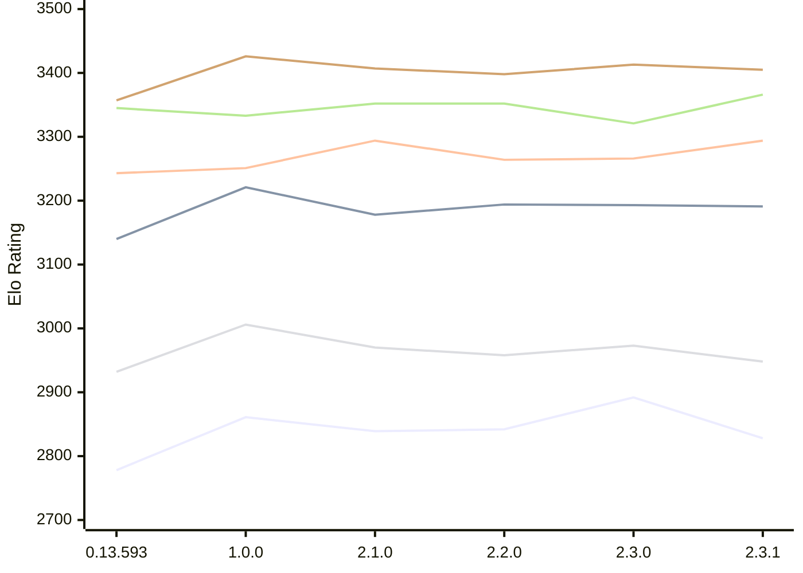

# Engine: Pawnstar

Author: Jonny Reckless

Home: https://github.com/jonny-reckless/pawnstar

## Elo Ratings E1 (Ultra 7 265T (1.50 GHz) - E-Core)

| Version | Published | STC 8.0+0.08s  | LTC 60.0+0.60s | VLTC 2m24s+1.12s | Comment |
| --- | --- | --- | --- | --- | --- |
| 2.3.1 | 2026-11-09 | 2828(-64) | 3191(-2) | 3294(+28) |  |
| 2.3.0 | 2026-11-08 | 2892(+50) | 3193(-1) | 3266(+2) |  |
| 2.2.0 | 2026-11-07 | 2842(+3) | 3194(+16) | 3264(-30) |  |
| 2.1.0 | 2026-10-31 | 2839(-22) | 3178(-43) | 3294(+43) |  |
| 1.0.0 | 2026-10-15 | 2861(+83) | 3221(+81) | 3251(+8) |  |
| 0.13.593 | 2026-06-30 | 2778 | 3140 | 3243 |  |
 | | | cElo (∆ prev) | cElo (∆ prev) | cElo (∆ prev) | 

## Elo Ratings P1 (Ultra 7 265T (1.50 GHz) - P-Core)

| Version | Published | STC 8.0+0.08s  | LTC 60.0+0.60s | VLTC 2m24s+1.12s | Comment |
| --- | --- | --- | --- | --- | --- |
| 2.3.1 | 2026-11-09 | 2948(-25) | 3366(+45) | 3405(-8) |  |
| 2.3.0 | 2026-11-08 | 2973(+15) | 3321(-31) | 3413(+15) |  |
| 2.2.0 | 2026-11-07 | 2958(-12) | 3352(0) | 3398(-9) |  |
| 2.1.0 | 2026-10-31 | 2970(-36) | 3352(+19) | 3407(-19) |  |
| 1.0.0 | 2026-10-15 | 3006(+74) | 3333(-12) | 3426(+69) |  |
| 0.13.593 | 2026-06-30 | 2932 | 3345 | 3357 |  |
 | | | cElo (∆ prev) | cElo (∆ prev) | cElo (∆ prev) | 

## Elo Ratings T1 (i5-7500T 2.70GHz)

| Version | Published | STC 8.0+0.08s  | LTC 60.0+0.60s | VLTC 2m24s+1.12s | Comment |
| --- | --- | --- | --- | --- | --- |
| 0.13.593 | 2026-06-30 | 2831 | 3125 | 3200 |  |
 | | | cElo (∆ prev) | cElo (∆ prev) | cElo (∆ prev) | 

<a href="https://github.com/computer-chess-index/cci/issues/new?template=submit-version.yml&title=[VERSION]+Pawnstar+<version>&body=###%20Engine%20name%0APawnstar%0A%0A###%20Version%0A0.13.593" target="_blank">Submit new version</a>

 Test Conditions:

GUI/CLI: <a href=https://github.com/cutechess/cutechess target="_blank">Cute-Chess</a> 
Elo Calculation: <a href=https://www.remi-coulom.fr/Bayesian-Elo/ target="_blank">Bayesian-Elo</a> 
CPU for P1: Intel(R) Core(TM) Ultra 7 265T (1.50 GHz) - P-Core 
CPU for E1: Intel(R) Core(TM) Ultra 7 265T (1.50 GHz) - E-Core 
CPU for T1: Intel(R) Core(TM) i5-7500T 2.70GHz 
Opening book: 8_moves_v3 
\* STC: 8.0+0.08s, LTC: 60.0+0.60s, VLTC: 2m24s+1.12s

 Lists:
Ratings: <a href=https://github.com/computer-chess-index/cci/blob/main/lists/CCIRatings.csv target="_blank">Complete list</a>

Generated: 2026-11-12 05:40:35

## Ratings Verlauf E1 / P1

```mermaid
%%{init: {"theme":"base","themeVariables":{"seriesColors:['#a3a3a3','#222221','#faa371']}}}%%
xychart-beta
  x-axis ["0.13.593", "1.0.0", "2.1.0", "2.2.0", "2.3.0", "2.3.1"]
  y-axis "Elo Rating" 2700 --> 3500
  line "E1: STC (8.0+0.08s)" [2778, 2861, 2839, 2842, 2892, 2828]
  line "E1: LTC (60.0+0.60s)" [3140, 3221, 3178, 3194, 3193, 3191]
  line "E1: VLTC (2m24s+1.12s)" [3243, 3251, 3294, 3264, 3266, 3294]
  line "P1: STC (8.0+0.08s)" [2932, 3006, 2970, 2958, 2973, 2948]
  line "P1: LTC (60.0+0.60s)" [3345, 3333, 3352, 3352, 3321, 3366]
  line "P1: VLTC (2m24s+1.12s)" [3357, 3426, 3407, 3398, 3413, 3405]
```

## Detailed Evaluation Results

| Version | Time Control | Variant | Elo  | Range +/- | Matches | Score | Average Opponent Elo | Draws |
| --- | --- |--- | --- | --- | --- | --- | --- | --- |
| 2.3.1 | VLTC (2m24s+1.12s) | E1 | 3294 | 30 | 288 | 51% | 3285 | 65% |
|  |  | P1 | 3405 | 39 | 176 | 50% | 3405 | 60% |
|  | LTC (60.0+0.60s) | E1 | 3191 | 31 | 292 | 53% | 3171 | 57% |
|  |  | P1 | 3366 | 44 | 136 | 49% | 3372 | 60% |
|  | STC (8.0+0.08s) | P1 | 2948 | 50 | 124 | 51% | 2938 | 35% |
|  |  | E1 | 2828 | 33 | 290 | 48% | 2840 | 37% |
| --- | --- |--- | --- | --- | --- | --- | --- | --- |
| 2.3.0 | VLTC (2m24s+1.12s) | P1 | 3413 | 44 | 136 | 50% | 3416 | 60% |
|  |  | E1 | 3266 | 37 | 196 | 49% | 3271 | 63% |
|  | LTC (60.0+0.60s) | P1 | 3321 | 38 | 182 | 52% | 3305 | 59% |
|  |  | E1 | 3193 | 33 | 244 | 46% | 3220 | 57% |
|  | STC (8.0+0.08s) | P1 | 2973 | 35 | 246 | 45% | 3015 | 39% |
|  |  | E1 | 2892 | 32 | 292 | 46% | 2923 | 42% |
| --- | --- |--- | --- | --- | --- | --- | --- | --- |
| 2.2.0 | VLTC (2m24s+1.12s) | P1 | 3398 | 38 | 178 | 53% | 3379 | 63% |
|  |  | E1 | 3264 | 32 | 262 | 51% | 3260 | 57% |
|  | LTC (60.0+0.60s) | P1 | 3352 | 48 | 116 | 48% | 3367 | 60% |
|  |  | E1 | 3194 | 32 | 280 | 53% | 3173 | 53% |
|  | STC (8.0+0.08s) | P1 | 2958 | 50 | 126 | 51% | 2947 | 36% |
|  |  | E1 | 2842 | 32 | 292 | 53% | 2815 | 43% |
| --- | --- |--- | --- | --- | --- | --- | --- | --- |
| 2.1.0 | VLTC (2m24s+1.12s) | P1 | 3407 | 34 | 232 | 47% | 3426 | 64% |
|  |  | E1 | 3294 | 28 | 340 | 53% | 3271 | 64% |
|  | LTC (60.0+0.60s) | E1 | 3178 | 29 | 344 | 54% | 3148 | 51% |
|  |  | P1 | 3352 | 41 | 152 | 49% | 3357 | 63% |
|  | STC (8.0+0.08s) | E1 | 2839 | 37 | 228 | 49% | 2847 | 40% |
|  |  | P1 | 2970 | 38 | 212 | 45% | 3015 | 40% |
| --- | --- |--- | --- | --- | --- | --- | --- | --- |
| 1.0.0 | VLTC (2m24s+1.12s) | P1 | 3426 | 40 | 160 | 50% | 3430 | 66% |
|  |  | E1 | 3251 | 34 | 232 | 50% | 3248 | 62% |
|  | LTC (60.0+0.60s) | P1 | 3333 | 39 | 180 | 50% | 3329 | 58% |
|  |  | E1 | 3221 | 32 | 276 | 51% | 3214 | 53% |
|  | STC (8.0+0.08s) | P1 | 3006 | 39 | 198 | 52% | 2988 | 45% |
|  |  | E1 | 2861 | 28 | 394 | 47% | 2885 | 40% |
| --- | --- |--- | --- | --- | --- | --- | --- | --- |
| 0.13.593 | VLTC (2m24s+1.12s) | P1 | 3357 | 35 | 220 | 46% | 3389 | 56% |
|  |  | E1 | 3243 | 30 | 312 | 47% | 3263 | 51% |
|  |  | T1 | 3200 | 26 | 432 | 50% | 3189 | 53% |
|  | LTC (60.0+0.60s) | P1 | 3345 | 34 | 248 | 52% | 3326 | 49% |
|  |  | E1 | 3140 | 31 | 300 | 48% | 3158 | 53% |
|  |  | T1 | 3125 | 26 | 450 | 52% | 3089 | 48% |
|  | STC (8.0+0.08s) | E1 | 2778 | 30 | 382 | 46% | 2816 | 31% |
|  |  | T1 | 2831 | 28 | 436 | 49% | 2822 | 32% |
|  |  | P1 | 2932 | 41 | 192 | 46% | 2970 | 35% |