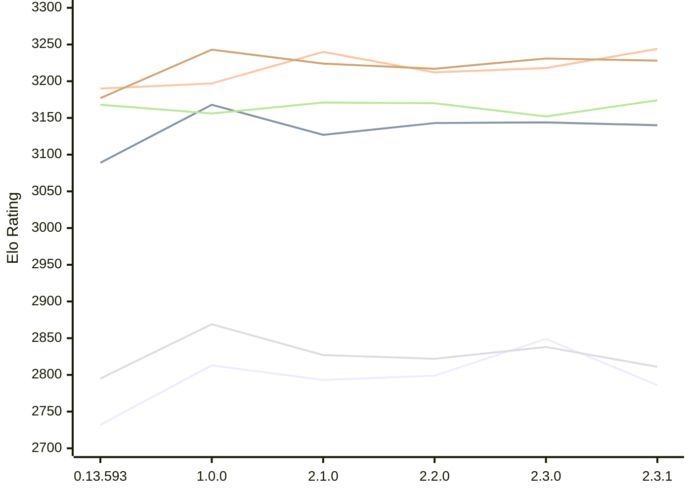

# Engine: Pawnstar

Author: Jonny Reckless

Home: https://github.com/jonny-reckless/pawnstar

## Elo Ratings E1 (Ultra 7 265T (1.50 GHz) - E-Core)

| Version | Published | STC 8.0+0.08s  | LTC 60.0+0.60s | VLTC 2m24s+1.12s | Comment |
| --- | --- | --- | --- | --- | --- |
| 2.3.1 | 2026-11-09 | 2786(-63) | 3140(-4) | 3244(+26) |  |
| 2.3.0 | 2026-11-08 | 2849(+50) | 3144(+1) | 3218(+6) |  |
| 2.2.0 | 2026-11-07 | 2799(+6) | 3143(+16) | 3212(-28) |  |
| 2.1.0 | 2026-10-31 | 2793(-20) | 3127(-41) | 3240(+43) |  |
| 1.0.0 | 2026-10-15 | 2813(+81) | 3168(+79) | 3197(+7) |  |
| 0.13.593 | 2026-06-30 | 2732 | 3089 | 3190 |  |
 | | | cElo (∆ prev) | cElo (∆ prev) | cElo (∆ prev) | 

## Elo Ratings P1 (Ultra 7 265T (1.50 GHz) - P-Core)

| Version | Published | STC 8.0+0.08s  | LTC 60.0+0.60s | VLTC 2m24s+1.12s | Comment |
| --- | --- | --- | --- | --- | --- |
| 2.3.1 | 2026-11-09 | 2811(-27) | 3174(+22) | 3228(-3) |  |
| 2.3.0 | 2026-11-08 | 2838(+16) | 3152(-18) | 3231(+14) |  |
| 2.2.0 | 2026-11-07 | 2822(-5) | 3170(-1) | 3217(-7) |  |
| 2.1.0 | 2026-10-31 | 2827(-42) | 3171(+15) | 3224(-19) |  |
| 1.0.0 | 2026-10-15 | 2869(+74) | 3156(-12) | 3243(+66) |  |
| 0.13.593 | 2026-06-30 | 2795 | 3168 | 3177 |  |
 | | | cElo (∆ prev) | cElo (∆ prev) | cElo (∆ prev) | 

## Elo Ratings T1 (i5-7500T 2.70GHz)

| Version | Published | STC 8.0+0.08s  | LTC 60.0+0.60s | VLTC 2m24s+1.12s | Comment |
| --- | --- | --- | --- | --- | --- |
| 0.13.593 | 2026-06-30 | 2831 | 3125 | 3200 |  |
 | | | cElo (∆ prev) | cElo (∆ prev) | cElo (∆ prev) | 

<a href="https://github.com/computer-chess-index/cci/issues/new?template=submit-version.yml&title=[VERSION]+Pawnstar+<version>&body=###%20Engine%20name%0APawnstar%0A%0A###%20Version%0A0.13.593" target="_blank">Submit new version</a>

 Test Conditions:

GUI/CLI: <a href=https://github.com/cutechess/cutechess target="_blank">Cute-Chess</a> 
Elo Calculation: <a href=https://www.remi-coulom.fr/Bayesian-Elo/ target="_blank">Bayesian-Elo</a> 
CPU for P1: Intel(R) Core(TM) Ultra 7 265T (1.50 GHz) - P-Core 
CPU for E1: Intel(R) Core(TM) Ultra 7 265T (1.50 GHz) - E-Core 
CPU for T1: Intel(R) Core(TM) i5-7500T 2.70GHz 
Opening book: 8_moves_v3 
\* STC: 8.0+0.08s, LTC: 60.0+0.60s, VLTC: 2m24s+1.12s

 Lists:
Ratings: <a href=https://github.com/computer-chess-index/cci/blob/main/lists/CCIRatings.csv target="_blank">Complete list</a>

Generated: 2026-11-28 05:41:13

## Ratings Verlauf E1 / P1

```mermaid
%%{init: {"theme":"base","themeVariables":{"seriesColors:['#a3a3a3','#222221','#faa371']}}}%%
xychart-beta
  x-axis ["0.13.593", "1.0.0", "2.1.0", "2.2.0", "2.3.0", "2.3.1"]
  y-axis "Elo Rating" 2700 --> 3300
  line "E1: STC (8.0+0.08s)" [2732, 2813, 2793, 2799, 2849, 2786]
  line "E1: LTC (60.0+0.60s)" [3089, 3168, 3127, 3143, 3144, 3140]
  line "E1: VLTC (2m24s+1.12s)" [3190, 3197, 3240, 3212, 3218, 3244]
  line "P1: STC (8.0+0.08s)" [2795, 2869, 2827, 2822, 2838, 2811]
  line "P1: LTC (60.0+0.60s)" [3168, 3156, 3171, 3170, 3152, 3174]
  line "P1: VLTC (2m24s+1.12s)" [3177, 3243, 3224, 3217, 3231, 3228]
```

## Detailed Evaluation Results

| Version | Time Control | Variant | Elo  | Range +/- | Matches | Score | Average Opponent Elo | Draws |
| --- | --- |--- | --- | --- | --- | --- | --- | --- |
| 2.3.1 | VLTC (2m24s+1.12s) | P1 | 3228 | 35 | 216 | 49% | 3237 | 59% |
|  |  | E1 | 3244 | 29 | 312 | 52% | 3232 | 64% |
|  | LTC (60.0+0.60s) | P1 | 3174 | 35 | 216 | 48% | 3189 | 60% |
|  |  | E1 | 3140 | 28 | 340 | 52% | 3125 | 57% |
|  | STC (8.0+0.08s) | P1 | 2811 | 41 | 188 | 49% | 2827 | 38% |
|  |  | E1 | 2786 | 28 | 414 | 46% | 2819 | 36% |
| --- | --- |--- | --- | --- | --- | --- | --- | --- |
| 2.3.0 | VLTC (2m24s+1.12s) | P1 | 3231 | 43 | 144 | 48% | 3244 | 59% |
|  |  | E1 | 3218 | 35 | 216 | 49% | 3227 | 62% |
|  | LTC (60.0+0.60s) | P1 | 3152 | 37 | 198 | 52% | 3133 | 58% |
|  |  | E1 | 3144 | 30 | 298 | 47% | 3170 | 58% |
|  | STC (8.0+0.08s) | P1 | 2838 | 33 | 286 | 46% | 2870 | 41% |
|  |  | E1 | 2849 | 30 | 332 | 48% | 2869 | 40% |
| --- | --- |--- | --- | --- | --- | --- | --- | --- |
| 2.2.0 | VLTC (2m24s+1.12s) | E1 | 3212 | 32 | 262 | 51% | 3208 | 57% |
|  |  | P1 | 3217 | 38 | 178 | 53% | 3197 | 63% |
|  | LTC (60.0+0.60s) | E1 | 3143 | 32 | 280 | 53% | 3123 | 53% |
|  |  | P1 | 3170 | 48 | 116 | 48% | 3185 | 60% |
|  | STC (8.0+0.08s) | E1 | 2799 | 32 | 292 | 53% | 2772 | 43% |
|  |  | P1 | 2822 | 50 | 126 | 51% | 2809 | 36% |
| --- | --- |--- | --- | --- | --- | --- | --- | --- |
| 2.1.0 | VLTC (2m24s+1.12s) | P1 | 3224 | 34 | 232 | 47% | 3243 | 64% |
|  |  | E1 | 3240 | 28 | 340 | 53% | 3218 | 64% |
|  | LTC (60.0+0.60s) | P1 | 3171 | 41 | 152 | 49% | 3177 | 63% |
|  |  | E1 | 3127 | 29 | 344 | 54% | 3097 | 51% |
|  | STC (8.0+0.08s) | P1 | 2827 | 38 | 212 | 45% | 2873 | 40% |
|  |  | E1 | 2793 | 37 | 228 | 49% | 2803 | 40% |
| --- | --- |--- | --- | --- | --- | --- | --- | --- |
| 1.0.0 | VLTC (2m24s+1.12s) | E1 | 3197 | 34 | 232 | 50% | 3195 | 62% |
|  |  | P1 | 3243 | 40 | 160 | 50% | 3245 | 66% |
|  | LTC (60.0+0.60s) | P1 | 3156 | 39 | 180 | 50% | 3152 | 58% |
|  |  | E1 | 3168 | 32 | 276 | 51% | 3162 | 53% |
|  | STC (8.0+0.08s) | P1 | 2869 | 39 | 198 | 52% | 2850 | 45% |
|  |  | E1 | 2813 | 28 | 394 | 47% | 2838 | 40% |
| --- | --- |--- | --- | --- | --- | --- | --- | --- |
| 0.13.593 | VLTC (2m24s+1.12s) | T1 | 3200 | 26 | 432 | 50% | 3189 | 53% |
|  |  | P1 | 3177 | 35 | 220 | 46% | 3206 | 56% |
|  |  | E1 | 3190 | 30 | 312 | 47% | 3210 | 51% |
|  | LTC (60.0+0.60s) | T1 | 3125 | 26 | 450 | 52% | 3089 | 48% |
|  |  | P1 | 3168 | 34 | 248 | 52% | 3150 | 49% |
|  |  | E1 | 3089 | 31 | 300 | 48% | 3106 | 53% |
|  | STC (8.0+0.08s) | T1 | 2831 | 28 | 436 | 49% | 2822 | 32% |
|  |  | P1 | 2795 | 41 | 192 | 46% | 2831 | 35% |
|  |  | E1 | 2732 | 30 | 382 | 46% | 2770 | 31% |