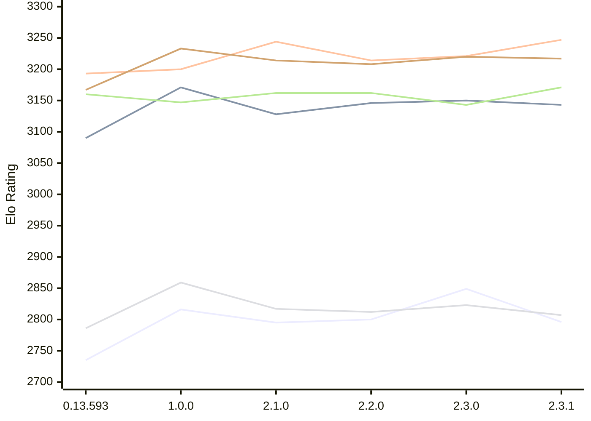

# Engine: Pawnstar

Author: Jonny Reckless

Home: https://github.com/jonny-reckless/pawnstar

## Elo Ratings E1 (Ultra 7 265T (1.50 GHz) - E-Core)

| Version | Published | STC 8.0+0.08s  | LTC 60.0+0.60s | VLTC 2m24s+1.12s | Comment |
| --- | --- | --- | --- | --- | --- |
| 2.3.1 | 2026-11-09 | 2796(-53) | 3143(-7) | 3247(+26) |  |
| 2.3.0 | 2026-11-08 | 2849(+49) | 3150(+4) | 3221(+7) |  |
| 2.2.0 | 2026-11-07 | 2800(+5) | 3146(+18) | 3214(-30) |  |
| 2.1.0 | 2026-10-31 | 2795(-21) | 3128(-43) | 3244(+44) |  |
| 1.0.0 | 2026-10-15 | 2816(+81) | 3171(+81) | 3200(+7) |  |
| 0.13.593 | 2026-06-30 | 2735 | 3090 | 3193 |  |
 | | | cElo (∆ prev) | cElo (∆ prev) | cElo (∆ prev) | 

## Elo Ratings P1 (Ultra 7 265T (1.50 GHz) - P-Core)

| Version | Published | STC 8.0+0.08s  | LTC 60.0+0.60s | VLTC 2m24s+1.12s | Comment |
| --- | --- | --- | --- | --- | --- |
| 2.3.1 | 2026-11-09 | 2807(-16) | 3171(+28) | 3217(-3) |  |
| 2.3.0 | 2026-11-08 | 2823(+11) | 3143(-19) | 3220(+12) |  |
| 2.2.0 | 2026-11-07 | 2812(-5) | 3162(0) | 3208(-6) |  |
| 2.1.0 | 2026-10-31 | 2817(-42) | 3162(+15) | 3214(-19) |  |
| 1.0.0 | 2026-10-15 | 2859(+73) | 3147(-13) | 3233(+66) |  |
| 0.13.593 | 2026-06-30 | 2786 | 3160 | 3167 |  |
 | | | cElo (∆ prev) | cElo (∆ prev) | cElo (∆ prev) | 

## Elo Ratings T1 (i5-7500T 2.70GHz)

| Version | Published | STC 8.0+0.08s  | LTC 60.0+0.60s | VLTC 2m24s+1.12s | Comment |
| --- | --- | --- | --- | --- | --- |
| 0.13.593 | 2026-06-30 | 2831 | 3125 | 3200 |  |
 | | | cElo (∆ prev) | cElo (∆ prev) | cElo (∆ prev) | 

<a href="https://github.com/computer-chess-index/cci/issues/new?template=submit-version.yml&title=[VERSION]+Pawnstar+<version>&body=###%20Engine%20name%0APawnstar%0A%0A###%20Version%0A0.13.593" target="_blank">Submit new version</a>

 Test Conditions:

GUI/CLI: <a href=https://github.com/cutechess/cutechess target="_blank">Cute-Chess</a> 
Elo Calculation: <a href=https://www.remi-coulom.fr/Bayesian-Elo/ target="_blank">Bayesian-Elo</a> 
CPU for P1: Intel(R) Core(TM) Ultra 7 265T (1.50 GHz) - P-Core 
CPU for E1: Intel(R) Core(TM) Ultra 7 265T (1.50 GHz) - E-Core 
CPU for T1: Intel(R) Core(TM) i5-7500T 2.70GHz 
Opening book: 8_moves_v3 
\* STC: 8.0+0.08s, LTC: 60.0+0.60s, VLTC: 2m24s+1.12s

 Lists:
Ratings: <a href=https://github.com/computer-chess-index/cci/blob/main/lists/CCIRatings.csv target="_blank">Complete list</a>

Generated: 2026-11-24 05:41:05

## Ratings Verlauf E1 / P1

```mermaid
%%{init: {"theme":"base","themeVariables":{"seriesColors:['#a3a3a3','#222221','#faa371']}}}%%
xychart-beta
  x-axis ["0.13.593", "1.0.0", "2.1.0", "2.2.0", "2.3.0", "2.3.1"]
  y-axis "Elo Rating" 2700 --> 3300
  line "E1: STC (8.0+0.08s)" [2735, 2816, 2795, 2800, 2849, 2796]
  line "E1: LTC (60.0+0.60s)" [3090, 3171, 3128, 3146, 3150, 3143]
  line "E1: VLTC (2m24s+1.12s)" [3193, 3200, 3244, 3214, 3221, 3247]
  line "P1: STC (8.0+0.08s)" [2786, 2859, 2817, 2812, 2823, 2807]
  line "P1: LTC (60.0+0.60s)" [3160, 3147, 3162, 3162, 3143, 3171]
  line "P1: VLTC (2m24s+1.12s)" [3167, 3233, 3214, 3208, 3220, 3217]
```

## Detailed Evaluation Results

| Version | Time Control | Variant | Elo  | Range +/- | Matches | Score | Average Opponent Elo | Draws |
| --- | --- |--- | --- | --- | --- | --- | --- | --- |
| 2.3.1 | VLTC (2m24s+1.12s) | P1 | 3217 | 35 | 216 | 49% | 3227 | 59% |
|  |  | E1 | 3247 | 29 | 308 | 51% | 3235 | 65% |
|  | LTC (60.0+0.60s) | P1 | 3171 | 39 | 176 | 48% | 3183 | 59% |
|  |  | E1 | 3143 | 29 | 328 | 52% | 3125 | 57% |
|  | STC (8.0+0.08s) | E1 | 2796 | 29 | 390 | 47% | 2822 | 35% |
|  |  | P1 | 2807 | 42 | 176 | 49% | 2819 | 38% |
| --- | --- |--- | --- | --- | --- | --- | --- | --- |
| 2.3.0 | VLTC (2m24s+1.12s) | P1 | 3220 | 43 | 144 | 48% | 3233 | 59% |
|  |  | E1 | 3221 | 35 | 216 | 49% | 3229 | 62% |
|  | LTC (60.0+0.60s) | P1 | 3143 | 37 | 198 | 52% | 3124 | 58% |
|  |  | E1 | 3150 | 31 | 286 | 47% | 3173 | 58% |
|  | STC (8.0+0.08s) | P1 | 2823 | 33 | 274 | 45% | 2861 | 41% |
|  |  | E1 | 2849 | 31 | 316 | 47% | 2874 | 41% |
| --- | --- |--- | --- | --- | --- | --- | --- | --- |
| 2.2.0 | VLTC (2m24s+1.12s) | E1 | 3214 | 32 | 262 | 51% | 3210 | 57% |
|  |  | P1 | 3208 | 38 | 178 | 53% | 3187 | 63% |
|  | LTC (60.0+0.60s) | P1 | 3162 | 48 | 116 | 48% | 3175 | 60% |
|  |  | E1 | 3146 | 32 | 280 | 53% | 3124 | 53% |
|  | STC (8.0+0.08s) | P1 | 2812 | 50 | 126 | 51% | 2801 | 36% |
|  |  | E1 | 2800 | 32 | 292 | 53% | 2773 | 43% |
| --- | --- |--- | --- | --- | --- | --- | --- | --- |
| 2.1.0 | VLTC (2m24s+1.12s) | P1 | 3214 | 34 | 232 | 47% | 3233 | 64% |
|  |  | E1 | 3244 | 28 | 340 | 53% | 3221 | 64% |
|  | LTC (60.0+0.60s) | P1 | 3162 | 41 | 152 | 49% | 3168 | 63% |
|  |  | E1 | 3128 | 29 | 344 | 54% | 3098 | 51% |
|  | STC (8.0+0.08s) | P1 | 2817 | 38 | 212 | 45% | 2863 | 40% |
|  |  | E1 | 2795 | 37 | 228 | 49% | 2803 | 40% |
| --- | --- |--- | --- | --- | --- | --- | --- | --- |
| 1.0.0 | VLTC (2m24s+1.12s) | P1 | 3233 | 40 | 160 | 50% | 3237 | 66% |
|  |  | E1 | 3200 | 34 | 232 | 50% | 3198 | 62% |
|  | LTC (60.0+0.60s) | P1 | 3147 | 39 | 180 | 50% | 3144 | 58% |
|  |  | E1 | 3171 | 32 | 276 | 51% | 3164 | 53% |
|  | STC (8.0+0.08s) | P1 | 2859 | 39 | 198 | 52% | 2840 | 45% |
|  |  | E1 | 2816 | 28 | 394 | 47% | 2842 | 40% |
| --- | --- |--- | --- | --- | --- | --- | --- | --- |
| 0.13.593 | VLTC (2m24s+1.12s) | T1 | 3200 | 26 | 432 | 50% | 3189 | 53% |
|  |  | P1 | 3167 | 35 | 220 | 46% | 3197 | 56% |
|  |  | E1 | 3193 | 30 | 312 | 47% | 3213 | 51% |
|  | LTC (60.0+0.60s) | T1 | 3125 | 26 | 450 | 52% | 3089 | 48% |
|  |  | P1 | 3160 | 34 | 248 | 52% | 3140 | 49% |
|  |  | E1 | 3090 | 31 | 300 | 48% | 3109 | 53% |
|  | STC (8.0+0.08s) | P1 | 2786 | 41 | 192 | 46% | 2823 | 35% |
|  |  | E1 | 2735 | 30 | 382 | 46% | 2773 | 31% |
|  |  | T1 | 2831 | 28 | 436 | 49% | 2822 | 32% |