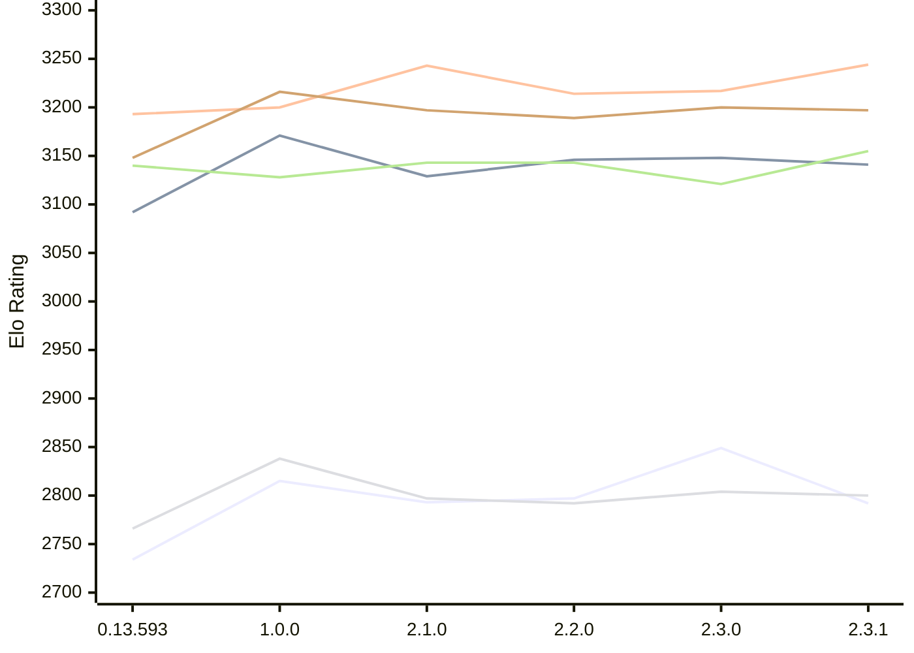

# Engine: Pawnstar

Author: Jonny Reckless

Home: https://github.com/jonny-reckless/pawnstar

## Elo Ratings E1 (Ultra 7 265T (1.50 GHz) - E-Core)

| Version | Published | STC 8.0+0.08s  | LTC 60.0+0.60s | VLTC 2m24s+1.12s | Comment |
| --- | --- | --- | --- | --- | --- |
| 2.3.1 | 2026-11-09 | 2792(-57) | 3141(-7) | 3244(+27) |  |
| 2.3.0 | 2026-11-08 | 2849(+52) | 3148(+2) | 3217(+3) |  |
| 2.2.0 | 2026-11-07 | 2797(+4) | 3146(+17) | 3214(-29) |  |
| 2.1.0 | 2026-10-31 | 2793(-22) | 3129(-42) | 3243(+43) |  |
| 1.0.0 | 2026-10-15 | 2815(+81) | 3171(+79) | 3200(+7) |  |
| 0.13.593 | 2026-06-30 | 2734 | 3092 | 3193 |  |
 | | | cElo (∆ prev) | cElo (∆ prev) | cElo (∆ prev) | 

## Elo Ratings P1 (Ultra 7 265T (1.50 GHz) - P-Core)

| Version | Published | STC 8.0+0.08s  | LTC 60.0+0.60s | VLTC 2m24s+1.12s | Comment |
| --- | --- | --- | --- | --- | --- |
| 2.3.1 | 2026-11-09 | 2800(-4) | 3155(+34) | 3197(-3) |  |
| 2.3.0 | 2026-11-08 | 2804(+12) | 3121(-22) | 3200(+11) |  |
| 2.2.0 | 2026-11-07 | 2792(-5) | 3143(0) | 3189(-8) |  |
| 2.1.0 | 2026-10-31 | 2797(-41) | 3143(+15) | 3197(-19) |  |
| 1.0.0 | 2026-10-15 | 2838(+72) | 3128(-12) | 3216(+68) |  |
| 0.13.593 | 2026-06-30 | 2766 | 3140 | 3148 |  |
 | | | cElo (∆ prev) | cElo (∆ prev) | cElo (∆ prev) | 

## Elo Ratings T1 (i5-7500T 2.70GHz)

| Version | Published | STC 8.0+0.08s  | LTC 60.0+0.60s | VLTC 2m24s+1.12s | Comment |
| --- | --- | --- | --- | --- | --- |
| 0.13.593 | 2026-06-30 | 2831 | 3125 | 3200 |  |
 | | | cElo (∆ prev) | cElo (∆ prev) | cElo (∆ prev) | 

<a href="https://github.com/computer-chess-index/cci/issues/new?template=submit-version.yml&title=[VERSION]+Pawnstar+<version>&body=###%20Engine%20name%0APawnstar%0A%0A###%20Version%0A0.13.593" target="_blank">Submit new version</a>

 Test Conditions:

GUI/CLI: <a href=https://github.com/cutechess/cutechess target="_blank">Cute-Chess</a> 
Elo Calculation: <a href=https://www.remi-coulom.fr/Bayesian-Elo/ target="_blank">Bayesian-Elo</a> 
CPU for P1: Intel(R) Core(TM) Ultra 7 265T (1.50 GHz) - P-Core 
CPU for E1: Intel(R) Core(TM) Ultra 7 265T (1.50 GHz) - E-Core 
CPU for T1: Intel(R) Core(TM) i5-7500T 2.70GHz 
Opening book: 8_moves_v3 
\* STC: 8.0+0.08s, LTC: 60.0+0.60s, VLTC: 2m24s+1.12s

 Lists:
Ratings: <a href=https://github.com/computer-chess-index/cci/blob/main/lists/CCIRatings.csv target="_blank">Complete list</a>

Generated: 2026-11-18 05:41:22

## Ratings Verlauf E1 / P1

```mermaid
%%{init: {"theme":"base","themeVariables":{"seriesColors:['#a3a3a3','#222221','#faa371']}}}%%
xychart-beta
  x-axis ["0.13.593", "1.0.0", "2.1.0", "2.2.0", "2.3.0", "2.3.1"]
  y-axis "Elo Rating" 2700 --> 3300
  line "E1: STC (8.0+0.08s)" [2734, 2815, 2793, 2797, 2849, 2792]
  line "E1: LTC (60.0+0.60s)" [3092, 3171, 3129, 3146, 3148, 3141]
  line "E1: VLTC (2m24s+1.12s)" [3193, 3200, 3243, 3214, 3217, 3244]
  line "P1: STC (8.0+0.08s)" [2766, 2838, 2797, 2792, 2804, 2800]
  line "P1: LTC (60.0+0.60s)" [3140, 3128, 3143, 3143, 3121, 3155]
  line "P1: VLTC (2m24s+1.12s)" [3148, 3216, 3197, 3189, 3200, 3197]
```

## Detailed Evaluation Results

| Version | Time Control | Variant | Elo  | Range +/- | Matches | Score | Average Opponent Elo | Draws |
| --- | --- |--- | --- | --- | --- | --- | --- | --- |
| 2.3.1 | VLTC (2m24s+1.12s) | P1 | 3197 | 36 | 212 | 49% | 3206 | 59% |
|  |  | E1 | 3244 | 29 | 300 | 51% | 3235 | 65% |
|  | LTC (60.0+0.60s) | P1 | 3155 | 43 | 148 | 48% | 3166 | 59% |
|  |  | E1 | 3141 | 29 | 320 | 52% | 3125 | 56% |
|  | STC (8.0+0.08s) | P1 | 2800 | 45 | 156 | 51% | 2799 | 35% |
|  |  | E1 | 2792 | 31 | 334 | 48% | 2805 | 36% |
| --- | --- |--- | --- | --- | --- | --- | --- | --- |
| 2.3.0 | VLTC (2m24s+1.12s) | E1 | 3217 | 35 | 212 | 49% | 3228 | 62% |
|  |  | P1 | 3200 | 43 | 144 | 48% | 3213 | 59% |
|  | LTC (60.0+0.60s) | P1 | 3121 | 37 | 198 | 52% | 3102 | 58% |
|  |  | E1 | 3148 | 31 | 278 | 47% | 3174 | 58% |
|  | STC (8.0+0.08s) | P1 | 2804 | 34 | 266 | 45% | 2840 | 41% |
|  |  | E1 | 2849 | 31 | 316 | 47% | 2874 | 41% |
| --- | --- |--- | --- | --- | --- | --- | --- | --- |
| 2.2.0 | VLTC (2m24s+1.12s) | P1 | 3189 | 38 | 178 | 53% | 3170 | 63% |
|  |  | E1 | 3214 | 32 | 262 | 51% | 3209 | 57% |
|  | LTC (60.0+0.60s) | P1 | 3143 | 48 | 116 | 48% | 3156 | 60% |
|  |  | E1 | 3146 | 32 | 280 | 53% | 3124 | 53% |
|  | STC (8.0+0.08s) | P1 | 2792 | 50 | 126 | 51% | 2781 | 36% |
|  |  | E1 | 2797 | 32 | 292 | 53% | 2770 | 43% |
| --- | --- |--- | --- | --- | --- | --- | --- | --- |
| 2.1.0 | VLTC (2m24s+1.12s) | P1 | 3197 | 34 | 232 | 47% | 3216 | 64% |
|  |  | E1 | 3243 | 28 | 340 | 53% | 3220 | 64% |
|  | LTC (60.0+0.60s) | P1 | 3143 | 41 | 152 | 49% | 3148 | 63% |
|  |  | E1 | 3129 | 29 | 344 | 54% | 3100 | 51% |
|  | STC (8.0+0.08s) | P1 | 2797 | 38 | 212 | 45% | 2843 | 40% |
|  |  | E1 | 2793 | 37 | 228 | 49% | 2801 | 40% |
| --- | --- |--- | --- | --- | --- | --- | --- | --- |
| 1.0.0 | VLTC (2m24s+1.12s) | P1 | 3216 | 40 | 160 | 50% | 3218 | 66% |
|  |  | E1 | 3200 | 34 | 232 | 50% | 3198 | 62% |
|  | LTC (60.0+0.60s) | P1 | 3128 | 39 | 180 | 50% | 3124 | 58% |
|  |  | E1 | 3171 | 32 | 276 | 51% | 3164 | 53% |
|  | STC (8.0+0.08s) | E1 | 2815 | 28 | 394 | 47% | 2840 | 40% |
|  |  | P1 | 2838 | 39 | 198 | 52% | 2819 | 45% |
| --- | --- |--- | --- | --- | --- | --- | --- | --- |
| 0.13.593 | VLTC (2m24s+1.12s) | T1 | 3200 | 26 | 432 | 50% | 3189 | 53% |
|  |  | P1 | 3148 | 35 | 220 | 46% | 3179 | 56% |
|  |  | E1 | 3193 | 30 | 312 | 47% | 3213 | 51% |
|  | LTC (60.0+0.60s) | T1 | 3125 | 26 | 450 | 52% | 3089 | 48% |
|  |  | P1 | 3140 | 34 | 248 | 52% | 3121 | 49% |
|  |  | E1 | 3092 | 31 | 300 | 48% | 3109 | 53% |
|  | STC (8.0+0.08s) | T1 | 2831 | 28 | 436 | 49% | 2822 | 32% |
|  |  | P1 | 2766 | 41 | 192 | 46% | 2803 | 35% |
|  |  | E1 | 2734 | 30 | 382 | 46% | 2772 | 31% |