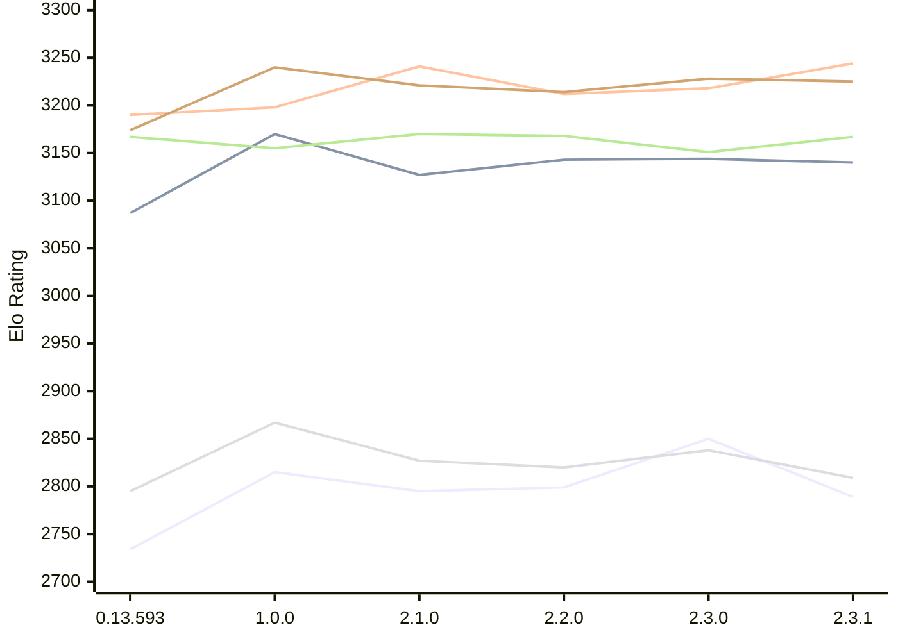

# Engine: Pawnstar

Author: Jonny Reckless

Home: https://github.com/jonny-reckless/pawnstar

## Elo Ratings E1 (Ultra 7 265T (1.50 GHz) - E-Core)

| Version | Published | STC 8.0+0.08s  | LTC 60.0+0.60s | VLTC 2m24s+1.12s | Comment |
| --- | --- | --- | --- | --- | --- |
| 2.3.1 | 2026-11-09 | 2789(-61) | 3140(-4) | 3244(+26) |  |
| 2.3.0 | 2026-11-08 | 2850(+51) | 3144(+1) | 3218(+6) |  |
| 2.2.0 | 2026-11-07 | 2799(+4) | 3143(+16) | 3212(-29) |  |
| 2.1.0 | 2026-10-31 | 2795(-20) | 3127(-43) | 3241(+43) |  |
| 1.0.0 | 2026-10-15 | 2815(+81) | 3170(+83) | 3198(+8) |  |
| 0.13.593 | 2026-06-30 | 2734 | 3087 | 3190 |  |
 | | | cElo (∆ prev) | cElo (∆ prev) | cElo (∆ prev) | 

## Elo Ratings P1 (Ultra 7 265T (1.50 GHz) - P-Core)

| Version | Published | STC 8.0+0.08s  | LTC 60.0+0.60s | VLTC 2m24s+1.12s | Comment |
| --- | --- | --- | --- | --- | --- |
| 2.3.1 | 2026-11-09 | 2809(-29) | 3167(+16) | 3225(-3) |  |
| 2.3.0 | 2026-11-08 | 2838(+18) | 3151(-17) | 3228(+14) |  |
| 2.2.0 | 2026-11-07 | 2820(-7) | 3168(-2) | 3214(-7) |  |
| 2.1.0 | 2026-10-31 | 2827(-40) | 3170(+15) | 3221(-19) |  |
| 1.0.0 | 2026-10-15 | 2867(+72) | 3155(-12) | 3240(+66) |  |
| 0.13.593 | 2026-06-30 | 2795 | 3167 | 3174 |  |
 | | | cElo (∆ prev) | cElo (∆ prev) | cElo (∆ prev) | 

## Elo Ratings T1 (i5-7500T 2.70GHz)

| Version | Published | STC 8.0+0.08s  | LTC 60.0+0.60s | VLTC 2m24s+1.12s | Comment |
| --- | --- | --- | --- | --- | --- |
| 0.13.593 | 2026-06-30 | 2831 | 3125 | 3200 |  |
 | | | cElo (∆ prev) | cElo (∆ prev) | cElo (∆ prev) | 

<a href="https://github.com/computer-chess-index/cci/issues/new?template=submit-version.yml&title=[VERSION]+Pawnstar+<version>&body=###%20Engine%20name%0APawnstar%0A%0A###%20Version%0A0.13.593" target="_blank">Submit new version</a>

 Test Conditions:

GUI/CLI: <a href=https://github.com/cutechess/cutechess target="_blank">Cute-Chess</a> 
Elo Calculation: <a href=https://www.remi-coulom.fr/Bayesian-Elo/ target="_blank">Bayesian-Elo</a> 
CPU for P1: Intel(R) Core(TM) Ultra 7 265T (1.50 GHz) - P-Core 
CPU for E1: Intel(R) Core(TM) Ultra 7 265T (1.50 GHz) - E-Core 
CPU for T1: Intel(R) Core(TM) i5-7500T 2.70GHz 
Opening book: 8_moves_v3 
\* STC: 8.0+0.08s, LTC: 60.0+0.60s, VLTC: 2m24s+1.12s

 Lists:
Ratings: <a href=https://github.com/computer-chess-index/cci/blob/main/lists/CCIRatings.csv target="_blank">Complete list</a>

Generated: 2026-11-26 05:41:20

## Ratings Verlauf E1 / P1

```mermaid
%%{init: {"theme":"base","themeVariables":{"seriesColors:['#a3a3a3','#222221','#faa371']}}}%%
xychart-beta
  x-axis ["0.13.593", "1.0.0", "2.1.0", "2.2.0", "2.3.0", "2.3.1"]
  y-axis "Elo Rating" 2700 --> 3300
  line "E1: STC (8.0+0.08s)" [2734, 2815, 2795, 2799, 2850, 2789]
  line "E1: LTC (60.0+0.60s)" [3087, 3170, 3127, 3143, 3144, 3140]
  line "E1: VLTC (2m24s+1.12s)" [3190, 3198, 3241, 3212, 3218, 3244]
  line "P1: STC (8.0+0.08s)" [2795, 2867, 2827, 2820, 2838, 2809]
  line "P1: LTC (60.0+0.60s)" [3167, 3155, 3170, 3168, 3151, 3167]
  line "P1: VLTC (2m24s+1.12s)" [3174, 3240, 3221, 3214, 3228, 3225]
```

## Detailed Evaluation Results

| Version | Time Control | Variant | Elo  | Range +/- | Matches | Score | Average Opponent Elo | Draws |
| --- | --- |--- | --- | --- | --- | --- | --- | --- |
| 2.3.1 | VLTC (2m24s+1.12s) | P1 | 3225 | 35 | 216 | 49% | 3236 | 59% |
|  |  | E1 | 3244 | 29 | 308 | 51% | 3232 | 65% |
|  | LTC (60.0+0.60s) | P1 | 3167 | 37 | 196 | 47% | 3189 | 59% |
|  |  | E1 | 3140 | 29 | 332 | 52% | 3124 | 57% |
|  | STC (8.0+0.08s) | P1 | 2809 | 41 | 188 | 49% | 2826 | 38% |
|  |  | E1 | 2789 | 28 | 406 | 46% | 2820 | 36% |
| --- | --- |--- | --- | --- | --- | --- | --- | --- |
| 2.3.0 | VLTC (2m24s+1.12s) | P1 | 3228 | 43 | 144 | 48% | 3241 | 59% |
|  |  | E1 | 3218 | 35 | 216 | 49% | 3228 | 62% |
|  | LTC (60.0+0.60s) | P1 | 3151 | 37 | 198 | 52% | 3132 | 58% |
|  |  | E1 | 3144 | 30 | 294 | 47% | 3170 | 58% |
|  | STC (8.0+0.08s) | E1 | 2850 | 31 | 328 | 48% | 2870 | 40% |
|  |  | P1 | 2838 | 33 | 286 | 46% | 2870 | 41% |
| --- | --- |--- | --- | --- | --- | --- | --- | --- |
| 2.2.0 | VLTC (2m24s+1.12s) | P1 | 3214 | 38 | 178 | 53% | 3195 | 63% |
|  |  | E1 | 3212 | 32 | 262 | 51% | 3208 | 57% |
|  | LTC (60.0+0.60s) | P1 | 3168 | 48 | 116 | 48% | 3182 | 60% |
|  |  | E1 | 3143 | 32 | 280 | 53% | 3121 | 53% |
|  | STC (8.0+0.08s) | P1 | 2820 | 50 | 126 | 51% | 2809 | 36% |
|  |  | E1 | 2799 | 32 | 292 | 53% | 2773 | 43% |
| --- | --- |--- | --- | --- | --- | --- | --- | --- |
| 2.1.0 | VLTC (2m24s+1.12s) | E1 | 3241 | 28 | 340 | 53% | 3218 | 64% |
|  |  | P1 | 3221 | 34 | 232 | 47% | 3241 | 64% |
|  | LTC (60.0+0.60s) | P1 | 3170 | 41 | 152 | 49% | 3175 | 63% |
|  |  | E1 | 3127 | 29 | 344 | 54% | 3097 | 51% |
|  | STC (8.0+0.08s) | P1 | 2827 | 38 | 212 | 45% | 2871 | 40% |
|  |  | E1 | 2795 | 37 | 228 | 49% | 2803 | 40% |
| --- | --- |--- | --- | --- | --- | --- | --- | --- |
| 1.0.0 | VLTC (2m24s+1.12s) | P1 | 3240 | 40 | 160 | 50% | 3244 | 66% |
|  |  | E1 | 3198 | 34 | 232 | 50% | 3195 | 62% |
|  | LTC (60.0+0.60s) | P1 | 3155 | 39 | 180 | 50% | 3152 | 58% |
|  |  | E1 | 3170 | 32 | 276 | 51% | 3162 | 53% |
|  | STC (8.0+0.08s) | P1 | 2867 | 39 | 198 | 52% | 2849 | 45% |
|  |  | E1 | 2815 | 28 | 394 | 47% | 2840 | 40% |
| --- | --- |--- | --- | --- | --- | --- | --- | --- |
| 0.13.593 | VLTC (2m24s+1.12s) | E1 | 3190 | 30 | 312 | 47% | 3210 | 51% |
|  |  | T1 | 3200 | 26 | 432 | 50% | 3189 | 53% |
|  |  | P1 | 3174 | 35 | 220 | 46% | 3204 | 56% |
|  | LTC (60.0+0.60s) | E1 | 3087 | 31 | 300 | 48% | 3106 | 53% |
|  |  | T1 | 3125 | 26 | 450 | 52% | 3089 | 48% |
|  |  | P1 | 3167 | 34 | 248 | 52% | 3148 | 49% |
|  | STC (8.0+0.08s) | T1 | 2831 | 28 | 436 | 49% | 2822 | 32% |
|  |  | P1 | 2795 | 41 | 192 | 46% | 2831 | 35% |
|  |  | E1 | 2734 | 30 | 382 | 46% | 2772 | 31% |