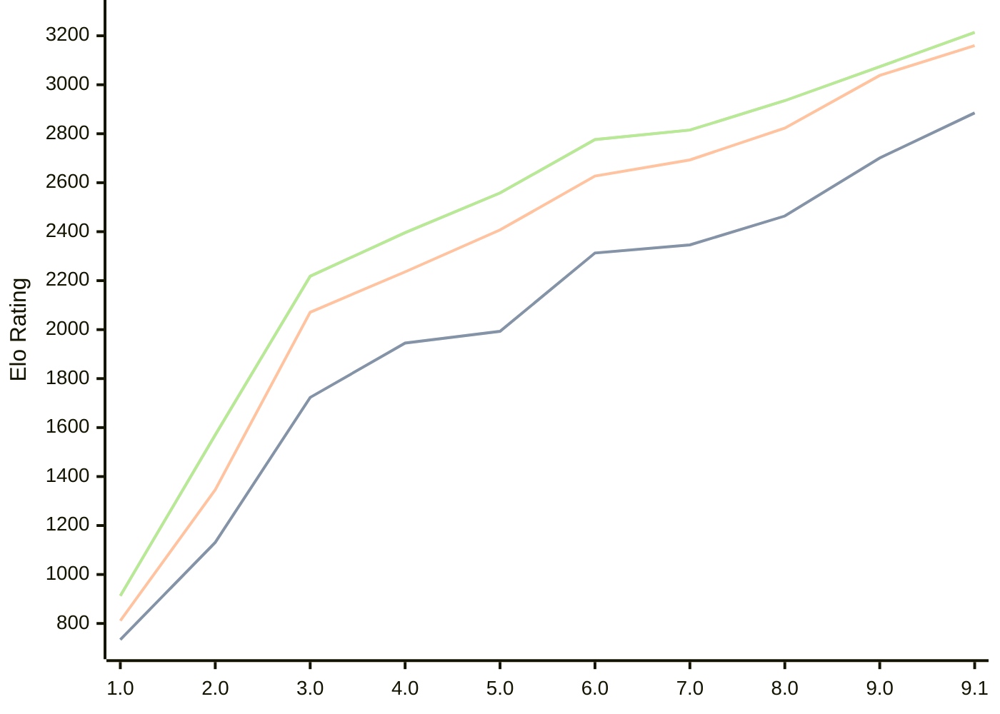

# Engine: Pea

Author: Warre Gevers

Home: https://github.com/WGCodings/Pea

## Elo Ratings

| Version | Published | STC 8.0+0.08s  | LTC 60.0+0.60s | VLTC 2m24s+1.12s | Comment |
| --- | --- | --- | --- | --- | --- |
| 9.1 | 2026-08-09 | 2885(+184) | 3160(+122) | 3214(+140) |  |
| 9.0 | 2026-06-01 | 2701(+237) | 3038(+215) | 3074(+139) |  |
| 8.0 | 2026-05-02 | 2464(+118) | 2823(+130) | 2935(+120) |  |
| 7.0 | 2026-04-25 | 2346(+33) | 2693(+66) | 2815(+39) |  |
| 6.0 | 2026-04-20 | 2313(+320) | 2627(+220) | 2776(+218) |  |
| 5.0 | 2026-04-15 | 1993(+48) | 2407(+171) | 2558(+162) |  |
| 4.0 | 2026-04-11 | 1945(+222) | 2236(+165) | 2396(+178) |  |
| 3.0 | 2026-04-09 | 1723(+592) | 2071(+725) | 2218(+648) |  |
| 2.0 | 2026-04-08 | 1131(+397) | 1346(+535) | 1570(+657) |  |
| 1.0 | 2026-04-06 | 734 | 811 | 913 |  |
 | | | cElo (∆ prev) | cElo (∆ prev) | cElo (∆ prev) | 

<a href="https://github.com/computer-chess-index/cci/issues/new?template=submit-version.yml&title=[VERSION]+Pea+<version>&body=###%20Engine%20name%0APea%0A%0A###%20Version%0A9.1" target="_blank">Submit new version</a>

 Test Conditions:

GUI/CLI: <a href=https://github.com/cutechess/cutechess target="_blank">Cute-Chess</a> 
Elo Calculation: <a href=https://www.remi-coulom.fr/Bayesian-Elo/ target="_blank">Bayesian-Elo</a> 
CPU: Intel(R) Core(TM) i5-7500T 2.70GHz 
Opening book: 8_moves_v3 
\* STC: 8.0+0.08s, LTC: 60.0+0.60s, VLTC: 2m24s+1.12s

 Lists:
Ratings: <a href=https://github.com/computer-chess-index/cci/blob/main/lists/CCIRatings.csv target="_blank">Complete list</a>

Generated: 2026-09-16 04:40:33

## Ratings Verlauf

## Detailed Evaluation Results

| Version | Time Control | Elo  | Range +/- | Matches | Score | Average Opponent Elo | Draws |
| --- | --- | --- | --- | --- | --- | --- | --- |
| 9.1 | VLTC (2m24s+1.12s) | 3214 | 29 | 326 | 50% | 3210 | 55% |
| 9.1 | LTC (60.0+0.60s) | 3160 | 30 | 320 | 52% | 3148 | 53% |
| 9.1 | STC (8.0+0.08s) | 2885 | 32 | 300 | 50% | 2882 | 40% |
| --- | --- | --- | --- | --- | --- | --- | --- |
| 9.0 | VLTC (2m24s+1.12s) | 3074 | 28 | 364 | 51% | 3067 | 53% |
| 9.0 | LTC (60.0+0.60s) | 3038 | 30 | 324 | 48% | 3054 | 48% |
| 9.0 | STC (8.0+0.08s) | 2701 | 29 | 404 | 53% | 2674 | 33% |
| --- | --- | --- | --- | --- | --- | --- | --- |
| 8.0 | VLTC (2m24s+1.12s) | 2935 | 30 | 358 | 49% | 2943 | 34% |
| 8.0 | LTC (60.0+0.60s) | 2823 | 32 | 302 | 50% | 2822 | 34% |
| 8.0 | STC (8.0+0.08s) | 2464 | 31 | 356 | 52% | 2435 | 23% |
| --- | --- | --- | --- | --- | --- | --- | --- |
| 7.0 | VLTC (2m24s+1.12s) | 2815 | 34 | 270 | 52% | 2799 | 39% |
| 7.0 | LTC (60.0+0.60s) | 2693 | 35 | 266 | 50% | 2696 | 34% |
| 7.0 | STC (8.0+0.08s) | 2346 | 33 | 320 | 48% | 2371 | 25% |
| --- | --- | --- | --- | --- | --- | --- | --- |
| 6.0 | VLTC (2m24s+1.12s) | 2776 | 36 | 248 | 52% | 2759 | 34% |
| 6.0 | LTC (60.0+0.60s) | 2627 | 36 | 274 | 51% | 2616 | 24% |
| 6.0 | STC (8.0+0.08s) | 2313 | 32 | 344 | 54% | 2273 | 22% |
| --- | --- | --- | --- | --- | --- | --- | --- |
| 5.0 | VLTC (2m24s+1.12s) | 2558 | 33 | 324 | 49% | 2570 | 23% |
| 5.0 | LTC (60.0+0.60s) | 2407 | 36 | 268 | 50% | 2406 | 26% |
| 5.0 | STC (8.0+0.08s) | 1993 | 36 | 276 | 50% | 1993 | 19% |
| --- | --- | --- | --- | --- | --- | --- | --- |
| 4.0 | VLTC (2m24s+1.12s) | 2396 | 34 | 310 | 54% | 2357 | 22% |
| 4.0 | LTC (60.0+0.60s) | 2236 | 36 | 272 | 49% | 2248 | 23% |
| 4.0 | STC (8.0+0.08s) | 1945 | 39 | 248 | 52% | 1928 | 14% |
| --- | --- | --- | --- | --- | --- | --- | --- |
| 3.0 | VLTC (2m24s+1.12s) | 2218 | 40 | 232 | 51% | 2214 | 20% |
| 3.0 | LTC (60.0+0.60s) | 2071 | 39 | 246 | 48% | 2091 | 14% |
| 3.0 | STC (8.0+0.08s) | 1723 | 43 | 208 | 47% | 1754 | 15% |
| --- | --- | --- | --- | --- | --- | --- | --- |
| 2.0 | VLTC (2m24s+1.12s) | 1570 | 34 | 316 | 48% | 1601 | 17% |
| 2.0 | LTC (60.0+0.60s) | 1346 | 39 | 258 | 46% | 1400 | 16% |
| 2.0 | STC (8.0+0.08s) | 1131 | 35 | 300 | 51% | 1104 | 22% |
| --- | --- | --- | --- | --- | --- | --- | --- |
| 1.0 | VLTC (2m24s+1.12s) | 913 | 79 | 110 | 38% | 1075 | 9% |
| 1.0 | LTC (60.0+0.60s) | 811 | 84 | 104 | 37% | 1030 | 8% |
| 1.0 | STC (8.0+0.08s) | 734 | 90 | 92 | 38% | 942 | 3% |
| --- | --- | --- | --- | --- | --- | --- | --- |