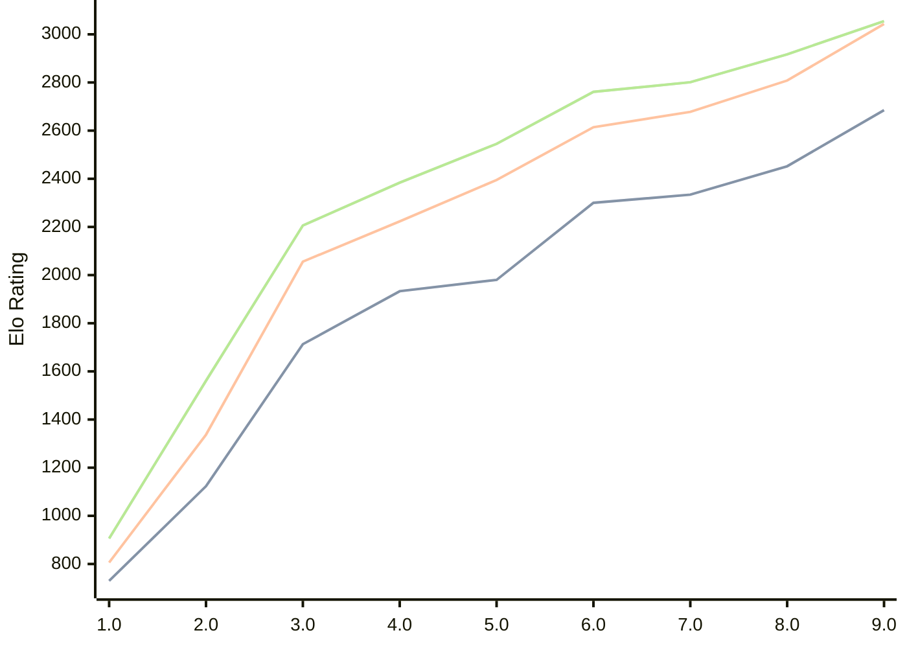

# Engine: Pea

Author: Warre Gevers

Home: https://github.com/WGCodings/Pea

## Elo Ratings

| Version | Published | STC 8.0+0.08s  | LTC 60.0+0.60s | VLTC 2m24s+1.12s | Comment |
| --- | --- | --- | --- | --- | --- |
| 9.0 | 2026-06-01 | 2685(+233) | 3043(+235) | 3055(+138) |  |
| 8.0 | 2026-05-02 | 2452(+118) | 2808(+130) | 2917(+116) |  |
| 7.0 | 2026-04-25 | 2334(+34) | 2678(+64) | 2801(+40) |  |
| 6.0 | 2026-04-20 | 2300(+320) | 2614(+219) | 2761(+216) |  |
| 5.0 | 2026-04-15 | 1980(+47) | 2395(+172) | 2545(+161) |  |
| 4.0 | 2026-04-11 | 1933(+220) | 2223(+167) | 2384(+178) |  |
| 3.0 | 2026-04-09 | 1713(+590) | 2056(+719) | 2206(+645) |  |
| 2.0 | 2026-04-08 | 1123(+393) | 1337(+531) | 1561(+655) |  |
| 1.0 | 2026-04-06 | 730 | 806 | 906 |  |
 | | | cElo (∆ prev) | cElo (∆ prev) | cElo (∆ prev) | 

<a href="https://github.com/computer-chess-index/cci/issues/new?template=submit-version.yml&title=[VERSION]+Pea+<version>&body=###%20Engine%20name%0APea%0A%0A###%20Version%0A9.0" target="_blank">Submit new version</a>

 Test Conditions:

GUI/CLI: <a href=https://github.com/cutechess/cutechess target="_blank">Cute-Chess</a> 
Elo Calculation: <a href=https://www.remi-coulom.fr/Bayesian-Elo/ target="_blank">Bayesian-Elo</a> 
CPU: Intel(R) Core(TM) i5-7500T 2.70GHz 
Opening book: 8_moves_v3 
\* STC: 8.0+0.08s, LTC: 60.0+0.60s, VLTC: 2m24s+1.12s

 Lists:
Ratings: <a href=https://github.com/computer-chess-index/cci/blob/main/lists/CCIRatings.csv target="_blank">Complete list</a>

Generated: 2026-06-27 06:27:04

## Ratings Verlauf

## Ratings Verlauf

⬛ STC (8.0+0.08s) &nbsp;&nbsp; 🟧 LTC (60.0+0.60s) &nbsp;&nbsp; 🟩 VLTC (2m24s+1.12s)

dark mode: 🟩STC (8.0+0.08s) 🟧LTC (60.0+0.60s) ⬜VLTC (2m24s+1.12s)

## Detailed Evaluation Results

| Version | Time Control | Elo  | Range +/- | Matches | Score | Average Opponent Elo | Draws |
| --- | --- | --- | --- | --- | --- | --- | --- |
| 9.0 | VLTC (2m24s+1.12s) | 3055 | 32 | 276 | 51% | 3043 | 51% |
| 9.0 | LTC (60.0+0.60s) | 3043 | 34 | 244 | 51% | 3036 | 48% |
| 9.0 | STC (8.0+0.08s) | 2685 | 33 | 308 | 54% | 2646 | 31% |
| --- | --- | --- | --- | --- | --- | --- | --- |
| 8.0 | VLTC (2m24s+1.12s) | 2917 | 30 | 358 | 49% | 2925 | 34% |
| 8.0 | LTC (60.0+0.60s) | 2808 | 32 | 302 | 50% | 2807 | 34% |
| 8.0 | STC (8.0+0.08s) | 2452 | 31 | 356 | 52% | 2423 | 23% |
| --- | --- | --- | --- | --- | --- | --- | --- |
| 7.0 | VLTC (2m24s+1.12s) | 2801 | 34 | 270 | 52% | 2785 | 39% |
| 7.0 | LTC (60.0+0.60s) | 2678 | 35 | 266 | 50% | 2681 | 34% |
| 7.0 | STC (8.0+0.08s) | 2334 | 33 | 320 | 48% | 2358 | 25% |
| --- | --- | --- | --- | --- | --- | --- | --- |
| 6.0 | VLTC (2m24s+1.12s) | 2761 | 36 | 248 | 52% | 2745 | 34% |
| 6.0 | LTC (60.0+0.60s) | 2614 | 36 | 274 | 51% | 2603 | 24% |
| 6.0 | STC (8.0+0.08s) | 2300 | 32 | 344 | 54% | 2261 | 22% |
| --- | --- | --- | --- | --- | --- | --- | --- |
| 5.0 | VLTC (2m24s+1.12s) | 2545 | 33 | 324 | 49% | 2557 | 23% |
| 5.0 | LTC (60.0+0.60s) | 2395 | 36 | 268 | 50% | 2394 | 26% |
| 5.0 | STC (8.0+0.08s) | 1980 | 36 | 276 | 50% | 1980 | 19% |
| --- | --- | --- | --- | --- | --- | --- | --- |
| 4.0 | VLTC (2m24s+1.12s) | 2384 | 34 | 310 | 54% | 2345 | 22% |
| 4.0 | LTC (60.0+0.60s) | 2223 | 36 | 272 | 49% | 2234 | 23% |
| 4.0 | STC (8.0+0.08s) | 1933 | 39 | 248 | 52% | 1916 | 14% |
| --- | --- | --- | --- | --- | --- | --- | --- |
| 3.0 | VLTC (2m24s+1.12s) | 2206 | 40 | 232 | 51% | 2201 | 20% |
| 3.0 | LTC (60.0+0.60s) | 2056 | 39 | 246 | 48% | 2078 | 14% |
| 3.0 | STC (8.0+0.08s) | 1713 | 43 | 208 | 47% | 1744 | 15% |
| --- | --- | --- | --- | --- | --- | --- | --- |
| 2.0 | VLTC (2m24s+1.12s) | 1561 | 34 | 316 | 48% | 1590 | 17% |
| 2.0 | LTC (60.0+0.60s) | 1337 | 39 | 258 | 46% | 1391 | 16% |
| 2.0 | STC (8.0+0.08s) | 1123 | 35 | 300 | 51% | 1096 | 22% |
| --- | --- | --- | --- | --- | --- | --- | --- |
| 1.0 | VLTC (2m24s+1.12s) | 906 | 79 | 110 | 38% | 1068 | 9% |
| 1.0 | LTC (60.0+0.60s) | 806 | 84 | 104 | 37% | 1023 | 8% |
| 1.0 | STC (8.0+0.08s) | 730 | 90 | 92 | 38% | 937 | 3% |
| --- | --- | --- | --- | --- | --- | --- | --- |