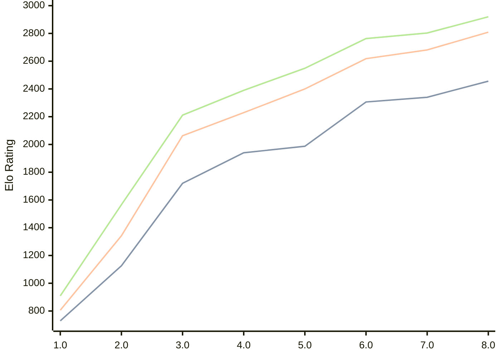

# Engine: Pea

Author: Warre Gevers

Home: https://github.com/WGCodings/Pea

## Elo Ratings

| Version | Published | STC 8.0+0.08s  | LTC 60.0+0.60s | VLTC 2m24s+1.12s | Comment |
| --- | --- | --- | --- | --- | --- |
| 8.0 | 2026-05-02 | 2456(+116) | 2809(+128) | 2920(+117) |  |
| 7.0 | 2026-04-25 | 2340(+34) | 2681(+63) | 2803(+40) |  |
| 6.0 | 2026-04-20 | 2306(+319) | 2618(+218) | 2763(+214) |  |
| 5.0 | 2026-04-15 | 1987(+47) | 2400(+171) | 2549(+159) |  |
| 4.0 | 2026-04-11 | 1940(+220) | 2229(+166) | 2390(+179) |  |
| 3.0 | 2026-04-09 | 1720(+594) | 2063(+721) | 2211(+645) |  |
| 2.0 | 2026-04-08 | 1126(+397) | 1342(+536) | 1566(+657) |  |
| 1.0 | 2026-04-06 | 729 | 806 | 909 |  |
 | | | cElo (∆ prev) | cElo (∆ prev) | cElo (∆ prev) | 

<a href="https://github.com/computer-chess-index/cci/issues/new?template=submit-version.yml&title=[VERSION]+Pea+<version>&body=###%20Engine%20name%0APea%0A%0A###%20Version%0A8.0" target="_blank">Submit new version</a>

 Test Conditions:

GUI/CLI: <a href=https://github.com/cutechess/cutechess target="_blank">Cute-Chess</a> 
Elo Calculation: <a href=https://www.remi-coulom.fr/Bayesian-Elo/ target="_blank">Bayesian-Elo</a> 
CPU: Intel(R) Core(TM) i5-7500T 2.70GHz 
Opening book: 8_moves_v3 
\* STC: 8.0+0.08s, LTC: 60.0+0.60s, VLTC: 2m24s+1.12s

 Lists:
Ratings: <a href=https://github.com/computer-chess-index/cci/blob/main/lists/CCIRatings.csv target="_blank">Complete list</a>

Generated: 2026-05-22 15:02:30

## Ratings Verlauf

⬛ STC (8.0+0.08s) &nbsp;&nbsp; 🟧 LTC (60.0+0.60s) &nbsp;&nbsp; 🟩 VLTC (2m24s+1.12s)

dark mode: 🟩STC (8.0+0.08s) 🟧LTC (60.0+0.60s) ⬜VLTC (2m24s+1.12s)

## Detailed Evaluation Results

| Version | Time Control | Elo  | Range +/- | Matches | Score | Average Opponent Elo | Draws |
| --- | --- | --- | --- | --- | --- | --- | --- |
| 8.0 | VLTC (2m24s+1.12s) | 2920 | 30 | 358 | 49% | 2928 | 34% |
| 8.0 | LTC (60.0+0.60s) | 2809 | 32 | 302 | 50% | 2808 | 34% |
| 8.0 | STC (8.0+0.08s) | 2456 | 31 | 356 | 52% | 2427 | 23% |
| --- | --- | --- | --- | --- | --- | --- | --- |
| 7.0 | VLTC (2m24s+1.12s) | 2803 | 34 | 270 | 52% | 2786 | 39% |
| 7.0 | LTC (60.0+0.60s) | 2681 | 35 | 266 | 50% | 2684 | 34% |
| 7.0 | STC (8.0+0.08s) | 2340 | 33 | 320 | 48% | 2364 | 25% |
| --- | --- | --- | --- | --- | --- | --- | --- |
| 6.0 | VLTC (2m24s+1.12s) | 2763 | 36 | 248 | 52% | 2746 | 34% |
| 6.0 | LTC (60.0+0.60s) | 2618 | 36 | 274 | 51% | 2607 | 24% |
| 6.0 | STC (8.0+0.08s) | 2306 | 32 | 344 | 54% | 2267 | 22% |
| --- | --- | --- | --- | --- | --- | --- | --- |
| 5.0 | VLTC (2m24s+1.12s) | 2549 | 33 | 324 | 49% | 2560 | 23% |
| 5.0 | LTC (60.0+0.60s) | 2400 | 36 | 268 | 50% | 2399 | 26% |
| 5.0 | STC (8.0+0.08s) | 1987 | 36 | 276 | 50% | 1987 | 19% |
| --- | --- | --- | --- | --- | --- | --- | --- |
| 4.0 | VLTC (2m24s+1.12s) | 2390 | 34 | 310 | 54% | 2350 | 22% |
| 4.0 | LTC (60.0+0.60s) | 2229 | 36 | 272 | 49% | 2240 | 23% |
| 4.0 | STC (8.0+0.08s) | 1940 | 39 | 248 | 52% | 1922 | 14% |
| --- | --- | --- | --- | --- | --- | --- | --- |
| 3.0 | VLTC (2m24s+1.12s) | 2211 | 40 | 232 | 51% | 2207 | 20% |
| 3.0 | LTC (60.0+0.60s) | 2063 | 39 | 246 | 48% | 2083 | 14% |
| 3.0 | STC (8.0+0.08s) | 1720 | 43 | 208 | 47% | 1751 | 15% |
| --- | --- | --- | --- | --- | --- | --- | --- |
| 2.0 | VLTC (2m24s+1.12s) | 1566 | 34 | 316 | 48% | 1596 | 17% |
| 2.0 | LTC (60.0+0.60s) | 1342 | 39 | 258 | 46% | 1396 | 16% |
| 2.0 | STC (8.0+0.08s) | 1126 | 35 | 300 | 51% | 1099 | 22% |
| --- | --- | --- | --- | --- | --- | --- | --- |
| 1.0 | VLTC (2m24s+1.12s) | 909 | 80 | 110 | 38% | 1069 | 9% |
| 1.0 | LTC (60.0+0.60s) | 806 | 84 | 104 | 37% | 1025 | 8% |
| 1.0 | STC (8.0+0.08s) | 729 | 91 | 92 | 38% | 937 | 3% |
| --- | --- | --- | --- | --- | --- | --- | --- |