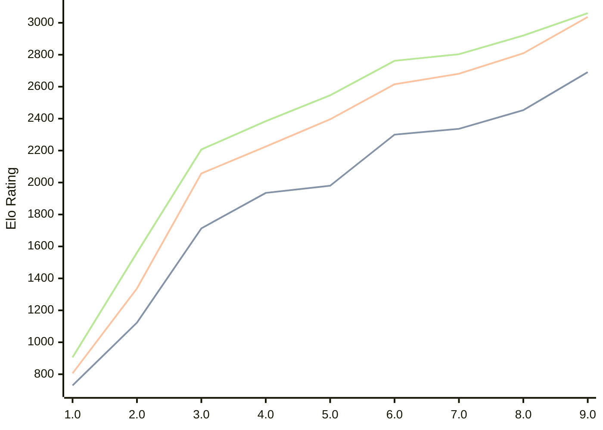

# Engine: Pea

Author: Warre Gevers

Home: https://github.com/WGCodings/Pea

## Elo Ratings

| Version | Published | STC 8.0+0.08s  | LTC 60.0+0.60s | VLTC 2m24s+1.12s | Comment |
| --- | --- | --- | --- | --- | --- |
| 9.0 | 2026-06-01 | 2691(+238) | 3036(+227) | 3060(+140) |  |
| 8.0 | 2026-05-02 | 2453(+117) | 2809(+128) | 2920(+117) |  |
| 7.0 | 2026-04-25 | 2336(+36) | 2681(+66) | 2803(+41) |  |
| 6.0 | 2026-04-20 | 2300(+320) | 2615(+219) | 2762(+216) |  |
| 5.0 | 2026-04-15 | 1980(+45) | 2396(+171) | 2546(+162) |  |
| 4.0 | 2026-04-11 | 1935(+222) | 2225(+168) | 2384(+177) |  |
| 3.0 | 2026-04-09 | 1713(+590) | 2057(+720) | 2207(+646) |  |
| 2.0 | 2026-04-08 | 1123(+393) | 1337(+531) | 1561(+655) |  |
| 1.0 | 2026-04-06 | 730 | 806 | 906 |  |
 | | | cElo (∆ prev) | cElo (∆ prev) | cElo (∆ prev) | 

<a href="https://github.com/computer-chess-index/cci/issues/new?template=submit-version.yml&title=[VERSION]+Pea+<version>&body=###%20Engine%20name%0APea%0A%0A###%20Version%0A9.0" target="_blank">Submit new version</a>

 Test Conditions:

GUI/CLI: <a href=https://github.com/cutechess/cutechess target="_blank">Cute-Chess</a> 
Elo Calculation: <a href=https://www.remi-coulom.fr/Bayesian-Elo/ target="_blank">Bayesian-Elo</a> 
CPU: Intel(R) Core(TM) i5-7500T 2.70GHz 
Opening book: 8_moves_v3 
\* STC: 8.0+0.08s, LTC: 60.0+0.60s, VLTC: 2m24s+1.12s

 Lists:
Ratings: <a href=https://github.com/computer-chess-index/cci/blob/main/lists/CCIRatings.csv target="_blank">Complete list</a>

Generated: 2026-07-07 06:27:38

## Ratings Verlauf

## Ratings Verlauf

⬛ STC (8.0+0.08s) &nbsp;&nbsp; 🟧 LTC (60.0+0.60s) &nbsp;&nbsp; 🟩 VLTC (2m24s+1.12s)

dark mode: 🟩STC (8.0+0.08s) 🟧LTC (60.0+0.60s) ⬜VLTC (2m24s+1.12s)

## Detailed Evaluation Results

| Version | Time Control | Elo  | Range +/- | Matches | Score | Average Opponent Elo | Draws |
| --- | --- | --- | --- | --- | --- | --- | --- |
| 9.0 | VLTC (2m24s+1.12s) | 3060 | 31 | 304 | 51% | 3048 | 51% |
| 9.0 | LTC (60.0+0.60s) | 3036 | 33 | 260 | 49% | 3040 | 48% |
| 9.0 | STC (8.0+0.08s) | 2691 | 32 | 328 | 54% | 2657 | 31% |
| --- | --- | --- | --- | --- | --- | --- | --- |
| 8.0 | VLTC (2m24s+1.12s) | 2920 | 30 | 358 | 49% | 2928 | 34% |
| 8.0 | LTC (60.0+0.60s) | 2809 | 32 | 302 | 50% | 2808 | 34% |
| 8.0 | STC (8.0+0.08s) | 2453 | 31 | 356 | 52% | 2425 | 23% |
| --- | --- | --- | --- | --- | --- | --- | --- |
| 7.0 | VLTC (2m24s+1.12s) | 2803 | 34 | 270 | 52% | 2786 | 39% |
| 7.0 | LTC (60.0+0.60s) | 2681 | 35 | 266 | 50% | 2684 | 34% |
| 7.0 | STC (8.0+0.08s) | 2336 | 33 | 320 | 48% | 2360 | 25% |
| --- | --- | --- | --- | --- | --- | --- | --- |
| 6.0 | VLTC (2m24s+1.12s) | 2762 | 36 | 248 | 52% | 2746 | 34% |
| 6.0 | LTC (60.0+0.60s) | 2615 | 36 | 274 | 51% | 2604 | 24% |
| 6.0 | STC (8.0+0.08s) | 2300 | 32 | 344 | 54% | 2263 | 22% |
| --- | --- | --- | --- | --- | --- | --- | --- |
| 5.0 | VLTC (2m24s+1.12s) | 2546 | 33 | 324 | 49% | 2558 | 23% |
| 5.0 | LTC (60.0+0.60s) | 2396 | 36 | 268 | 50% | 2395 | 26% |
| 5.0 | STC (8.0+0.08s) | 1980 | 36 | 276 | 50% | 1980 | 19% |
| --- | --- | --- | --- | --- | --- | --- | --- |
| 4.0 | VLTC (2m24s+1.12s) | 2384 | 34 | 310 | 54% | 2346 | 22% |
| 4.0 | LTC (60.0+0.60s) | 2225 | 36 | 272 | 49% | 2236 | 23% |
| 4.0 | STC (8.0+0.08s) | 1935 | 39 | 248 | 52% | 1917 | 14% |
| --- | --- | --- | --- | --- | --- | --- | --- |
| 3.0 | VLTC (2m24s+1.12s) | 2207 | 40 | 232 | 51% | 2202 | 20% |
| 3.0 | LTC (60.0+0.60s) | 2057 | 39 | 246 | 48% | 2078 | 14% |
| 3.0 | STC (8.0+0.08s) | 1713 | 43 | 208 | 47% | 1746 | 15% |
| --- | --- | --- | --- | --- | --- | --- | --- |
| 2.0 | VLTC (2m24s+1.12s) | 1561 | 34 | 316 | 48% | 1590 | 17% |
| 2.0 | LTC (60.0+0.60s) | 1337 | 39 | 258 | 46% | 1392 | 16% |
| 2.0 | STC (8.0+0.08s) | 1123 | 35 | 300 | 51% | 1096 | 22% |
| --- | --- | --- | --- | --- | --- | --- | --- |
| 1.0 | VLTC (2m24s+1.12s) | 906 | 79 | 110 | 38% | 1069 | 9% |
| 1.0 | LTC (60.0+0.60s) | 806 | 84 | 104 | 37% | 1023 | 8% |
| 1.0 | STC (8.0+0.08s) | 730 | 90 | 92 | 38% | 937 | 3% |
| --- | --- | --- | --- | --- | --- | --- | --- |