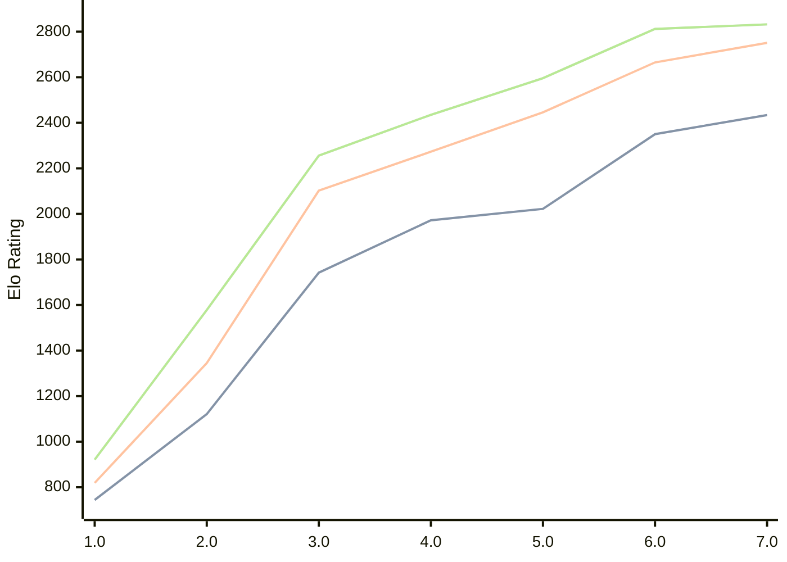

# Engine: Pea

Author: Warre Gevers

Home: https://github.com/WGCodings/Pea

## Ratings nach Version

| Version | Published | STC 8.0+0.08s  | LTC 60.0+0.60s | VLTC 2m24s+1.12s | Comment |
| --- | --- | --- | --- | --- | --- |
| 7.0 | 2026-04-25 | 2434(+84) | 2751(+86) | 2832(+20) |  |
| 6.0 | 2026-04-20 | 2350(+328) | 2665(+219) | 2812(+216) |  |
| 5.0 | 2026-04-15 | 2022(+50) | 2446(+173) | 2596(+161) |  |
| 4.0 | 2026-04-11 | 1972(+230) | 2273(+171) | 2435(+179) |  |
| 3.0 | 2026-04-09 | 1742(+621) | 2102(+757) | 2256(+678) |  |
| 2.0 | 2026-04-08 | 1121(+377) | 1345(+526) | 1578(+657) |  |
| 1.0 | 2026-04-06 | 744 | 819 | 921 |  |
 | | | cElo (∆ prev) | cElo (∆ prev) | cElo (∆ prev) | 

<a href="https://github.com/computer-chess-index/cci/issues/new?template=submit-version.yml&title=[VERSION]+Pea+<version>&body=###%20Engine%20name%0APea%0A%0A###%20Version%0A7.0" target="_blank">Submit new version</a>

 Test Conditions:

GUI/CLI: <a href=https://github.com/cutechess/cutechess target="_blank">Cute-Chess</a> 
Elo Calculation: <a href=https://www.remi-coulom.fr/Bayesian-Elo/ target="_blank">Bayesian-Elo</a> 
CPU: Intel(R) Core(TM) i5-7500T 2.70GHz 
Opening book: 8_moves_v3 
\* STC: 8.0+0.08s, LTC: 60.0+0.60s, VLTC: 2m24s+1.12s

 Lists:
Ratings: <a href=https://github.com/computer-chess-index/cci/blob/main/lists/CCIRatings.csv target="_blank">Complete list</a>

Generated: 2026-04-27 06:26:08

## Ratings Verlauf

⬛ STC (8.0+0.08s) &nbsp;&nbsp; 🟧 LTC (60.0+0.60s) &nbsp;&nbsp; 🟩 VLTC (2m24s+1.12s)

dark mode: 🟩STC (8.0+0.08s) 🟧LTC (60.0+0.60s) ⬜VLTC (2m24s+1.12s)

