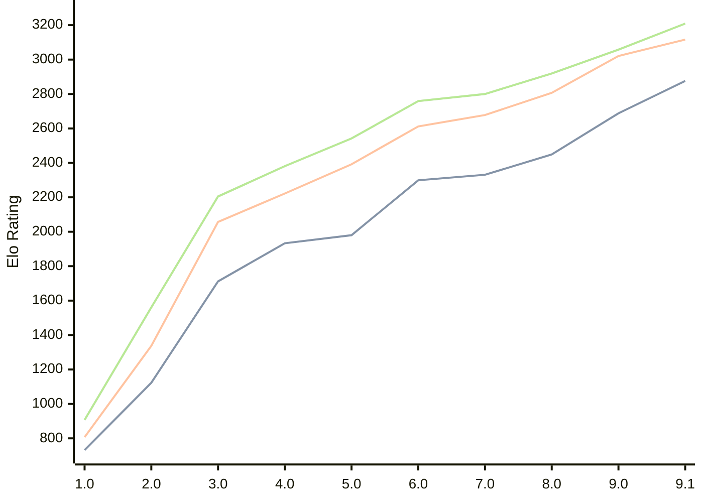

# Engine: Pea

Author: Warre Gevers

Home: https://github.com/WGCodings/Pea

## Elo Ratings

| Version | Published | STC 8.0+0.08s  | LTC 60.0+0.60s | VLTC 2m24s+1.12s | Comment |
| --- | --- | --- | --- | --- | --- |
| 9.1 | 2026-08-09 | 2876(+188) | 3116(+95) | 3209(+151) |  |
| 9.0 | 2026-06-01 | 2688(+239) | 3021(+214) | 3058(+139) |  |
| 8.0 | 2026-05-02 | 2449(+118) | 2807(+129) | 2919(+119) |  |
| 7.0 | 2026-04-25 | 2331(+32) | 2678(+66) | 2800(+41) |  |
| 6.0 | 2026-04-20 | 2299(+319) | 2612(+220) | 2759(+217) |  |
| 5.0 | 2026-04-15 | 1980(+47) | 2392(+170) | 2542(+161) |  |
| 4.0 | 2026-04-11 | 1933(+221) | 2222(+165) | 2381(+176) |  |
| 3.0 | 2026-04-09 | 1712(+589) | 2057(+720) | 2205(+644) |  |
| 2.0 | 2026-04-08 | 1123(+391) | 1337(+530) | 1561(+654) |  |
| 1.0 | 2026-04-06 | 732 | 807 | 907 |  |
 | | | cElo (∆ prev) | cElo (∆ prev) | cElo (∆ prev) | 

<a href="https://github.com/computer-chess-index/cci/issues/new?template=submit-version.yml&title=[VERSION]+Pea+<version>&body=###%20Engine%20name%0APea%0A%0A###%20Version%0A9.1" target="_blank">Submit new version</a>

 Test Conditions:

GUI/CLI: <a href=https://github.com/cutechess/cutechess target="_blank">Cute-Chess</a> 
Elo Calculation: <a href=https://www.remi-coulom.fr/Bayesian-Elo/ target="_blank">Bayesian-Elo</a> 
CPU: Intel(R) Core(TM) i5-7500T 2.70GHz 
Opening book: 8_moves_v3 
\* STC: 8.0+0.08s, LTC: 60.0+0.60s, VLTC: 2m24s+1.12s

 Lists:
Ratings: <a href=https://github.com/computer-chess-index/cci/blob/main/lists/CCIRatings.csv target="_blank">Complete list</a>

Generated: 2026-08-12 08:03:04

## Ratings Verlauf

⬛ STC (8.0+0.08s) &nbsp;&nbsp; 🟧 LTC (60.0+0.60s) &nbsp;&nbsp; 🟩 VLTC (2m24s+1.12s)

dark mode: 🟩STC (8.0+0.08s) 🟧LTC (60.0+0.60s) ⬜VLTC (2m24s+1.12s)

## Detailed Evaluation Results

| Version | Time Control | Elo  | Range +/- | Matches | Score | Average Opponent Elo | Draws |
| --- | --- | --- | --- | --- | --- | --- | --- |
| 9.1 | VLTC (2m24s+1.12s) | 3209 | 46 | 134 | 52% | 3195 | 51% |
| 9.1 | LTC (60.0+0.60s) | 3116 | 54 | 100 | 52% | 3100 | 44% |
| 9.1 | STC (8.0+0.08s) | 2876 | 58 | 92 | 53% | 2846 | 39% |
| --- | --- | --- | --- | --- | --- | --- | --- |
| 9.0 | VLTC (2m24s+1.12s) | 3058 | 28 | 364 | 51% | 3050 | 53% |
| 9.0 | LTC (60.0+0.60s) | 3021 | 30 | 324 | 48% | 3036 | 48% |
| 9.0 | STC (8.0+0.08s) | 2688 | 29 | 404 | 53% | 2661 | 33% |
| --- | --- | --- | --- | --- | --- | --- | --- |
| 8.0 | VLTC (2m24s+1.12s) | 2919 | 30 | 358 | 49% | 2927 | 34% |
| 8.0 | LTC (60.0+0.60s) | 2807 | 32 | 302 | 50% | 2805 | 34% |
| 8.0 | STC (8.0+0.08s) | 2449 | 31 | 356 | 52% | 2421 | 23% |
| --- | --- | --- | --- | --- | --- | --- | --- |
| 7.0 | VLTC (2m24s+1.12s) | 2800 | 34 | 270 | 52% | 2784 | 39% |
| 7.0 | LTC (60.0+0.60s) | 2678 | 35 | 266 | 50% | 2681 | 34% |
| 7.0 | STC (8.0+0.08s) | 2331 | 33 | 320 | 48% | 2356 | 25% |
| --- | --- | --- | --- | --- | --- | --- | --- |
| 6.0 | VLTC (2m24s+1.12s) | 2759 | 36 | 248 | 52% | 2743 | 34% |
| 6.0 | LTC (60.0+0.60s) | 2612 | 36 | 274 | 51% | 2601 | 24% |
| 6.0 | STC (8.0+0.08s) | 2299 | 32 | 344 | 54% | 2260 | 22% |
| --- | --- | --- | --- | --- | --- | --- | --- |
| 5.0 | VLTC (2m24s+1.12s) | 2542 | 33 | 324 | 49% | 2554 | 23% |
| 5.0 | LTC (60.0+0.60s) | 2392 | 36 | 268 | 50% | 2391 | 26% |
| 5.0 | STC (8.0+0.08s) | 1980 | 36 | 276 | 50% | 1980 | 19% |
| --- | --- | --- | --- | --- | --- | --- | --- |
| 4.0 | VLTC (2m24s+1.12s) | 2381 | 34 | 310 | 54% | 2342 | 22% |
| 4.0 | LTC (60.0+0.60s) | 2222 | 36 | 272 | 49% | 2234 | 23% |
| 4.0 | STC (8.0+0.08s) | 1933 | 39 | 248 | 52% | 1916 | 14% |
| --- | --- | --- | --- | --- | --- | --- | --- |
| 3.0 | VLTC (2m24s+1.12s) | 2205 | 40 | 232 | 51% | 2201 | 20% |
| 3.0 | LTC (60.0+0.60s) | 2057 | 39 | 246 | 48% | 2078 | 14% |
| 3.0 | STC (8.0+0.08s) | 1712 | 43 | 208 | 47% | 1744 | 15% |
| --- | --- | --- | --- | --- | --- | --- | --- |
| 2.0 | VLTC (2m24s+1.12s) | 1561 | 34 | 316 | 48% | 1590 | 17% |
| 2.0 | LTC (60.0+0.60s) | 1337 | 39 | 258 | 46% | 1391 | 16% |
| 2.0 | STC (8.0+0.08s) | 1123 | 35 | 300 | 51% | 1096 | 22% |
| --- | --- | --- | --- | --- | --- | --- | --- |
| 1.0 | VLTC (2m24s+1.12s) | 907 | 79 | 110 | 38% | 1069 | 9% |
| 1.0 | LTC (60.0+0.60s) | 807 | 84 | 104 | 37% | 1026 | 8% |
| 1.0 | STC (8.0+0.08s) | 732 | 90 | 92 | 38% | 938 | 3% |
| --- | --- | --- | --- | --- | --- | --- | --- |