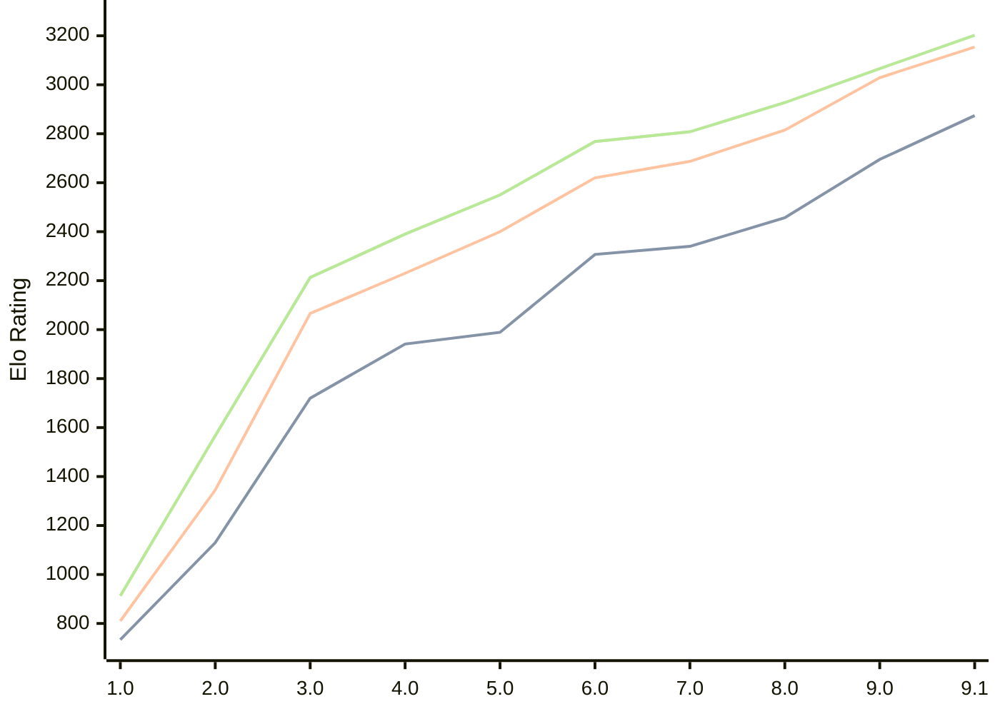

# Engine: Pea

Author: Warre Gevers

Home: https://github.com/WGCodings/Pea

## Elo Ratings

| Version | Published | STC 8.0+0.08s  | LTC 60.0+0.60s | VLTC 2m24s+1.12s | Comment |
| --- | --- | --- | --- | --- | --- |
| 9.1 | 2026-08-09 | 2874(+179) | 3154(+125) | 3202(+136) |  |
| 9.0 | 2026-06-01 | 2695(+238) | 3029(+214) | 3066(+139) |  |
| 8.0 | 2026-05-02 | 2457(+117) | 2815(+128) | 2927(+119) |  |
| 7.0 | 2026-04-25 | 2340(+33) | 2687(+67) | 2808(+40) |  |
| 6.0 | 2026-04-20 | 2307(+318) | 2620(+220) | 2768(+218) |  |
| 5.0 | 2026-04-15 | 1989(+48) | 2400(+170) | 2550(+160) |  |
| 4.0 | 2026-04-11 | 1941(+221) | 2230(+164) | 2390(+177) |  |
| 3.0 | 2026-04-09 | 1720(+590) | 2066(+721) | 2213(+646) |  |
| 2.0 | 2026-04-08 | 1130(+396) | 1345(+535) | 1567(+654) |  |
| 1.0 | 2026-04-06 | 734 | 810 | 913 |  |
 | | | cElo (∆ prev) | cElo (∆ prev) | cElo (∆ prev) | 

<a href="https://github.com/computer-chess-index/cci/issues/new?template=submit-version.yml&title=[VERSION]+Pea+<version>&body=###%20Engine%20name%0APea%0A%0A###%20Version%0A9.1" target="_blank">Submit new version</a>

 Test Conditions:

GUI/CLI: <a href=https://github.com/cutechess/cutechess target="_blank">Cute-Chess</a> 
Elo Calculation: <a href=https://www.remi-coulom.fr/Bayesian-Elo/ target="_blank">Bayesian-Elo</a> 
CPU: Intel(R) Core(TM) i5-7500T 2.70GHz 
Opening book: 8_moves_v3 
\* STC: 8.0+0.08s, LTC: 60.0+0.60s, VLTC: 2m24s+1.12s

 Lists:
Ratings: <a href=https://github.com/computer-chess-index/cci/blob/main/lists/CCIRatings.csv target="_blank">Complete list</a>

Generated: 2026-08-22 06:27:48

## Ratings Verlauf

⬛ STC (8.0+0.08s) &nbsp;&nbsp; 🟧 LTC (60.0+0.60s) &nbsp;&nbsp; 🟩 VLTC (2m24s+1.12s)

dark mode: 🟩STC (8.0+0.08s) 🟧LTC (60.0+0.60s) ⬜VLTC (2m24s+1.12s)

## Detailed Evaluation Results

| Version | Time Control | Elo  | Range +/- | Matches | Score | Average Opponent Elo | Draws |
| --- | --- | --- | --- | --- | --- | --- | --- |
| 9.1 | VLTC (2m24s+1.12s) | 3202 | 33 | 250 | 50% | 3205 | 53% |
| 9.1 | LTC (60.0+0.60s) | 3154 | 33 | 260 | 52% | 3137 | 52% |
| 9.1 | STC (8.0+0.08s) | 2874 | 37 | 228 | 50% | 2870 | 38% |
| --- | --- | --- | --- | --- | --- | --- | --- |
| 9.0 | VLTC (2m24s+1.12s) | 3066 | 28 | 364 | 51% | 3059 | 53% |
| 9.0 | LTC (60.0+0.60s) | 3029 | 30 | 324 | 48% | 3044 | 48% |
| 9.0 | STC (8.0+0.08s) | 2695 | 29 | 404 | 53% | 2668 | 33% |
| --- | --- | --- | --- | --- | --- | --- | --- |
| 8.0 | VLTC (2m24s+1.12s) | 2927 | 30 | 358 | 49% | 2935 | 34% |
| 8.0 | LTC (60.0+0.60s) | 2815 | 32 | 302 | 50% | 2813 | 34% |
| 8.0 | STC (8.0+0.08s) | 2457 | 31 | 356 | 52% | 2429 | 23% |
| --- | --- | --- | --- | --- | --- | --- | --- |
| 7.0 | VLTC (2m24s+1.12s) | 2808 | 34 | 270 | 52% | 2792 | 39% |
| 7.0 | LTC (60.0+0.60s) | 2687 | 35 | 266 | 50% | 2688 | 34% |
| 7.0 | STC (8.0+0.08s) | 2340 | 33 | 320 | 48% | 2364 | 25% |
| --- | --- | --- | --- | --- | --- | --- | --- |
| 6.0 | VLTC (2m24s+1.12s) | 2768 | 36 | 248 | 52% | 2751 | 34% |
| 6.0 | LTC (60.0+0.60s) | 2620 | 36 | 274 | 51% | 2608 | 24% |
| 6.0 | STC (8.0+0.08s) | 2307 | 32 | 344 | 54% | 2268 | 22% |
| --- | --- | --- | --- | --- | --- | --- | --- |
| 5.0 | VLTC (2m24s+1.12s) | 2550 | 33 | 324 | 49% | 2562 | 23% |
| 5.0 | LTC (60.0+0.60s) | 2400 | 36 | 268 | 50% | 2399 | 26% |
| 5.0 | STC (8.0+0.08s) | 1989 | 36 | 276 | 50% | 1987 | 19% |
| --- | --- | --- | --- | --- | --- | --- | --- |
| 4.0 | VLTC (2m24s+1.12s) | 2390 | 34 | 310 | 54% | 2350 | 22% |
| 4.0 | LTC (60.0+0.60s) | 2230 | 36 | 272 | 49% | 2242 | 23% |
| 4.0 | STC (8.0+0.08s) | 1941 | 39 | 248 | 52% | 1924 | 14% |
| --- | --- | --- | --- | --- | --- | --- | --- |
| 3.0 | VLTC (2m24s+1.12s) | 2213 | 40 | 232 | 51% | 2209 | 20% |
| 3.0 | LTC (60.0+0.60s) | 2066 | 39 | 246 | 48% | 2086 | 14% |
| 3.0 | STC (8.0+0.08s) | 1720 | 43 | 208 | 47% | 1751 | 15% |
| --- | --- | --- | --- | --- | --- | --- | --- |
| 2.0 | VLTC (2m24s+1.12s) | 1567 | 34 | 316 | 48% | 1597 | 17% |
| 2.0 | LTC (60.0+0.60s) | 1345 | 39 | 258 | 46% | 1399 | 16% |
| 2.0 | STC (8.0+0.08s) | 1130 | 35 | 300 | 51% | 1103 | 22% |
| --- | --- | --- | --- | --- | --- | --- | --- |
| 1.0 | VLTC (2m24s+1.12s) | 913 | 79 | 110 | 38% | 1073 | 9% |
| 1.0 | LTC (60.0+0.60s) | 810 | 84 | 104 | 37% | 1030 | 8% |
| 1.0 | STC (8.0+0.08s) | 734 | 90 | 92 | 38% | 941 | 3% |
| --- | --- | --- | --- | --- | --- | --- | --- |