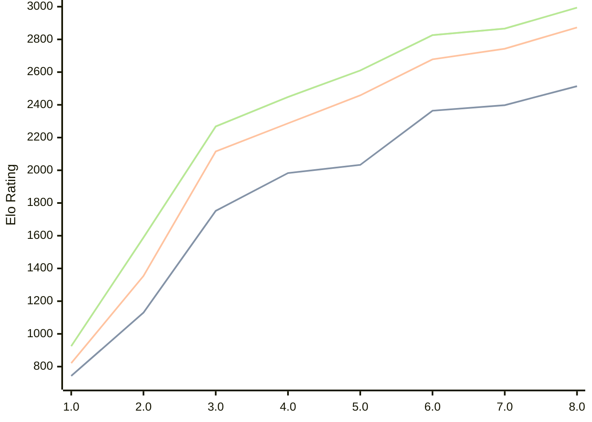

# Engine: Pea

Author: Warre Gevers

Home: https://github.com/WGCodings/Pea

## Elo Ratings

| Version | Published | STC 8.0+0.08s  | LTC 60.0+0.60s | VLTC 2m24s+1.12s | Comment |
| --- | --- | --- | --- | --- | --- |
| 8.0 | 2026-05-02 | 2514(+116) | 2873(+130) | 2994(+128) |  |
| 7.0 | 2026-04-25 | 2398(+34) | 2743(+65) | 2866(+40) |  |
| 6.0 | 2026-04-20 | 2364(+331) | 2678(+220) | 2826(+216) |  |
| 5.0 | 2026-04-15 | 2033(+50) | 2458(+171) | 2610(+162) |  |
| 4.0 | 2026-04-11 | 1983(+231) | 2287(+172) | 2448(+180) |  |
| 3.0 | 2026-04-09 | 1752(+622) | 2115(+761) | 2268(+679) |  |
| 2.0 | 2026-04-08 | 1130(+387) | 1354(+533) | 1589(+664) |  |
| 1.0 | 2026-04-06 | 743 | 821 | 925 |  |
 | | | cElo (∆ prev) | cElo (∆ prev) | cElo (∆ prev) | 

<a href="https://github.com/computer-chess-index/cci/issues/new?template=submit-version.yml&title=[VERSION]+Pea+<version>&body=###%20Engine%20name%0APea%0A%0A###%20Version%0A8.0" target="_blank">Submit new version</a>

 Test Conditions:

GUI/CLI: <a href=https://github.com/cutechess/cutechess target="_blank">Cute-Chess</a> 
Elo Calculation: <a href=https://www.remi-coulom.fr/Bayesian-Elo/ target="_blank">Bayesian-Elo</a> 
CPU: Intel(R) Core(TM) i5-7500T 2.70GHz 
Opening book: 8_moves_v3 
\* STC: 8.0+0.08s, LTC: 60.0+0.60s, VLTC: 2m24s+1.12s

 Lists:
Ratings: <a href=https://github.com/computer-chess-index/cci/blob/main/lists/CCIRatings.csv target="_blank">Complete list</a>

Generated: 2026-05-17 06:26:40

## Ratings Verlauf

⬛ STC (8.0+0.08s) &nbsp;&nbsp; 🟧 LTC (60.0+0.60s) &nbsp;&nbsp; 🟩 VLTC (2m24s+1.12s)

dark mode: 🟩STC (8.0+0.08s) 🟧LTC (60.0+0.60s) ⬜VLTC (2m24s+1.12s)

## Detailed Evaluation Results

| Version | Time Control | Elo  | Range +/- | Matches | Score | Average Opponent Elo | Draws |
| --- | --- | --- | --- | --- | --- | --- | --- |
| 8.0 | VLTC (2m24s+1.12s) | 2994 | 32 | 306 | 50% | 2998 | 34% |
| 8.0 | LTC (60.0+0.60s) | 2873 | 34 | 278 | 50% | 2870 | 34% |
| 8.0 | STC (8.0+0.08s) | 2514 | 34 | 300 | 51% | 2498 | 25% |
| --- | --- | --- | --- | --- | --- | --- | --- |
| 7.0 | VLTC (2m24s+1.12s) | 2866 | 34 | 270 | 52% | 2850 | 39% |
| 7.0 | LTC (60.0+0.60s) | 2743 | 35 | 266 | 50% | 2746 | 34% |
| 7.0 | STC (8.0+0.08s) | 2398 | 33 | 320 | 48% | 2422 | 25% |
| --- | --- | --- | --- | --- | --- | --- | --- |
| 6.0 | VLTC (2m24s+1.12s) | 2826 | 36 | 248 | 52% | 2809 | 34% |
| 6.0 | LTC (60.0+0.60s) | 2678 | 36 | 274 | 51% | 2668 | 24% |
| 6.0 | STC (8.0+0.08s) | 2364 | 32 | 344 | 54% | 2325 | 22% |
| --- | --- | --- | --- | --- | --- | --- | --- |
| 5.0 | VLTC (2m24s+1.12s) | 2610 | 33 | 324 | 49% | 2622 | 23% |
| 5.0 | LTC (60.0+0.60s) | 2458 | 36 | 268 | 50% | 2457 | 26% |
| 5.0 | STC (8.0+0.08s) | 2033 | 36 | 276 | 50% | 2034 | 19% |
| --- | --- | --- | --- | --- | --- | --- | --- |
| 4.0 | VLTC (2m24s+1.12s) | 2448 | 34 | 310 | 54% | 2408 | 22% |
| 4.0 | LTC (60.0+0.60s) | 2287 | 36 | 272 | 49% | 2298 | 23% |
| 4.0 | STC (8.0+0.08s) | 1983 | 39 | 248 | 52% | 1966 | 14% |
| --- | --- | --- | --- | --- | --- | --- | --- |
| 3.0 | VLTC (2m24s+1.12s) | 2268 | 40 | 232 | 51% | 2263 | 20% |
| 3.0 | LTC (60.0+0.60s) | 2115 | 39 | 246 | 48% | 2136 | 14% |
| 3.0 | STC (8.0+0.08s) | 1752 | 43 | 208 | 47% | 1785 | 15% |
| --- | --- | --- | --- | --- | --- | --- | --- |
| 2.0 | VLTC (2m24s+1.12s) | 1589 | 34 | 316 | 48% | 1619 | 17% |
| 2.0 | LTC (60.0+0.60s) | 1354 | 39 | 258 | 46% | 1411 | 16% |
| 2.0 | STC (8.0+0.08s) | 1130 | 35 | 300 | 51% | 1103 | 22% |
| --- | --- | --- | --- | --- | --- | --- | --- |
| 1.0 | VLTC (2m24s+1.12s) | 925 | 80 | 110 | 38% | 1088 | 9% |
| 1.0 | LTC (60.0+0.60s) | 821 | 85 | 104 | 37% | 1042 | 8% |
| 1.0 | STC (8.0+0.08s) | 743 | 91 | 92 | 38% | 952 | 3% |
| --- | --- | --- | --- | --- | --- | --- | --- |