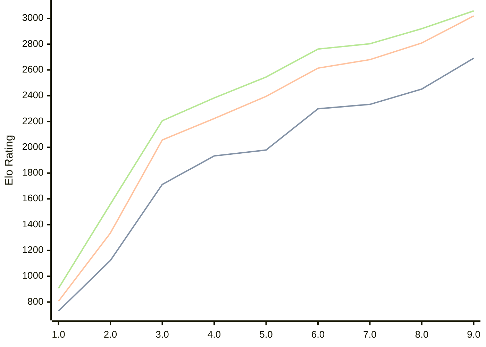

# Engine: Pea

Author: Warre Gevers

Home: https://github.com/WGCodings/Pea

## Elo Ratings

| Version | Published | STC 8.0+0.08s  | LTC 60.0+0.60s | VLTC 2m24s+1.12s | Comment |
| --- | --- | --- | --- | --- | --- |
| 9.0 | 2026-06-01 | 2691(+239) | 3019(+210) | 3058(+138) |  |
| 8.0 | 2026-05-02 | 2452(+119) | 2809(+129) | 2920(+117) |  |
| 7.0 | 2026-04-25 | 2333(+34) | 2680(+66) | 2803(+41) |  |
| 6.0 | 2026-04-20 | 2299(+320) | 2614(+219) | 2762(+217) |  |
| 5.0 | 2026-04-15 | 1979(+46) | 2395(+172) | 2545(+162) |  |
| 4.0 | 2026-04-11 | 1933(+221) | 2223(+166) | 2383(+177) |  |
| 3.0 | 2026-04-09 | 1712(+590) | 2057(+722) | 2206(+647) |  |
| 2.0 | 2026-04-08 | 1122(+392) | 1335(+529) | 1559(+653) |  |
| 1.0 | 2026-04-06 | 730 | 806 | 906 |  |
 | | | cElo (∆ prev) | cElo (∆ prev) | cElo (∆ prev) | 

<a href="https://github.com/computer-chess-index/cci/issues/new?template=submit-version.yml&title=[VERSION]+Pea+<version>&body=###%20Engine%20name%0APea%0A%0A###%20Version%0A9.0" target="_blank">Submit new version</a>

 Test Conditions:

GUI/CLI: <a href=https://github.com/cutechess/cutechess target="_blank">Cute-Chess</a> 
Elo Calculation: <a href=https://www.remi-coulom.fr/Bayesian-Elo/ target="_blank">Bayesian-Elo</a> 
CPU: Intel(R) Core(TM) i5-7500T 2.70GHz 
Opening book: 8_moves_v3 
\* STC: 8.0+0.08s, LTC: 60.0+0.60s, VLTC: 2m24s+1.12s

 Lists:
Ratings: <a href=https://github.com/computer-chess-index/cci/blob/main/lists/CCIRatings.csv target="_blank">Complete list</a>

Generated: 2026-07-24 06:28:18

## Ratings Verlauf

⬛ STC (8.0+0.08s) &nbsp;&nbsp; 🟧 LTC (60.0+0.60s) &nbsp;&nbsp; 🟩 VLTC (2m24s+1.12s)

dark mode: 🟩STC (8.0+0.08s) 🟧LTC (60.0+0.60s) ⬜VLTC (2m24s+1.12s)

## Detailed Evaluation Results

| Version | Time Control | Elo  | Range +/- | Matches | Score | Average Opponent Elo | Draws |
| --- | --- | --- | --- | --- | --- | --- | --- |
| 9.0 | VLTC (2m24s+1.12s) | 3058 | 29 | 328 | 51% | 3050 | 52% |
| 9.0 | LTC (60.0+0.60s) | 3019 | 31 | 308 | 47% | 3039 | 47% |
| 9.0 | STC (8.0+0.08s) | 2691 | 30 | 368 | 54% | 2660 | 32% |
| --- | --- | --- | --- | --- | --- | --- | --- |
| 8.0 | VLTC (2m24s+1.12s) | 2920 | 30 | 358 | 49% | 2928 | 34% |
| 8.0 | LTC (60.0+0.60s) | 2809 | 32 | 302 | 50% | 2808 | 34% |
| 8.0 | STC (8.0+0.08s) | 2452 | 31 | 356 | 52% | 2423 | 23% |
| --- | --- | --- | --- | --- | --- | --- | --- |
| 7.0 | VLTC (2m24s+1.12s) | 2803 | 34 | 270 | 52% | 2786 | 39% |
| 7.0 | LTC (60.0+0.60s) | 2680 | 35 | 266 | 50% | 2682 | 34% |
| 7.0 | STC (8.0+0.08s) | 2333 | 33 | 320 | 48% | 2357 | 25% |
| --- | --- | --- | --- | --- | --- | --- | --- |
| 6.0 | VLTC (2m24s+1.12s) | 2762 | 36 | 248 | 52% | 2746 | 34% |
| 6.0 | LTC (60.0+0.60s) | 2614 | 36 | 274 | 51% | 2603 | 24% |
| 6.0 | STC (8.0+0.08s) | 2299 | 32 | 344 | 54% | 2261 | 22% |
| --- | --- | --- | --- | --- | --- | --- | --- |
| 5.0 | VLTC (2m24s+1.12s) | 2545 | 33 | 324 | 49% | 2557 | 23% |
| 5.0 | LTC (60.0+0.60s) | 2395 | 36 | 268 | 50% | 2394 | 26% |
| 5.0 | STC (8.0+0.08s) | 1979 | 36 | 276 | 50% | 1979 | 19% |
| --- | --- | --- | --- | --- | --- | --- | --- |
| 4.0 | VLTC (2m24s+1.12s) | 2383 | 34 | 310 | 54% | 2345 | 22% |
| 4.0 | LTC (60.0+0.60s) | 2223 | 36 | 272 | 49% | 2234 | 23% |
| 4.0 | STC (8.0+0.08s) | 1933 | 39 | 248 | 52% | 1916 | 14% |
| --- | --- | --- | --- | --- | --- | --- | --- |
| 3.0 | VLTC (2m24s+1.12s) | 2206 | 40 | 232 | 51% | 2201 | 20% |
| 3.0 | LTC (60.0+0.60s) | 2057 | 39 | 246 | 48% | 2078 | 14% |
| 3.0 | STC (8.0+0.08s) | 1712 | 43 | 208 | 47% | 1743 | 15% |
| --- | --- | --- | --- | --- | --- | --- | --- |
| 2.0 | VLTC (2m24s+1.12s) | 1559 | 34 | 316 | 48% | 1589 | 17% |
| 2.0 | LTC (60.0+0.60s) | 1335 | 39 | 258 | 46% | 1389 | 16% |
| 2.0 | STC (8.0+0.08s) | 1122 | 35 | 300 | 51% | 1095 | 22% |
| --- | --- | --- | --- | --- | --- | --- | --- |
| 1.0 | VLTC (2m24s+1.12s) | 906 | 79 | 110 | 38% | 1068 | 9% |
| 1.0 | LTC (60.0+0.60s) | 806 | 84 | 104 | 37% | 1023 | 8% |
| 1.0 | STC (8.0+0.08s) | 730 | 90 | 92 | 38% | 937 | 3% |
| --- | --- | --- | --- | --- | --- | --- | --- |