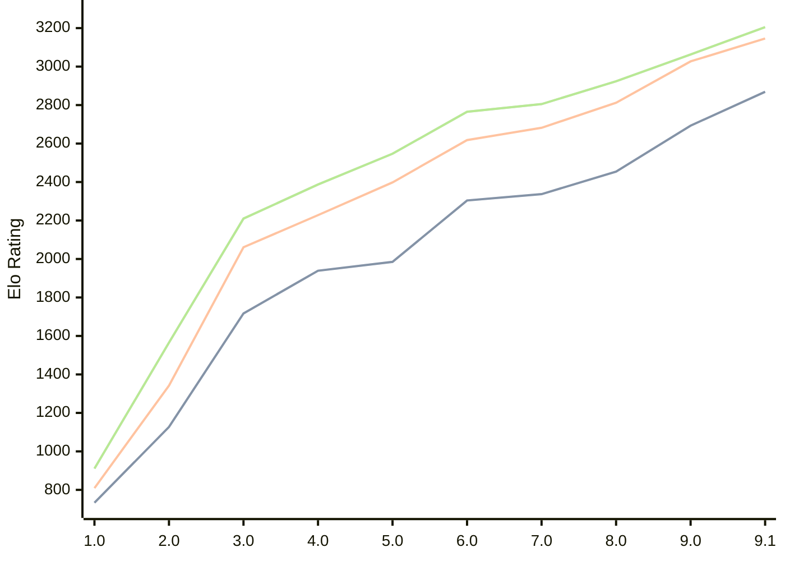

# Engine: Pea

Author: Warre Gevers

Home: https://github.com/WGCodings/Pea

## Elo Ratings

| Version | Published | STC 8.0+0.08s  | LTC 60.0+0.60s | VLTC 2m24s+1.12s | Comment |
| --- | --- | --- | --- | --- | --- |
| 9.1 | 2026-08-09 | 2869(+176) | 3146(+119) | 3205(+142) |  |
| 9.0 | 2026-06-01 | 2693(+239) | 3027(+215) | 3063(+139) |  |
| 8.0 | 2026-05-02 | 2454(+117) | 2812(+130) | 2924(+119) |  |
| 7.0 | 2026-04-25 | 2337(+33) | 2682(+64) | 2805(+40) |  |
| 6.0 | 2026-04-20 | 2304(+319) | 2618(+220) | 2765(+218) |  |
| 5.0 | 2026-04-15 | 1985(+46) | 2398(+170) | 2547(+160) |  |
| 4.0 | 2026-04-11 | 1939(+222) | 2228(+167) | 2387(+177) |  |
| 3.0 | 2026-04-09 | 1717(+590) | 2061(+719) | 2210(+645) |  |
| 2.0 | 2026-04-08 | 1127(+394) | 1342(+533) | 1565(+654) |  |
| 1.0 | 2026-04-06 | 733 | 809 | 911 |  |
 | | | cElo (∆ prev) | cElo (∆ prev) | cElo (∆ prev) | 

<a href="https://github.com/computer-chess-index/cci/issues/new?template=submit-version.yml&title=[VERSION]+Pea+<version>&body=###%20Engine%20name%0APea%0A%0A###%20Version%0A9.1" target="_blank">Submit new version</a>

 Test Conditions:

GUI/CLI: <a href=https://github.com/cutechess/cutechess target="_blank">Cute-Chess</a> 
Elo Calculation: <a href=https://www.remi-coulom.fr/Bayesian-Elo/ target="_blank">Bayesian-Elo</a> 
CPU: Intel(R) Core(TM) i5-7500T 2.70GHz 
Opening book: 8_moves_v3 
\* STC: 8.0+0.08s, LTC: 60.0+0.60s, VLTC: 2m24s+1.12s

 Lists:
Ratings: <a href=https://github.com/computer-chess-index/cci/blob/main/lists/CCIRatings.csv target="_blank">Complete list</a>

Generated: 2026-08-18 06:27:39

## Ratings Verlauf

⬛ STC (8.0+0.08s) &nbsp;&nbsp; 🟧 LTC (60.0+0.60s) &nbsp;&nbsp; 🟩 VLTC (2m24s+1.12s)

dark mode: 🟩STC (8.0+0.08s) 🟧LTC (60.0+0.60s) ⬜VLTC (2m24s+1.12s)

## Detailed Evaluation Results

| Version | Time Control | Elo  | Range +/- | Matches | Score | Average Opponent Elo | Draws |
| --- | --- | --- | --- | --- | --- | --- | --- |
| 9.1 | VLTC (2m24s+1.12s) | 3205 | 36 | 210 | 50% | 3206 | 54% |
| 9.1 | LTC (60.0+0.60s) | 3146 | 38 | 196 | 53% | 3125 | 50% |
| 9.1 | STC (8.0+0.08s) | 2869 | 41 | 184 | 49% | 2871 | 39% |
| --- | --- | --- | --- | --- | --- | --- | --- |
| 9.0 | VLTC (2m24s+1.12s) | 3063 | 28 | 364 | 51% | 3055 | 53% |
| 9.0 | LTC (60.0+0.60s) | 3027 | 30 | 324 | 48% | 3042 | 48% |
| 9.0 | STC (8.0+0.08s) | 2693 | 29 | 404 | 53% | 2665 | 33% |
| --- | --- | --- | --- | --- | --- | --- | --- |
| 8.0 | VLTC (2m24s+1.12s) | 2924 | 30 | 358 | 49% | 2932 | 34% |
| 8.0 | LTC (60.0+0.60s) | 2812 | 32 | 302 | 50% | 2811 | 34% |
| 8.0 | STC (8.0+0.08s) | 2454 | 31 | 356 | 52% | 2426 | 23% |
| --- | --- | --- | --- | --- | --- | --- | --- |
| 7.0 | VLTC (2m24s+1.12s) | 2805 | 34 | 270 | 52% | 2789 | 39% |
| 7.0 | LTC (60.0+0.60s) | 2682 | 35 | 266 | 50% | 2685 | 34% |
| 7.0 | STC (8.0+0.08s) | 2337 | 33 | 320 | 48% | 2361 | 25% |
| --- | --- | --- | --- | --- | --- | --- | --- |
| 6.0 | VLTC (2m24s+1.12s) | 2765 | 36 | 248 | 52% | 2749 | 34% |
| 6.0 | LTC (60.0+0.60s) | 2618 | 36 | 274 | 51% | 2606 | 24% |
| 6.0 | STC (8.0+0.08s) | 2304 | 32 | 344 | 54% | 2265 | 22% |
| --- | --- | --- | --- | --- | --- | --- | --- |
| 5.0 | VLTC (2m24s+1.12s) | 2547 | 33 | 324 | 49% | 2560 | 23% |
| 5.0 | LTC (60.0+0.60s) | 2398 | 36 | 268 | 50% | 2396 | 26% |
| 5.0 | STC (8.0+0.08s) | 1985 | 36 | 276 | 50% | 1985 | 19% |
| --- | --- | --- | --- | --- | --- | --- | --- |
| 4.0 | VLTC (2m24s+1.12s) | 2387 | 34 | 310 | 54% | 2348 | 22% |
| 4.0 | LTC (60.0+0.60s) | 2228 | 36 | 272 | 49% | 2238 | 23% |
| 4.0 | STC (8.0+0.08s) | 1939 | 39 | 248 | 52% | 1921 | 14% |
| --- | --- | --- | --- | --- | --- | --- | --- |
| 3.0 | VLTC (2m24s+1.12s) | 2210 | 40 | 232 | 51% | 2205 | 20% |
| 3.0 | LTC (60.0+0.60s) | 2061 | 39 | 246 | 48% | 2083 | 14% |
| 3.0 | STC (8.0+0.08s) | 1717 | 43 | 208 | 47% | 1748 | 15% |
| --- | --- | --- | --- | --- | --- | --- | --- |
| 2.0 | VLTC (2m24s+1.12s) | 1565 | 34 | 316 | 48% | 1594 | 17% |
| 2.0 | LTC (60.0+0.60s) | 1342 | 39 | 258 | 46% | 1396 | 16% |
| 2.0 | STC (8.0+0.08s) | 1127 | 35 | 300 | 51% | 1100 | 22% |
| --- | --- | --- | --- | --- | --- | --- | --- |
| 1.0 | VLTC (2m24s+1.12s) | 911 | 79 | 110 | 38% | 1072 | 9% |
| 1.0 | LTC (60.0+0.60s) | 809 | 84 | 104 | 37% | 1027 | 8% |
| 1.0 | STC (8.0+0.08s) | 733 | 90 | 92 | 38% | 940 | 3% |
| --- | --- | --- | --- | --- | --- | --- | --- |