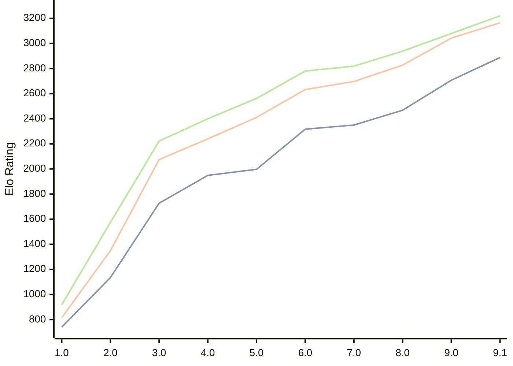

# Engine: Pea

Author: Warre Gevers

Home: https://github.com/WGCodings/Pea

## Elo Ratings E1

| Version | Published | STC 8.0+0.08s  | LTC 60.0+0.60s | VLTC 2m24s+1.12s | Comment |
| --- | --- | --- | --- | --- | --- |
| 9.1 | 2026-08-09 | 2741 | 3070 | 3128 |  |
 | | | cElo (∆ prev) | cElo (∆ prev) | cElo (∆ prev) | 

## Elo Ratings P1

| Version | Published | STC 8.0+0.08s  | LTC 60.0+0.60s | VLTC 2m24s+1.12s | Comment |
| --- | --- | --- | --- | --- | --- |
| 9.1 | 2026-08-09 | 3033 | 3363 | 3367 |  |
 | | | cElo (∆ prev) | cElo (∆ prev) | cElo (∆ prev) | 

## Elo Ratings T1

| Version | Published | STC 8.0+0.08s  | LTC 60.0+0.60s | VLTC 2m24s+1.12s | Comment |
| --- | --- | --- | --- | --- | --- |
| 9.1 | 2026-08-09 | 2888(+181) | 3164(+121) | 3220(+141) |  |
| 9.0 | 2026-06-01 | 2707(+239) | 3043(+216) | 3079(+140) |  |
| 8.0 | 2026-05-02 | 2468(+118) | 2827(+130) | 2939(+120) |  |
| 7.0 | 2026-04-25 | 2350(+33) | 2697(+64) | 2819(+39) |  |
| 6.0 | 2026-04-20 | 2317(+320) | 2633(+222) | 2780(+218) |  |
| 5.0 | 2026-04-15 | 1997(+48) | 2411(+171) | 2562(+162) |  |
| 4.0 | 2026-04-11 | 1949(+222) | 2240(+165) | 2400(+178) |  |
| 3.0 | 2026-04-09 | 1727(+592) | 2075(+725) | 2222(+647) |  |
| 2.0 | 2026-04-08 | 1135(+395) | 1350(+535) | 1575(+657) |  |
| 1.0 | 2026-04-06 | 740 | 815 | 918 |  |
 | | | cElo (∆ prev) | cElo (∆ prev) | cElo (∆ prev) | 

<a href="https://github.com/computer-chess-index/cci/issues/new?template=submit-version.yml&title=[VERSION]+Pea+<version>&body=###%20Engine%20name%0APea%0A%0A###%20Version%0A9.1" target="_blank">Submit new version</a>

 Test Conditions:

GUI/CLI: <a href=https://github.com/cutechess/cutechess target="_blank">Cute-Chess</a> 
Elo Calculation: <a href=https://www.remi-coulom.fr/Bayesian-Elo/ target="_blank">Bayesian-Elo</a> 
CPU for P1: Intel(R) Core(TM) Ultra 7 265T (1.50 GHz) - P-Core 
CPU for E1: Intel(R) Core(TM) Ultra 7 265T (1.50 GHz) - E-Core 
CPU for T1: Intel(R) Core(TM) i5-7500T 2.70GHz 
Opening book: 8_moves_v3 
\* STC: 8.0+0.08s, LTC: 60.0+0.60s, VLTC: 2m24s+1.12s

 Lists:
Ratings: <a href=https://github.com/computer-chess-index/cci/blob/main/lists/CCIRatings.csv target="_blank">Complete list</a>

Generated: 2026-10-10 04:40:56

## Ratings Verlauf

```mermaid
%%{init: {"theme":"base","themeVariables":{"seriesColors:['#a3a3a3','#222221','#faa371']}}}%%
xychart-beta
  x-axis ["1.0", "2.0", "3.0", "4.0", "5.0", "6.0", "7.0", "8.0", "9.0", "9.1"]
  y-axis "Elo Rating" 700 --> 3300
  line "" [740, 1135, 1727, 1949, 1997, 2317, 2350, 2468, 2707, 2888]
  line "STC (8.0+0.08s)" [740, 1135, 1727, 1949, 1997, 2317, 2350, 2468, 2707, 2888]
  line "LTC (60.0+0.60s)" [815, 1350, 2075, 2240, 2411, 2633, 2697, 2827, 3043, 3164]
  line "" [918, 1575, 2222, 2400, 2562, 2780, 2819, 2939, 3079, 3220]
  line "VLTC (2m24s+1.12s)" [918, 1575, 2222, 2400, 2562, 2780, 2819, 2939, 3079, 3220]
```

## Detailed Evaluation Results

| Version | Time Control | Elo  | Range +/- | Matches | Score | Average Opponent Elo | Draws |
| --- | --- | --- | --- | --- | --- | --- | --- |
| 9.1 | VLTC (2m24s+1.12s) | 3128 | 34 | 252 | 48% | 3144 | 49% |
| 9.1 | VLTC (2m24s+1.12s) | 3220 | 29 | 338 | 50% | 3217 | 56% |
| 9.1 | VLTC (2m24s+1.12s) | 3367 | 37 | 202 | 48% | 3382 | 56% |
| 9.1 | LTC (60.0+0.60s) | 3070 | 31 | 290 | 46% | 3098 | 52% |
| 9.1 | LTC (60.0+0.60s) | 3164 | 29 | 324 | 51% | 3154 | 53% |
| 9.1 | LTC (60.0+0.60s) | 3363 | 38 | 194 | 50% | 3359 | 54% |
| 9.1 | STC (8.0+0.08s) | 2888 | 32 | 304 | 50% | 2886 | 40% |
| --- | --- | --- | --- | --- | --- | --- | --- |
| 9.1 | STC (8.0+0.08s) | 3033 | 43 | 164 | 50% | 3051 | 43% |
| --- | --- | --- | --- | --- | --- | --- | --- |
| 9.1 | STC (8.0+0.08s) | 2741 | 31 | 326 | 43% | 2801 | 36% |
| --- | --- | --- | --- | --- | --- | --- | --- |
| 9.0 | VLTC (2m24s+1.12s) | 3079 | 28 | 364 | 51% | 3071 | 53% |
| 9.0 | LTC (60.0+0.60s) | 3043 | 30 | 324 | 48% | 3058 | 48% |
| 9.0 | STC (8.0+0.08s) | 2707 | 29 | 404 | 53% | 2678 | 33% |
| --- | --- | --- | --- | --- | --- | --- | --- |
| 8.0 | VLTC (2m24s+1.12s) | 2939 | 30 | 358 | 49% | 2947 | 34% |
| 8.0 | LTC (60.0+0.60s) | 2827 | 32 | 302 | 50% | 2826 | 34% |
| 8.0 | STC (8.0+0.08s) | 2468 | 31 | 356 | 52% | 2439 | 23% |
| --- | --- | --- | --- | --- | --- | --- | --- |
| 7.0 | VLTC (2m24s+1.12s) | 2819 | 34 | 270 | 52% | 2804 | 39% |
| 7.0 | LTC (60.0+0.60s) | 2697 | 35 | 266 | 50% | 2700 | 34% |
| 7.0 | STC (8.0+0.08s) | 2350 | 33 | 320 | 48% | 2375 | 25% |
| --- | --- | --- | --- | --- | --- | --- | --- |
| 6.0 | VLTC (2m24s+1.12s) | 2780 | 36 | 248 | 52% | 2763 | 34% |
| 6.0 | LTC (60.0+0.60s) | 2633 | 36 | 274 | 51% | 2620 | 24% |
| 6.0 | STC (8.0+0.08s) | 2317 | 32 | 344 | 54% | 2279 | 22% |
| --- | --- | --- | --- | --- | --- | --- | --- |
| 5.0 | VLTC (2m24s+1.12s) | 2562 | 33 | 324 | 49% | 2574 | 23% |
| 5.0 | LTC (60.0+0.60s) | 2411 | 36 | 268 | 50% | 2410 | 26% |
| 5.0 | STC (8.0+0.08s) | 1997 | 36 | 276 | 50% | 1997 | 19% |
| --- | --- | --- | --- | --- | --- | --- | --- |
| 4.0 | VLTC (2m24s+1.12s) | 2400 | 34 | 310 | 54% | 2361 | 22% |
| 4.0 | LTC (60.0+0.60s) | 2240 | 36 | 272 | 49% | 2252 | 23% |
| 4.0 | STC (8.0+0.08s) | 1949 | 39 | 248 | 52% | 1932 | 14% |
| --- | --- | --- | --- | --- | --- | --- | --- |
| 3.0 | VLTC (2m24s+1.12s) | 2222 | 40 | 232 | 51% | 2218 | 20% |
| 3.0 | LTC (60.0+0.60s) | 2075 | 39 | 246 | 48% | 2095 | 14% |
| 3.0 | STC (8.0+0.08s) | 1727 | 43 | 208 | 47% | 1759 | 15% |
| --- | --- | --- | --- | --- | --- | --- | --- |
| 2.0 | VLTC (2m24s+1.12s) | 1575 | 34 | 316 | 48% | 1605 | 17% |
| 2.0 | LTC (60.0+0.60s) | 1350 | 39 | 258 | 46% | 1404 | 16% |
| 2.0 | STC (8.0+0.08s) | 1135 | 35 | 300 | 51% | 1108 | 22% |
| --- | --- | --- | --- | --- | --- | --- | --- |
| 1.0 | VLTC (2m24s+1.12s) | 918 | 79 | 110 | 38% | 1079 | 9% |
| 1.0 | LTC (60.0+0.60s) | 815 | 84 | 104 | 37% | 1035 | 8% |
| 1.0 | STC (8.0+0.08s) | 740 | 90 | 92 | 38% | 946 | 3% |
| --- | --- | --- | --- | --- | --- | --- | --- |