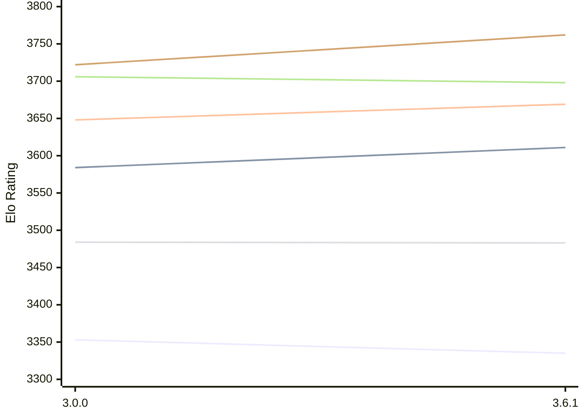

# Engine: Peras

Author: Jesse Sissala

Home: https://github.com/FirePlank/Peras

## Elo Ratings E1 (Ultra 7 265T (1.50 GHz) - E-Core)

| Version | Published | STC 8.0+0.08s  | LTC 60.0+0.60s | VLTC 2m24s+1.12s | Comment |
| --- | --- | --- | --- | --- | --- |
| 3.6.1 | 2026-10-13 | 3335(-18) | 3611(+27) | 3669(+21) |  |
| 3.0.0 | 2026-09-13 | 3353 | 3584 | 3648 |  |
 | | | cElo (∆ prev) | cElo (∆ prev) | cElo (∆ prev) | 

## Elo Ratings P1 (Ultra 7 265T (1.50 GHz) - P-Core)

| Version | Published | STC 8.0+0.08s  | LTC 60.0+0.60s | VLTC 2m24s+1.12s | Comment |
| --- | --- | --- | --- | --- | --- |
| 3.6.1 | 2026-10-13 | 3483(-1) | 3698(-8) | 3762(+40) |  |
| 3.0.0 | 2026-09-13 | 3484 | 3706 | 3722 |  |
 | | | cElo (∆ prev) | cElo (∆ prev) | cElo (∆ prev) | 

## Elo Ratings T1 (i5-7500T 2.70GHz)

| Version | Published | STC 8.0+0.08s  | LTC 60.0+0.60s | VLTC 2m24s+1.12s | Comment |
| --- | --- | --- | --- | --- | --- |
| 3.0.0 | 2026-09-13 | 3283 | 3488 | 3521 |  |
 | | | cElo (∆ prev) | cElo (∆ prev) | cElo (∆ prev) | 

<a href="https://github.com/computer-chess-index/cci/issues/new?template=submit-version.yml&title=[VERSION]+Peras+<version>&body=###%20Engine%20name%0APeras%0A%0A###%20Version%0A3.0.0" target="_blank">Submit new version</a>

 Test Conditions:

GUI/CLI: <a href=https://github.com/cutechess/cutechess target="_blank">Cute-Chess</a> 
Elo Calculation: <a href=https://www.remi-coulom.fr/Bayesian-Elo/ target="_blank">Bayesian-Elo</a> 
CPU for P1: Intel(R) Core(TM) Ultra 7 265T (1.50 GHz) - P-Core 
CPU for E1: Intel(R) Core(TM) Ultra 7 265T (1.50 GHz) - E-Core 
CPU for T1: Intel(R) Core(TM) i5-7500T 2.70GHz 
Opening book: 8_moves_v3 
\* STC: 8.0+0.08s, LTC: 60.0+0.60s, VLTC: 2m24s+1.12s

 Lists:
Ratings: <a href=https://github.com/computer-chess-index/cci/blob/main/lists/CCIRatings.csv target="_blank">Complete list</a>

Generated: 2026-11-04 05:41:03

## Ratings Verlauf E1 / P1

```mermaid
%%{init: {"theme":"base","themeVariables":{"seriesColors:['#a3a3a3','#222221','#faa371']}}}%%
xychart-beta
  x-axis ["3.0.0", "3.6.1"]
  y-axis "Elo Rating" 3300 --> 3800
  line "E1: STC (8.0+0.08s)" [3353, 3335]
  line "E1: LTC (60.0+0.60s)" [3584, 3611]
  line "E1: VLTC (2m24s+1.12s)" [3648, 3669]
  line "P1: STC (8.0+0.08s)" [3484, 3483]
  line "P1: LTC (60.0+0.60s)" [3706, 3698]
  line "P1: VLTC (2m24s+1.12s)" [3722, 3762]
```

## Detailed Evaluation Results

| Version | Time Control | Variant | Elo  | Range +/- | Matches | Score | Average Opponent Elo | Draws |
| --- | --- |--- | --- | --- | --- | --- | --- | --- |
| 3.6.1 | VLTC (2m24s+1.12s) | E1 | 3669 | 37 | 176 | 50% | 3671 | 81% |
|  |  | P1 | 3762 | 44 | 118 | 52% | 3749 | 86% |
|  | LTC (60.0+0.60s) | P1 | 3698 | 48 | 100 | 51% | 3692 | 85% |
|  |  | E1 | 3611 | 30 | 256 | 48% | 3622 | 81% |
|  | STC (8.0+0.08s) | P1 | 3483 | 35 | 200 | 48% | 3497 | 71% |
|  |  | E1 | 3335 | 34 | 228 | 49% | 3340 | 63% |
| --- | --- |--- | --- | --- | --- | --- | --- | --- |
| 3.0.0 | VLTC (2m24s+1.12s) | P1 | 3722 | 36 | 184 | 48% | 3734 | 82% |
|  |  | E1 | 3648 | 33 | 220 | 48% | 3661 | 81% |
|  |  | T1 | 3521 | 30 | 272 | 52% | 3498 | 79% |
|  | LTC (60.0+0.60s) | P1 | 3706 | 36 | 188 | 48% | 3717 | 79% |
|  |  | E1 | 3584 | 31 | 248 | 47% | 3603 | 78% |
|  |  | T1 | 3488 | 34 | 216 | 52% | 3464 | 78% |
|  | STC (8.0+0.08s) | E1 | 3353 | 31 | 288 | 49% | 3359 | 60% |
|  |  | T1 | 3283 | 33 | 240 | 52% | 3259 | 62% |
|  |  | P1 | 3484 | 37 | 196 | 49% | 3492 | 59% |