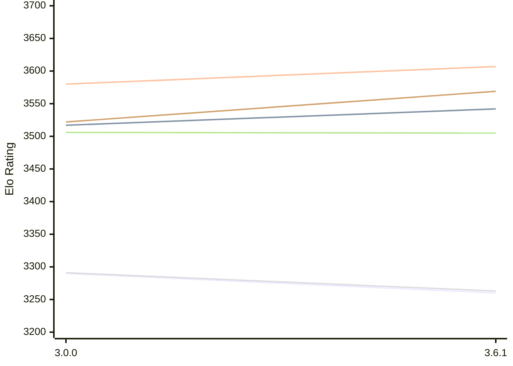

# Engine: Peras

Author: Jesse Sissala

Home: https://github.com/FirePlank/Peras

## Elo Ratings E1 (Ultra 7 265T (1.50 GHz) - E-Core)

| Version | Published | STC 8.0+0.08s  | LTC 60.0+0.60s | VLTC 2m24s+1.12s | Comment |
| --- | --- | --- | --- | --- | --- |
| 3.6.1 | 2026-10-13 | 3260(-30) | 3542(+25) | 3607(+27) |  |
| 3.0.0 | 2026-09-13 | 3290 | 3517 | 3580 |  |
 | | | cElo (∆ prev) | cElo (∆ prev) | cElo (∆ prev) | 

## Elo Ratings P1 (Ultra 7 265T (1.50 GHz) - P-Core)

| Version | Published | STC 8.0+0.08s  | LTC 60.0+0.60s | VLTC 2m24s+1.12s | Comment |
| --- | --- | --- | --- | --- | --- |
| 3.6.1 | 2026-10-13 | 3263(-28) | 3505(-1) | 3569(+47) |  |
| 3.0.0 | 2026-09-13 | 3291 | 3506 | 3522 |  |
 | | | cElo (∆ prev) | cElo (∆ prev) | cElo (∆ prev) | 

## Elo Ratings T1 (i5-7500T 2.70GHz)

| Version | Published | STC 8.0+0.08s  | LTC 60.0+0.60s | VLTC 2m24s+1.12s | Comment |
| --- | --- | --- | --- | --- | --- |
| 3.0.0 | 2026-09-13 | 3283 | 3488 | 3521 |  |
 | | | cElo (∆ prev) | cElo (∆ prev) | cElo (∆ prev) | 

<a href="https://github.com/computer-chess-index/cci/issues/new?template=submit-version.yml&title=[VERSION]+Peras+<version>&body=###%20Engine%20name%0APeras%0A%0A###%20Version%0A3.0.0" target="_blank">Submit new version</a>

 Test Conditions:

GUI/CLI: <a href=https://github.com/cutechess/cutechess target="_blank">Cute-Chess</a> 
Elo Calculation: <a href=https://www.remi-coulom.fr/Bayesian-Elo/ target="_blank">Bayesian-Elo</a> 
CPU for P1: Intel(R) Core(TM) Ultra 7 265T (1.50 GHz) - P-Core 
CPU for E1: Intel(R) Core(TM) Ultra 7 265T (1.50 GHz) - E-Core 
CPU for T1: Intel(R) Core(TM) i5-7500T 2.70GHz 
Opening book: 8_moves_v3 
\* STC: 8.0+0.08s, LTC: 60.0+0.60s, VLTC: 2m24s+1.12s

 Lists:
Ratings: <a href=https://github.com/computer-chess-index/cci/blob/main/lists/CCIRatings.csv target="_blank">Complete list</a>

Generated: 2026-11-25 05:41:20

## Ratings Verlauf E1 / P1

```mermaid
%%{init: {"theme":"base","themeVariables":{"seriesColors:['#a3a3a3','#222221','#faa371']}}}%%
xychart-beta
  x-axis ["3.0.0", "3.6.1"]
  y-axis "Elo Rating" 3200 --> 3700
  line "E1: STC (8.0+0.08s)" [3290, 3260]
  line "E1: LTC (60.0+0.60s)" [3517, 3542]
  line "E1: VLTC (2m24s+1.12s)" [3580, 3607]
  line "P1: STC (8.0+0.08s)" [3291, 3263]
  line "P1: LTC (60.0+0.60s)" [3506, 3505]
  line "P1: VLTC (2m24s+1.12s)" [3522, 3569]
```

## Detailed Evaluation Results

| Version | Time Control | Variant | Elo  | Range +/- | Matches | Score | Average Opponent Elo | Draws |
| --- | --- |--- | --- | --- | --- | --- | --- | --- |
| 3.6.1 | VLTC (2m24s+1.12s) | P1 | 3569 | 41 | 138 | 53% | 3553 | 85% |
|  |  | E1 | 3607 | 34 | 200 | 51% | 3606 | 82% |
|  | LTC (60.0+0.60s) | P1 | 3505 | 45 | 112 | 51% | 3495 | 85% |
|  |  | E1 | 3542 | 27 | 328 | 48% | 3557 | 80% |
|  | STC (8.0+0.08s) | P1 | 3263 | 27 | 352 | 45% | 3299 | 69% |
|  |  | E1 | 3260 | 27 | 360 | 49% | 3270 | 64% |
| --- | --- |--- | --- | --- | --- | --- | --- | --- |
| 3.0.0 | VLTC (2m24s+1.12s) | T1 | 3521 | 30 | 272 | 52% | 3498 | 79% |
|  |  | P1 | 3522 | 35 | 188 | 48% | 3534 | 81% |
|  |  | E1 | 3580 | 31 | 244 | 48% | 3595 | 82% |
|  | LTC (60.0+0.60s) | T1 | 3488 | 34 | 216 | 52% | 3464 | 78% |
|  |  | P1 | 3506 | 35 | 192 | 48% | 3517 | 79% |
|  |  | E1 | 3517 | 30 | 276 | 48% | 3533 | 79% |
|  | STC (8.0+0.08s) | T1 | 3283 | 33 | 240 | 52% | 3259 | 62% |
|  |  | P1 | 3291 | 33 | 240 | 49% | 3302 | 59% |
|  |  | E1 | 3290 | 29 | 324 | 49% | 3301 | 59% |